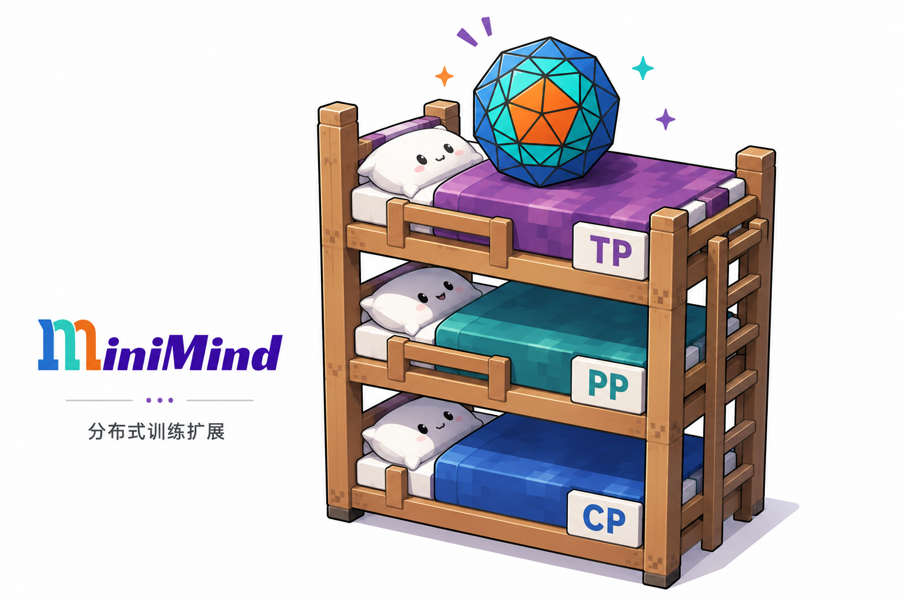

<p align="center">
  
</p>

# minimind-tron

`minimind-tron` 基于 [MiniMind](https://github.com/jingyaogong/minimind) 构建，是一个面向学习与实验的 Megatron 风格分布式并行训练项目。

MiniMind 用较小、清晰的代码展示了一条完整的大模型训练链路，让个人开发者也能看清一个 Transformer 如何从模型定义走到训练和推理。`minimind-tron` 继承了这种尽量简单、透明的思路，在保留 MiniMind 模型结构的基础上，从零加入 Tensor、Sequence、Vocab、Pipeline 与 Context Parallelism，以及这些策略组成的多维并行训练。

项目中的核心并行算法均使用 PyTorch 原生能力实现，不依赖 DeepSpeed、Megatron-Core 等第三方分布式框架提供的高层并行抽象。Process Group、collective、P2P 通信、跨 rank autograd 和 pipeline schedule 都直接建立在 `torch.distributed` 与 `torch.autograd.Function` 之上。

这不仅是一个为 LLM 加入分布式训练能力的项目，也是一套面向分布式训练的入门与实践教程。今天调用成熟框架完成模型切分已经很方便，但理解这些算法为什么这样切、tensor layout 如何变化、forward/backward 分别发生什么通信，仍然是一件很有趣的事，并根据不同策略的特征指导我们在真实训练中选择合适的并行策略。

> `minimind-tron` 不试图替代成熟的工业级分布式训练框架。它更关注用尽可能小的实现，把并行训练中的核心的原理讲清楚并验证正确。

## 已实现的并行策略

| 策略 | 切分对象 | 关键实现 |
|---|---|---|
| Tensor Parallelism（TP） | Attention heads、MLP intermediate dimension | Column / Row Parallel Linear，collective 接入 autograd |
| Sequence Parallelism（SP） | TP 区域之间的逐 token activation | All-Gather / Reduce-Scatter，local shard 与 full tensor 布局转换 |
| Vocab Parallelism（VP） | Embedding、LM head、logits | Vocab Parallel Embedding 与分布式 Cross Entropy |
| Pipeline Parallelism（PP） | 连续 Transformer layers | PipelineStage、P2P 通信、GPipe 与 1F1B |
| Context Parallelism（CP） | 长序列 Attention 的序列维度 | All-Gather K/V 与 sequence-to-head All-to-All |

这些策略可以组合使用。每个进程通过 TP、CP、PP 三个逻辑坐标加入对应的 Process Group；SP 与 VP 在 TP group 内继续改变 activation 或词表的布局。

### 性能相关实现

- **通信与计算重叠**：在 Linear backward 中异步发起 dgrad collective，同时计算 wgrad GEMM。
- **SP activation 重计算**：forward 只保存 local sequence shard，backward 时重新 All-Gather 完整输入，以额外通信换取显存。
- **Vocab Parallel Cross Entropy**：不收集完整 logits 计算 loss，只同步全局最大值、目标 token logit 和 sum-exp 等必要统计量。
- **1F1B schedule**：完成 warmup 后交错执行 forward/backward，让较早 microbatch 的 activation 更早释放。

## 快速开始

### 1. 安装

```bash
git clone https://github.com/ANKer661/minimind-tron.git
cd minimind-tron
pip install -r requirements.txt
```

并行验证和 benchmark 目前面向 Nvidia GPU，需要至少与并行规模相同数量的可见 GPU。

### 2. 运行一个基础 TP 验证

```bash
python -m evaluation.parallel validate \
  --tp_size 2 \
  --pp_size 1
```

## 统一的 Evaluation

`evaluation` 包为不同并行策略提供统一入口：`validate` 将 TP × CP × PP 的任意组合与 Dense 模型进行数值对齐，`benchmark` 基于同一套配置运行显存、step time 和吞吐实验。入口会根据并行规模启动所需进程，并将具体任务参数交给对应的验证或 benchmark 模块。

完整的命令结构、可用配置和示例见 [evaluation/README.md](evaluation/README.md)。

## 项目结构

```text
model/
├── parallel_state.py
│   └── TP、CP、PP 与 tied embedding Process Group 的统一构造
├── tensor_parallel_layers.py
│   └── Column / Row / Vocab Parallel 与 Async Linear
├── tensor_parallel_mappings.py
│   └── TP/SP collective 的 autograd 映射
├── model_tp.py
│   └── TP、SP、VP 模型组装与 Dense checkpoint 切分
├── attention_cp.py
│   └── All-Gather K/V 与 A2A Context Parallel Attention
├── context_parallel_mappings.py
│   └── CP sequence-to-head / head-to-sequence 布局转换
├── model_pp.py
│   └── PipelineStage 与 stage-local model
├── pipeline_parallel_p2p_communication.py
│   └── stage 间 forward/backward P2P
└── pipeline_schedules.py
    └── GPipe、1F1B 调度实现与梯度后处理

evaluation/
├── parallel.py
│   └── validate / benchmark 统一入口
├── presets.py
│   └── benchmark mode preset 与运行配置解析
├── validate.py
│   └── Dense 与多维并行的数值一致性验证
├── benchmark.py
│   └── 配置扫描、worker 调度与 CSV 输出
├── benchmark_utils.py
│   └── CSV schema/写入、终端格式化与统一绘图
└── benchmark_worker.py
    └── 单个分布式配置的显存、时间与吞吐测量
```

## 教程

在线教程：<https://anker661.github.io/minimind-tron/>

本地预览：

```bash
quarto preview book
```

构建静态页面：

```bash
quarto render book
```

当前已整理好的是 TP 主线，其中包含 Tensor、Sequence、Vocab Parallelism，异步通信、activation recompute，以及统一的显存与吞吐实验：

- [从 MiniMind 到 Tensor、Sequence 与 Vocab Parallelism](book/src/tensor_parallel.qmd)

Pipeline Parallelism、Context Parallelism 和 TP × CP × PP 多维并行的实现已经完成，相关教程仍在整理，后续会逐章发布。

## 当前限制

- TP、CP、PP 的数值验证和 benchmark 当前面向单机 CUDA 环境。
- TP Attention 暂不支持 KV Cache，模型暂不支持 MoE。
- 各种并行策略都需要相应维度可被整除
- CP 当前实现 All-Gather K/V 与 A2A 两条路径，尚未实现 Ring Attention。

更具体的 shape 约束、实验边界和源码索引记录在各教程末尾。

## 致谢

- [MiniMind：🧠「大模型」2小时完全从0训练64M的小参数LLM！Train a 64M-parameter LLM from scratch in just 2h!](https://github.com/jingyaogong/minimind)：本项目的代码基础与灵感来源。
- [Megatron-LM](https://github.com/NVIDIA/Megatron-LM)：Tensor、Sequence、Pipeline 等并行策略的重要实现参考。

## License

本项目基于 Apache License 2.0 发布。
