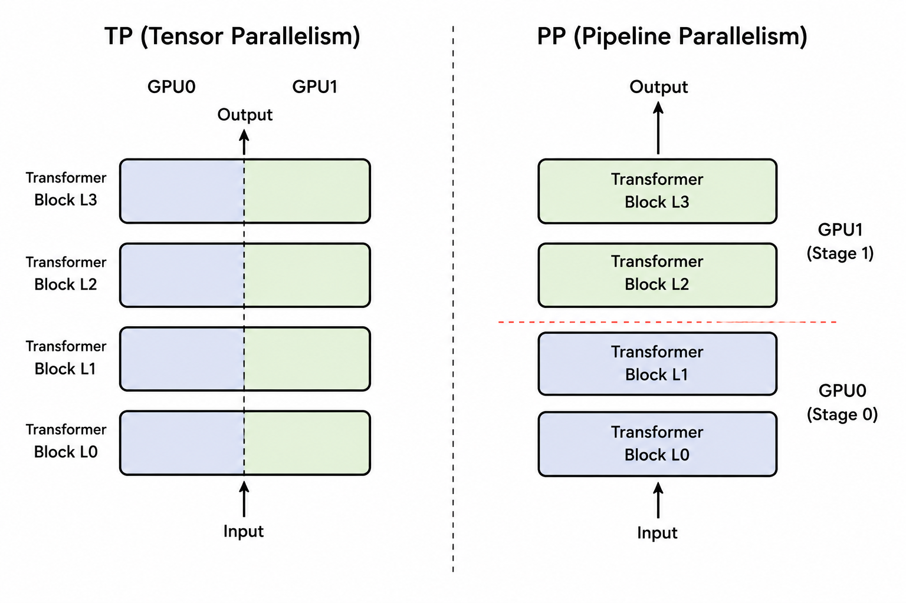

# Pipeline Parallelism

## Pipeline Parallelism 的动机



与 TP（Tensor Parallelism）一样，Pipeline Parallelism（PP，流水线并行）也是为了解决当模型过大、单 GPU 显存无法容纳的问题。TP 的思路是将每一层的参数和计算切分到不同的 GPU 上；而 PP 则更加直观，直接把模型不同的层（Layers）依次分配到不同的 GPU 上。

我们把每个 GPU 上持有的部分模型称为一个 stage。

从概念和正确性上来说，PP 只需要解决两个基础问题：

1. stage 内部实现：负责单个 GPU 上模型的结构定义与前反向计算；

2. stage 间通信：负责 Hidden States 和梯度在不同 GPU 之间的传输。

但要构建一个实际高效的系统，还需要解决第三个问题：

3. 流水线调度：负责编排 Batch 的执行顺序，以减少 GPU 的空闲（Bubble），最大化 GPU 利用率。

本章我们将主要关注概念与正确性层面，即 stage 内部的模型实现与 stage 间的通信，下一章再探讨如何通过流水线调度来实现高效的 PP。

## 模型：从 Dense Transformer 到 Pipeline Stages {#sec-pp-stage}

### 模型实现

在 `model_pp.py` 中，stage 由 `PipelineStageModel` 和 `PipelineStage` 两个模块实现。它们直接复用上一章已经封装好的 TP block。由于 TP block 对外仍保持普通 block 的输入输出契约，PP 只需要决定每个 stage 持有哪些 layers，不需要介入一层内部如何切分。这样，沿层切分的 PP 与层内切分的 TP 从模型设计开始就是两条相互独立的维度，之后可以自然组合成 TP × PP。

<details>
<summary>PipelineStageModel / PipelineStage 与 TP 模块的对比</summary>

```diff
-class TPMiniMindModel(nn.Module):
+class PipelineStageModel(nn.Module):
+    self.layer_start = num_hidden_layers * pp_rank // pp_size
+    self.layer_end = num_hidden_layers * (pp_rank + 1) // pp_size

-    self.embed_tokens = ...
-    self.dropout = ...
+    if pp_context.is_first:
+        self.embed_tokens = ...
+        self.dropout = ...

-    self.layers = nn.ModuleList(
-        block(layer) for layer in range(num_hidden_layers)
+    self.layers = nn.ModuleDict(
+        {str(layer): block(layer)
+         for layer in range(self.layer_start, self.layer_end)}
     )

-    self.norm = RMSNorm(...)
+    if pp_context.is_last:
+        self.norm = RMSNorm(...)

-class TPMiniMindForCausalLM(PreTrainedModel):
+class PipelineStage(nn.Module):
-    self.lm_head = ...
+    if pp_context.is_last:
+        self.lm_head = ...
```

`PipelineStageModel` 对应普通模型中的 base model：first stage 额外持有 embedding，本地 stage 只持有分配给自己的 Transformer layers，last stage 额外持有 final norm。这里复用的是 `TPMiniMindBlock`，因此 PP 只改变 layers 在哪些进程上存在，不改变 block 内部已有的 TP 计算。

`PipelineStage` 对应 `ForCausalLM` 外层封装，负责调用 base model，并只在 last stage 执行 lm_head。Loss 仍由外部 schedule 在 last stage 上计算，与通信和 backward 一起编排。

切分 layers 时，一个更直接的做法是让每个 stage 都从局部编号 0 开始。例如，假设 Stage 1 持有全局第 3～5 层，局部编号会变成 `layers.0`、`layers.1`、`layers.2`。模型当然可以正常计算，但 `layers.0` 在 Dense checkpoint 中指向全局第 0 层，在 Stage 1 中却变成了全局第 3 层。加载参数时就必须额外维护一份 `global_to_local` 映射，并重写所有 layer key。

当前实现选择使用 `ModuleDict` 保留全局层号：

```text
model.layers.<global_layer_id>.*
```

于是 Stage 1 中的第一层仍叫 `layers.3`，stage 参数名与 Dense/TP 模型天然对齐。加载 checkpoint 时，先按 TP 规则切分每个参数，再用当前 stage 的 key 过滤即可，不再需要改写参数名：

```python
dense_state_dict = shard_state_dict_for_tp(dense_model.state_dict(), tp_context)
stage_state_dict = {
    name: dense_state_dict[name]
    for name in stage_model.state_dict()
}
stage_model.load_state_dict(stage_state_dict, strict=True)
```

embedding 只会出现在 first stage 的参数中，final norm 和 lm_head 只会出现在 last stage 的参数中，也会随 `state_dict()` 的 key 自然完成筛选。

</details>

### 模型切分：层数怎么分配到每个 stage 

有了 stage 的模型结构之后，接下来的问题是：$N$ 层 Transformer 应该怎么分配给 $p$ 个 stage，才能让每个 GPU 拿到的计算量尽量接近？

如果 $N$ 恰好能被 $p$ 整除，每个 stage 直接拿 $N/p$ 层即可。当 $N/p$ 不是整数时，只按 `N // p` 分配会剩下若干层；把余数全部塞进某个 stage，又会让它明显更重。我们希望切分后的 layers 仍保持连续，同时让多出来的层尽量均匀地落在各个 stage 上。

一种简洁的做法不是逐个处理余数，而是先在全局 layer 序列上放置 $p+1$ 个近似等距的边界。第 $t$ 个 stage 取相邻两个边界之间的连续区间：

假设我们把 $[0, N)$ 切成 $p$ 段左闭右开的连续区间

$$
[\text{start}_t, \text{end}_t), \quad t = 0, 1, \dots, p-1,
$$

当前实现用一个取整公式给出每个 rank 的边界：

```python
self.layer_start = num_hidden_layers * pp_rank // pp_size
self.layer_end = num_hidden_layers * (pp_rank + 1) // pp_size
```

这个公式同时满足三个要求：

- 覆盖完整：`layer_start` 在 `pp_rank=0` 时取值 0，`layer_end` 在 `pp_rank=pp_size-1` 时取值 $N$，所以整个区间序列从 0 开始、到 $N$ 结束，不会漏掉任何一层。
- 相邻区间无缝：`layer_end[t]` 和 `layer_start[t+1]` 用的是同一个表达式 `num_hidden_layers * (t+1) // pp_size`，两者天然相等，因此相邻 stage 的区间不会漏掉某一层，也不会重叠。
- 分配尽量均衡：每个 stage 的层数只可能是 $\lfloor N/p \rfloor$ 或 $\lceil N/p \rceil$，任意两个 stage 最多相差一层。

```{ojs}
//| echo: false
//| classes: no-code-copy
viewof ppPartitionLayers = Inputs.range(
  [1, 32],
  {value: 10, step: 1, label: "Transformer layers N"}
)

viewof ppPartitionStages = Inputs.range(
  [1, 8],
  {value: 4, step: 1, label: "Pipeline stages p"}
)
```

```{ojs}
//| echo: false
//| classes: no-code-copy

{
  const N = ppPartitionLayers
  const p = ppPartitionStages
  const colors = [
    "#1971c2", "#5f3dc4", "#2b8a3e", "#e8590c",
    "#c2255c", "#0b7285", "#9c36b5", "#495057"
  ]
  const ranges = Array.from({length: p}, (_, stage) => {
    const start = Math.floor(N * stage / p)
    const end = Math.floor(N * (stage + 1) / p)
    return {stage, start, end, count: end - start}
  })

  const root = html`<div class="pp-partition-demo">
    <style>
      .pp-partition-demo {
        margin: 0.5rem 0 1.5rem;
        color: var(--bs-body-color, #212529);
      }
      .pp-partition-demo .pp-partition-heading {
        display: flex;
        align-items: baseline;
        justify-content: space-between;
        gap: 1rem;
        margin-bottom: 0.55rem;
        font-weight: 700;
      }
      .pp-partition-demo .pp-partition-formula {
        color: var(--bs-secondary-color, #6c757d);
        font-family: var(--bs-font-monospace, monospace);
        font-size: 0.85rem;
        font-weight: 500;
      }
      .pp-partition-demo .pp-layer-scroll {
        overflow-x: auto;
        padding: 0.15rem 0 0.45rem;
      }
      .pp-partition-demo .pp-layer-track {
        display: grid;
        gap: 3px;
      }
      .pp-partition-demo .pp-layer-cell {
        display: grid;
        place-items: center;
        min-height: 42px;
        border: 1px solid rgba(0, 0, 0, 0.18);
        border-radius: 4px;
        color: #fff;
        font-size: 0.78rem;
        font-weight: 700;
      }
      .pp-partition-demo .pp-stage-list {
        display: grid;
        grid-template-columns: repeat(auto-fit, minmax(135px, 1fr));
        gap: 0.65rem;
        margin-top: 0.8rem;
      }
      .pp-partition-demo .pp-stage-card {
        padding: 0.65rem 0.75rem;
        border: 1px solid var(--bs-border-color, #dee2e6);
        border-top: 5px solid var(--stage-color);
        border-radius: 5px;
        background: var(--bs-body-bg, #fff);
      }
      .pp-partition-demo .pp-stage-card.empty {
        border-style: dashed;
        opacity: 0.72;
      }
      .pp-partition-demo .pp-stage-name {
        font-weight: 750;
      }
      .pp-partition-demo .pp-stage-range {
        margin-top: 0.18rem;
        font-family: var(--bs-font-monospace, monospace);
        font-size: 0.9rem;
      }
      .pp-partition-demo .pp-stage-count {
        margin-top: 0.12rem;
        color: var(--bs-secondary-color, #6c757d);
        font-size: 0.82rem;
      }
      .pp-partition-demo .pp-partition-warning {
        margin-top: 0.75rem;
        color: #b02a37;
        font-size: 0.86rem;
        font-weight: 600;
      }
    </style>
    <div class="pp-partition-heading">
      <span>Global Transformer layers</span>
      <span class="pp-partition-formula"></span>
    </div>
    <div class="pp-layer-scroll">
      <div class="pp-layer-track"></div>
    </div>
    <div class="pp-stage-list"></div>
    <div class="pp-partition-warning" hidden></div>
  </div>`

  root.querySelector(".pp-partition-formula").textContent = `N=${N}, p=${p}`

  const track = root.querySelector(".pp-layer-track")
  track.style.gridTemplateColumns = `repeat(${N}, minmax(21px, 1fr))`
  track.style.minWidth = `${Math.max(520, N * 24)}px`

  for (let layer = 0; layer < N; layer += 1) {
    const range = ranges.find(({start, end}) => layer >= start && layer < end)
    const cell = document.createElement("div")
    cell.className = "pp-layer-cell"
    cell.style.background = colors[range.stage]
    cell.textContent = layer
    cell.title = `Layer ${layer} → Stage ${range.stage}`
    cell.setAttribute("aria-label", cell.title)
    track.appendChild(cell)
  }

  const stageList = root.querySelector(".pp-stage-list")
  for (const range of ranges) {
    const card = document.createElement("div")
    card.className = `pp-stage-card${range.count === 0 ? " empty" : ""}`
    card.style.setProperty("--stage-color", colors[range.stage])

    const name = document.createElement("div")
    name.className = "pp-stage-name"
    name.textContent = `Stage ${range.stage}`

    const interval = document.createElement("div")
    interval.className = "pp-stage-range"
    interval.textContent = `[${range.start}, ${range.end})`

    const count = document.createElement("div")
    count.className = "pp-stage-count"
    count.textContent = `${range.count} layer${range.count === 1 ? "" : "s"}`

    card.append(name, interval, count)
    stageList.appendChild(card)
  }

  if (p > N) {
    const warning = root.querySelector(".pp-partition-warning")
    warning.hidden = false
    warning.textContent = "p > N 会产生空 stage；公式仍然成立，但实际训练通常应避免这种配置。"
  }

  return root
}
```

<details>
<summary>为什么各 stage 的层数最多相差一层？</summary>

把总层数写成

$$
N = \text{base} \times p + r, \qquad 0 \le r < p.
$$

第 $t$ 个 stage 的末尾边界可以展开为

$$
\text{end}_t
= \text{base} \times (t+1)
+ \left\lfloor \frac{(t+1)r}{p} \right\rfloor.
$$

相邻两个边界相减时，第一项固定贡献 $\text{base}$ 层；第二项的增量只可能是 0 或 1。因此每个 stage 最终只会拿到 $\text{base}$ 或 $\text{base}+1$ 层。

</details>

需要注意的是，这个划分方式只保证了**层数**上的均衡，并没有考虑到 stage 0 额外持有 embedding、最后一个 stage 额外持有 final norm 和 lm_head 带来的计算/显存差异。

## Stage 的边界契约 {#sec-pp-stage-contract}

模型被切分为多个 stage 之后，对外部调度器而言，每个 stage 最好表现为一个黑盒：无论它处于 first、middle 还是 last，只要接收符合约定的输入 tensor，就会产生符合约定的输出 tensor。

要让这层黑盒成立，外部调度器与 stage 之间必须提前约定 tensor 的语义和 layout。这里的边界契约分为两类。

### 外部数据与 loss 边界

模型与外部训练流程之间保持普通语言模型的标准 I/O：

| 外部 I/O | Tensor 语义 | Layout |
| --- | --- | --- |
| data iterator → first stage | token IDs | `[B,S]` |
| last stage → loss | logits | `[B,S,V]` |

::: {.callout-note title="Loss 不属于 stage 契约"}
`PipelineStage.forward()` 的职责到生成 logits 为止。将 logits 与 labels 结合并计算标量 loss，是外层训练循环 `forward_step()` 的职责，不属于 stage 内部的模型结构。
:::

### Stage 间的 PP 通信边界

相邻 stage 之间遵循 PP 的通信契约。Forward 传递 hidden states，Backward 沿原路传回相同 layout 的 gradient：

| PP 通信方向 | Tensor 语义 | Layout |
| --- | --- | --- |
| stage $t$ → stage $t+1$ | hidden states | `[S,B,H]` |
| stage $t+1$ → stage $t$ | hidden-state gradient | `[S,B,H]` |

::: {.callout-note title="为什么 PP 边界选择 `[S,B,H]`？"}
外部 I/O 使用 `[B,S]`，而 PP stage 内部之间使用 `[S,B,H]`，是因为当前 stage 内部复用了前面章节实现的 TP block，它以 sequence-first 的 `[S,B,H]` 作为内部 layout。让 PP 边界与 TP block 保持一致，数据无需额外转置便能直接进入计算 block。即使没有开启 TP，纯 Dense 模式也沿用 `[S,B,H]` 契约，使两种 stage 对调度器保持相同的接口。
:::

### First、Middle 与 Last Stage 如何适配契约

外部 layout `[B,S]` 与 PP 内部 layout `[S,B,H]` 之间的转换，由位于流水线两端的 embedding 和 lm_head 承担：

| Stage | 输入 tensor | 本地职责与运算 | 输出 tensor | Layout 适配角色 |
| --- | --- | --- | --- | --- |
| First | `input_ids [B,S]` | `movedim` → embedding → local layers | hidden states `[S,B,H]` | 入口适配：将外部 `[B,S]` 转换为内部 `[S,B,H]` |
| Middle | hidden states `[S,B,H]` | local layers | hidden states `[S,B,H]` | 内部透传：始终保持 `[S,B,H]`，无需转换 |
| Last | hidden states `[S,B,H]` | local layers → final norm → lm_head | logits `[B,S,V]` | 出口适配：将内部 `[S,B,H]` 恢复为外部 `[B,S,V]` |

边界契约统一了 stage 对外的数据形态，stage 内部是否开启 TP、包含多少层等细节不再影响外部对 stage 的调用。

## Stage 间的 P2P 通信 {#sec-pp-p2p}

stage 定义好之后，模型仍然只是分布在不同进程里的几段独立计算，真正把它们连成 @sec-pp-one-batch 里的流水线的，是 stage 之间传递 hidden states 和梯度的通信。Forward 产生的 hidden states 交给下一个 stage，Backward 产生的梯度沿原路返回。

这种通信只发生在相邻两个 stage 之间，属于 point-to-point（P2P）通信。当前实现用 `P2PCommunicator` 集中管理通信对象、接收 buffer 和实际的 send/recv。

### 训练时需要的四个操作

站在一个 stage 的视角，我们只需要四个具有训练语义的操作：

- `recv_forward()`：从 prev stage 接收 hidden states，作为本地 forward 的输入。first stage 返回 `None`，直接从 data iterator 读取 `input_ids`。

- `send_forward(hidden)`：将本地 forward 输出的 hidden states 发送给 next stage。last stage 跳过发送，直接输出 logits 用于计算 loss。

- `send_backward(grad)`：将本地 backward 计算出的输入梯度发送给 prev stage。first stage 跳过发送。

- `recv_backward()`：从 next stage 接收输出梯度，作为本地 backward 的 `grad_tensors`。last stage 返回 `None`，从标量 loss 启动 backward。

```{=html}
<div class="pp-local-operations" role="img" aria-label="一个 stage 内 forward 和 backward 的 P2P 操作顺序">
  <style>
    .pp-local-operations {
      margin: 1rem 0 1.5rem;
      overflow-x: auto;
    }
    .pp-local-operations svg {
      display: block;
      width: 100%;
      min-width: 720px;
      height: auto;
      font-family: var(--bs-body-font-family, system-ui, sans-serif);
    }
    .pp-local-operations .row-panel {
      fill: var(--bs-tertiary-bg, #f8f9fa);
      stroke: var(--bs-border-color, #ced4da);
      stroke-width: 1.5;
    }
    .pp-local-operations .row-title {
      fill: var(--bs-body-color, #212529);
      font-size: 18px;
      font-weight: 750;
      text-anchor: middle;
    }
    .pp-local-operations .node {
      stroke-width: 1.5;
    }
    .pp-local-operations .forward-node {
      fill: #1971c2;
      stroke: #0b4a85;
    }
    .pp-local-operations .backward-node {
      fill: #2b8a3e;
      stroke: #176329;
    }
    .pp-local-operations .compute-node {
      fill: #5f3dc4;
      stroke: #3b2585;
    }
    .pp-local-operations .node-text {
      fill: #fff;
      font-family: var(--bs-font-monospace, monospace);
      font-size: 15px;
      font-weight: 650;
      text-anchor: middle;
    }
    .pp-local-operations .edge {
      fill: none;
      stroke-width: 2.8;
    }
    .pp-local-operations .forward-edge {
      stroke: #1971c2;
      marker-end: url(#pp-local-forward-arrow);
    }
    .pp-local-operations .backward-edge {
      stroke: #2b8a3e;
      marker-end: url(#pp-local-backward-arrow);
    }
    .pp-local-operations .edge-label,
    .pp-local-operations .boundary-note {
      font-size: 13px;
      text-anchor: middle;
    }
    .pp-local-operations .edge-label {
      fill: var(--bs-secondary-color, #6c757d);
    }
    .pp-local-operations .boundary-note {
      fill: var(--bs-body-color, #495057);
    }
  </style>

  <svg viewBox="0 0 960 320" aria-hidden="true">
    <defs>
      <marker id="pp-local-forward-arrow" markerWidth="8" markerHeight="8" refX="7" refY="4" orient="auto">
        <path d="M0,0 L8,4 L0,8 Z" fill="#1971c2"></path>
      </marker>
      <marker id="pp-local-backward-arrow" markerWidth="8" markerHeight="8" refX="7" refY="4" orient="auto">
        <path d="M0,0 L8,4 L0,8 Z" fill="#2b8a3e"></path>
      </marker>
    </defs>

    <rect class="row-panel" x="20" y="15" width="920" height="135" rx="10"></rect>
    <text class="row-title" x="90" y="86">Forward</text>
    <rect class="node forward-node" x="170" y="45" width="210" height="52" rx="7"></rect>
    <rect class="node compute-node" x="430" y="45" width="180" height="52" rx="7"></rect>
    <rect class="node forward-node" x="660" y="45" width="210" height="52" rx="7"></rect>
    <text class="node-text" x="275" y="77">recv_forward()</text>
    <text class="node-text" x="520" y="77">local forward</text>
    <text class="node-text" x="765" y="77">send_forward(h)</text>
    <path class="edge forward-edge" d="M380 71 H430"></path>
    <path class="edge forward-edge" d="M610 71 H660"></path>
    <text class="boundary-note" x="275" y="122">first stage：recv_forward 返回 None</text>
    <text class="boundary-note" x="765" y="122">last stage：跳过发送</text>

    <rect class="row-panel" x="20" y="170" width="920" height="135" rx="10"></rect>
    <text class="row-title" x="90" y="241">Backward</text>
    <rect class="node backward-node" x="170" y="200" width="210" height="52" rx="7"></rect>
    <rect class="node compute-node" x="430" y="200" width="180" height="52" rx="7"></rect>
    <rect class="node backward-node" x="660" y="200" width="210" height="52" rx="7"></rect>
    <text class="node-text" x="275" y="232">send_backward(g)</text>
    <text class="node-text" x="520" y="232">local backward</text>
    <text class="node-text" x="765" y="232">recv_backward()</text>
    <path class="edge backward-edge" d="M430 226 H380"></path>
    <path class="edge backward-edge" d="M660 226 H610"></path>
    <text class="boundary-note" x="275" y="277">first stage：跳过发送</text>
    <text class="boundary-note" x="765" y="277">last stage：recv_backward 返回 None</text>
  </svg>
</div>
```

正确的 P2P 通信的关键是，在 forward / backward 中，stage 的 send 需要与相邻的 recv 匹配：

```{=html}
<div class="pp-api-pairs" role="img" aria-label="Stage k 与 Stage k+1 之间成对的 forward 和 backward P2P 操作">
  <style>
    .pp-api-pairs {
      margin: 1rem 0 1.5rem;
      overflow-x: auto;
    }
    .pp-api-pairs svg {
      display: block;
      width: 100%;
      min-width: 640px;
      height: auto;
      font-family: var(--bs-body-font-family, system-ui, sans-serif);
    }
    .pp-api-pairs .stage-box {
      fill: var(--bs-body-bg, #fff);
      stroke: var(--bs-border-color, #ced4da);
      stroke-width: 1.5;
    }
    .pp-api-pairs .stage-title {
      fill: var(--bs-body-color, #212529);
      font-size: 18px;
      font-weight: 750;
      text-anchor: middle;
    }
    .pp-api-pairs .api-box {
      fill: #1971c2;
      stroke: #0b4a85;
      stroke-width: 1.5;
    }
    .pp-api-pairs .api-box.backward {
      fill: #2b8a3e;
      stroke: #176329;
    }
    .pp-api-pairs .api-text {
      fill: #fff;
      font-family: var(--bs-font-monospace, monospace);
      font-size: 16px;
      font-weight: 650;
      text-anchor: middle;
    }
    .pp-api-pairs .forward-path,
    .pp-api-pairs .backward-path {
      fill: none;
      stroke-width: 3;
    }
    .pp-api-pairs .forward-path {
      stroke: #1971c2;
      marker-end: url(#pp-api-forward-arrow);
    }
    .pp-api-pairs .backward-path {
      stroke: #2b8a3e;
      marker-end: url(#pp-api-backward-arrow);
    }
    .pp-api-pairs .path-label {
      font-size: 16px;
      font-weight: 700;
      text-anchor: middle;
    }
    .pp-api-pairs .path-label.forward {
      fill: #145c9e;
    }
    .pp-api-pairs .path-label.backward {
      fill: #237032;
    }
  </style>

  <svg viewBox="0 0 960 260" aria-hidden="true">
    <defs>
      <marker id="pp-api-forward-arrow" markerWidth="8" markerHeight="8" refX="7" refY="4" orient="auto">
        <path d="M0,0 L8,4 L0,8 Z" fill="#1971c2"></path>
      </marker>
      <marker id="pp-api-backward-arrow" markerWidth="8" markerHeight="8" refX="7" refY="4" orient="auto">
        <path d="M0,0 L8,4 L0,8 Z" fill="#2b8a3e"></path>
      </marker>
    </defs>

    <rect class="stage-box" x="20" y="15" width="350" height="225" rx="10"></rect>
    <rect class="stage-box" x="590" y="15" width="350" height="225" rx="10"></rect>
    <text class="stage-title" x="195" y="48">Stage k</text>
    <text class="stage-title" x="765" y="48">Stage k+1</text>

    <rect class="api-box" x="55" y="70" width="280" height="50" rx="7"></rect>
    <text class="api-text" x="195" y="101">send_forward(hidden)</text>
    <rect class="api-box" x="625" y="70" width="280" height="50" rx="7"></rect>
    <text class="api-text" x="765" y="101">recv_forward()</text>

    <path class="forward-path" d="M335 95 H625"></path>
    <text class="path-label forward" x="480" y="77">hidden states</text>

    <rect class="api-box backward" x="55" y="160" width="280" height="50" rx="7"></rect>
    <text class="api-text" x="195" y="191">recv_backward()</text>
    <rect class="api-box backward" x="625" y="160" width="280" height="50" rx="7"></rect>
    <text class="api-text" x="765" y="191">send_backward(input_grad)</text>

    <path class="backward-path" d="M625 185 H335"></path>
    <text class="path-label backward" x="480" y="167">input gradient</text>
  </svg>
</div>
```

“匹配”包括约定相同的 shape 和 dtype，这部分已在 @sec-pp-stage-contract 中讨论过。除此之外，send/recv 的调用顺序也必须协调一致。如果相邻两个 stage 同时阻塞在 `send` 上等待对方的 `recv`，就会导致死锁。当前实现使用 `isend/irecv` 异步发起通信，再通过 `.wait()` 等待完成，由底层处理顺序问题。因此当前实现实际是仍然是同步调用，将 wait() 延后以实现通信与计算重叠，可以作为未来的优化方向。

### `P2PCommunicator` 实现细节

前面的四个基础操作最终共享同一条实现路径。先只看代码结构：

```python
def _batched_p2p_ops(...):
    # 将非空的通信方向构造成 dist.P2POp
    # 通过 dist.batch_isend_irecv 一次性发起
    return reqs

class P2PCommunicator:
    def __init__(...):
        # 在 PP group 内找到相邻 stage
        # 将 prev / next 的 group rank 转换为 global rank

    def recv_forward(...):

    def send_forward(...):

    def recv_backward(...):

    def send_backward(...):

    def _communicate(...):
        # 根据启用的方向准备 recv buffer
        # 调用 _batched_p2p_ops，再等待所有 requests 完成
        return tensor_from_prev, tensor_from_next
```

`__init__` 负责确定通信对象：先在 PP group 内计算出 prev/next 的 group rank，再把它们转换成实际发起 P2P 时用到的 global rank。这一步是必要的，因为当 TP × PP 同时启用时，rank ± 1 并不一定对应真正的 prev/next stage。

四个基础方法 `recv_forward`、`send_forward`、`recv_backward`、`send_backward` 负责把训练语义翻译成底层的通信方向，并处理 first/last stage 的边界情况（例如 first stage 的 `recv_forward` 直接返回 `None`）。它们最终都会调用同一个入口 `_communicate`，只是传入的方向参数不同。

`_communicate` 是发起通信的统一入口。它根据调用方启用的 recv-prev、recv-next 准备好接收 buffer，然后调用 `_batched_p2p_ops` 发起通信。这个接口在设计上可以同时描述四个方向，但目前 `recv_forward` 等方法每次只会用到其中一个方向。

`_batched_p2p_ops` 接收 recv buffer 和待发送的 tensor，把每个非空的通信方向包装成对应的 `dist.P2POp`，再通过 `dist.batch_isend_irecv` 一次性发起。返回的 requests 会在 `_communicate` 中逐个 `.wait()`，所以底层虽然用的是非阻塞的 `isend`/`irecv`，但对调用方来说整个接口仍然表现为同步通信。

完整实现位于 `model/pipeline_parallel_p2p_communication.py`，主要入口是 `_batched_p2p_ops` 和 `P2PCommunicator`。

P2P 通信只是把 tensor 的值送过了进程边界，autograd graph 并不会自动跨越进程，这就需要我们手动在两个 stage 的计算图之间建立连接。

## 跨进程 Autograd：手动连接两段计算图 {#sec-pp-autograd}

`P2PCommunicator._communicate` 接收来自上一个 stage 的数据时，会显式创建一个 `requires_grad=True` 的 buffer 来接收对方发来的数据：

```python
tensor_recv_prev = torch.empty(
    recv_prev_shape,
    requires_grad=True,
    device=torch.cuda.current_device(),
    dtype=pipeline_dtype,
)
```

这个接收的 tensor 会作为当前 stage 本地计算图的叶子节点，从这里建立当前 stage 的计算图。

```{=html}
<div class="pp-autograd-steps pp-autograd-forward" role="img" aria-label="P2P 连接两张独立的本地计算图；接收 tensor 是 requires-grad leaf，第二张计算图从这里开始">
  <style>
    .pp-autograd-steps {
      margin: 1rem 0 1.5rem;
      overflow-x: auto;
    }
    .pp-autograd-steps svg {
      display: block;
      width: 100%;
      min-width: 760px;
      height: auto;
    }
    .pp-autograd-steps text {
      font-family: var(--bs-body-font-family, system-ui, sans-serif);
    }
    .pp-autograd-steps .step-panel,
    .pp-autograd-steps .local-graph {
      fill: var(--bs-tertiary-bg, #f8f9fa);
      stroke: var(--bs-border-color, #ced4da);
      stroke-width: 1.5;
    }
    .pp-autograd-steps .local-graph {
      fill: var(--bs-body-bg, #fff);
      stroke-dasharray: 5 4;
    }
    .pp-autograd-steps .step-title,
    .pp-autograd-steps .graph-title,
    .pp-autograd-steps .note {
      fill: var(--bs-body-color, #212529);
    }
    .pp-autograd-steps .step-title {
      font-size: 18px;
      font-weight: 750;
    }
    .pp-autograd-steps .graph-title {
      font-size: 13px;
      font-weight: 700;
    }
    .pp-autograd-steps .note {
      font-size: 12px;
      fill: var(--bs-secondary-color, #6c757d);
      text-anchor: middle;
    }
    .pp-autograd-steps .node rect,
    .pp-autograd-steps .node ellipse {
      stroke-width: 1.5;
    }
    .pp-autograd-steps .node text {
      fill: #fff;
      font-size: 14px;
      font-weight: 700;
      text-anchor: middle;
    }
    .pp-autograd-steps .node text.sub {
      font-size: 12px;
      font-weight: 450;
    }
    .pp-autograd-steps .tensor rect {
      fill: #1971c2;
      stroke: #0b4a85;
    }
    .pp-autograd-steps .operation ellipse {
      fill: #5f3dc4;
      stroke: #3b2585;
    }
    .pp-autograd-steps .gradient rect {
      fill: #2b8a3e;
      stroke: #176329;
    }
    .pp-autograd-steps .forward-edge,
    .pp-autograd-steps .grad-edge,
    .pp-autograd-steps .comm-edge,
    .pp-autograd-steps .relation-edge {
      fill: none;
      stroke-width: 2.3;
    }
    .pp-autograd-steps .forward-edge {
      stroke: #1971c2;
      marker-end: url(#pp-step-forward-arrow);
    }
    .pp-autograd-steps .grad-edge {
      stroke: #2b8a3e;
      marker-end: url(#pp-step-backward-arrow);
    }
    .pp-autograd-steps .comm-edge {
      stroke: #e8590c;
      stroke-width: 3;
      marker-end: url(#pp-step-comm-arrow);
    }
    .pp-autograd-steps .relation-edge {
      stroke: var(--bs-secondary-color, #6c757d);
      stroke-dasharray: 5 4;
    }
    .pp-autograd-steps .broken-edge {
      stroke: #c92a2a;
      stroke-width: 2.5;
      stroke-dasharray: 6 5;
    }
    .pp-autograd-steps .break-mark {
      stroke: #c92a2a;
      stroke-width: 3;
    }
    .pp-autograd-steps .break-label,
    .pp-autograd-steps .comm-label {
      font-size: 12px;
      font-weight: 700;
      text-anchor: middle;
    }
    .pp-autograd-steps .break-label {
      fill: #c92a2a;
    }
    .pp-autograd-steps .comm-label {
      fill: #e8590c;
    }
    .pp-autograd-forward svg {
      min-width: 640px;
    }
    .pp-autograd-forward .local-graph {
      stroke-dasharray: none;
    }
    .pp-autograd-forward .received-leaf rect {
      stroke: #2b8a3e;
      stroke-width: 3;
    }
    .pp-autograd-forward .requires-badge rect {
      fill: #2b8a3e;
      stroke: #176329;
      stroke-width: 1.2;
    }
    .pp-autograd-forward .requires-badge text {
      fill: #fff;
      font-size: 12px;
      font-weight: 700;
      text-anchor: middle;
    }
    .pp-autograd-forward .p2p-value-edge {
      fill: none;
      stroke: #a13d00;
      stroke-width: 3;
      stroke-dasharray: 7 6;
      marker-end: url(#pp-forward-p2p-arrow);
    }
    .pp-autograd-forward .blocked-autograd-edge {
      fill: none;
      stroke: #d98989;
      stroke-width: 2.2;
      stroke-dasharray: 4 7;
      marker-end: url(#pp-forward-blocked-arrow);
    }
    .pp-autograd-forward .blocked-cross {
      stroke: #c92a2a;
      stroke-width: 3.5;
      stroke-linecap: round;
    }
    .pp-autograd-forward .blocked-label {
      fill: #c92a2a;
      font-size: 13px;
      font-weight: 700;
      text-anchor: middle;
    }
    .pp-autograd-forward .legend-text {
      fill: var(--bs-secondary-color, #6c757d);
      font-size: 16px;
      font-weight: 600;
    }
  </style>

  <svg viewBox="0 0 1100 300" aria-hidden="true">
    <defs>
      <marker id="pp-step-forward-arrow" markerWidth="8" markerHeight="8" refX="7" refY="4" orient="auto">
        <path d="M0,0 L8,4 L0,8 Z" fill="#1971c2"></path>
      </marker>
      <marker id="pp-forward-p2p-arrow" markerWidth="8" markerHeight="8" refX="7" refY="4" orient="auto">
        <path d="M0,0 L8,4 L0,8 Z" fill="#a13d00"></path>
      </marker>
      <marker id="pp-forward-blocked-arrow" markerWidth="8" markerHeight="8" refX="7" refY="4" orient="auto">
        <path d="M0,0 L8,4 L0,8 Z" fill="#d98989"></path>
      </marker>
    </defs>

    <rect class="step-panel" x="20" y="15" width="1060" height="270" rx="10"></rect>
    <text class="step-title" x="45" y="48">两张独立的 local autograd graphs</text>

    <rect class="local-graph" x="40" y="68" width="445" height="170" rx="8"></rect>
    <rect class="local-graph" x="615" y="68" width="445" height="170" rx="8"></rect>
    <text class="graph-title" x="60" y="94">Stage k</text>
    <text class="graph-title" x="635" y="94">Stage k+1</text>

    <g class="node tensor">
      <rect x="65" y="140" width="105" height="62" rx="7"></rect>
      <text x="117.5" y="176">xₖ</text>
    </g>
    <g class="node operation">
      <ellipse cx="275" cy="171" rx="58" ry="35"></ellipse>
      <text x="275" y="176">fₖ</text>
    </g>
    <g class="node tensor">
      <rect x="385" y="140" width="80" height="62" rx="7"></rect>
      <text x="425" y="176">yₖ</text>
    </g>
    <path class="forward-edge" d="M170 171 H217"></path>
    <path class="forward-edge" d="M333 171 H385"></path>

    <g class="requires-badge">
      <rect x="625" y="103" width="145" height="26" rx="13"></rect>
      <text x="697.5" y="121">leaf · requires_grad=True</text>
    </g>
    <g class="node tensor received-leaf">
      <rect x="635" y="140" width="125" height="62" rx="7"></rect>
      <text x="697.5" y="176">xₖ₊₁</text>
    </g>
    <g class="node operation">
      <ellipse cx="865" cy="171" rx="58" ry="35"></ellipse>
      <text x="865" y="176">fₖ₊₁</text>
    </g>
    <g class="node tensor">
      <rect x="965" y="140" width="75" height="62" rx="7"></rect>
      <text x="1002.5" y="176">yₖ₊₁</text>
    </g>
    <path class="forward-edge" d="M760 171 H807"></path>
    <path class="forward-edge" d="M923 171 H965"></path>

    <path class="p2p-value-edge" d="M465 171 H635"></path>
    <text class="comm-label" x="550" y="151">P2P · value only</text>

    <path class="blocked-autograd-edge" d="M635 210 C610 248 490 248 465 210"></path>
    <line class="blocked-cross" x1="542" y1="230" x2="558" y2="246"></line>
    <line class="blocked-cross" x1="558" y1="230" x2="542" y2="246"></line>
    <text class="blocked-label" x="550" y="224">autograd cannot cross</text>

    <line x1="330" y1="263" x2="370" y2="263" class="forward-edge"></line>
    <text class="legend-text" x="380" y="267">autograd edge</text>
    <line x1="585" y1="263" x2="625" y2="263" class="p2p-value-edge"></line>
    <text class="legend-text" x="635" y="267">value transfer only</text>
  </svg>
</div>
```

但 `requires_grad=True` 只建立了当前 stage 内部的计算图，stage 之间的计算图仍然是孤立的。P2P 通信只搬运了 hidden states 的数值，autograd 不会自动把梯度从下一个 stage 传回上一个 stage。因此，我们需要在 backward 方向再次通过 P2P 接收梯度，再手动调用 torch.autograd.backward，将梯度接回本地计算图。

```{=html}
<div class="pp-autograd-steps pp-autograd-gradient" role="img" aria-label="Backward 穿过 pipeline 边界的两种情况：last stage 从标量 loss 开始；非 last stage 从 next 传回的 output gradient 开始">
  <style>
    .pp-autograd-gradient svg {
      min-width: 640px;
    }
    .pp-autograd-gradient .step-title {
      font-size: 19px;
    }
    .pp-autograd-gradient .graph-title {
      font-size: 14px;
    }
    .pp-autograd-gradient .node text {
      font-size: 15px;
    }
    .pp-autograd-gradient .node text.sub {
      font-size: 13px;
    }
    .pp-autograd-gradient .comm-label,
    .pp-autograd-gradient .break-label {
      font-size: 13px;
    }
    .pp-autograd-gradient .broken-edge {
      stroke: #7b8794;
      stroke-width: 1.8;
      stroke-dasharray: 5 5;
    }
    .pp-autograd-gradient .break-label {
      fill: #66717d;
      font-weight: 650;
    }
    .pp-autograd-gradient .grad-edge {
      stroke-width: 2.8;
      marker-end: url(#pp-boundary-backward-arrow);
    }
    .pp-autograd-gradient .comm-edge {
      stroke: #a13d00;
      stroke-width: 3.4;
      marker-end: url(#pp-boundary-comm-arrow);
    }
    .pp-autograd-gradient .comm-label {
      fill: #8f3600;
      font-weight: 750;
    }
  </style>

  <svg viewBox="0 0 960 445" aria-hidden="true">
    <defs>
      <marker id="pp-boundary-backward-arrow" markerWidth="8" markerHeight="8" refX="7" refY="4" orient="auto">
        <path d="M0,0 L8,4 L0,8 Z" fill="#2b8a3e"></path>
      </marker>
      <marker id="pp-boundary-comm-arrow" markerWidth="8" markerHeight="8" refX="7" refY="4" orient="auto">
        <path d="M0,0 L8,4 L0,8 Z" fill="#a13d00"></path>
      </marker>
    </defs>

    <rect class="step-panel" x="15" y="10" width="930" height="200" rx="10"></rect>
    <text class="step-title" x="35" y="43">Last stage：标量 loss 直接启动 backward</text>

    <line class="broken-edge" x1="90" y1="70" x2="90" y2="132"></line>
    <line class="broken-edge" x1="90" y1="160" x2="90" y2="188"></line>
    <text class="break-label" x="90" y="201">boundary</text>
    <text class="graph-title" x="45" y="86">Prev</text>
    <text class="graph-title" x="120" y="86">Last stage</text>
    <text class="graph-title" x="790" y="86">没有 next stage</text>

    <g class="node gradient">
      <rect x="260" y="112" width="190" height="68" rx="8"></rect>
      <text x="355" y="139">input_tensor.grad</text>
      <text class="sub" x="355" y="162">leaf 上的输入梯度</text>
    </g>
    <g class="node tensor">
      <rect x="700" y="112" width="180" height="68" rx="8"></rect>
      <text x="790" y="139">output_tensor</text>
      <text class="sub" x="790" y="162">scalar loss</text>
    </g>

    <path class="grad-edge" d="M700 146 H450"></path>
    <text class="graph-title" x="575" y="126" style="text-anchor:middle">local backward</text>
    <text class="note" x="575" y="168">output_grad=None</text>
    <path class="comm-edge" d="M260 146 H90"></path>
    <text class="comm-label" x="175" y="126">send prev</text>

    <rect class="step-panel" x="15" y="230" width="930" height="200" rx="10"></rect>
    <text class="step-title" x="35" y="263">Non-last stage：next 的梯度启动 backward</text>

    <line class="broken-edge" x1="90" y1="290" x2="90" y2="352"></line>
    <line class="broken-edge" x1="90" y1="380" x2="90" y2="408"></line>
    <line class="broken-edge" x1="890" y1="290" x2="890" y2="352"></line>
    <line class="broken-edge" x1="890" y1="380" x2="890" y2="408"></line>
    <text class="break-label" x="90" y="421">boundary</text>
    <text class="break-label" x="890" y="421" style="text-anchor:end">boundary</text>
    <text class="graph-title" x="45" y="306">Prev</text>
    <text class="graph-title" x="120" y="306">Current stage</text>
    <text class="graph-title" x="910" y="306">Next</text>

    <g class="node gradient">
      <rect x="260" y="332" width="190" height="68" rx="8"></rect>
      <text x="355" y="359">input_tensor.grad</text>
      <text class="sub" x="355" y="382">leaf 上的输入梯度</text>
    </g>
    <g class="node gradient">
      <rect x="700" y="332" width="120" height="68" rx="8"></rect>
      <text x="760" y="359">output_grad</text>
      <text class="sub" x="760" y="382">来自 next</text>
    </g>

    <path class="comm-edge" d="M890 366 H820"></path>
    <text class="comm-label" x="855" y="346">recv next</text>
    <path class="grad-edge" d="M700 366 H450"></path>
    <text class="graph-title" x="575" y="346" style="text-anchor:middle">local backward</text>
    <text class="note" x="575" y="388">使用 output_grad</text>
    <path class="comm-edge" d="M260 366 H90"></path>
    <text class="comm-label" x="175" y="346">若存在 prev，则继续传递</text>
  </svg>
</div>
```

这一步具体怎么做，取决于当前 stage 是不是 last stage：last stage 没有 next，backward 的起点来自本地；非 last stage 后面还有 next，backward 的起点要等 P2P 从 next 传回梯度才有。

两种情形可以统一成同一次调用：

```python
torch.autograd.backward(
    tensors=output_tensor,
    grad_tensors=output_grad,
)
```

Last stage 的 `output_tensor` 本身就是标量 loss，`output_grad` 传 `None`，PyTorch 会隐式使用梯度 1 来启动 backward；非 last stage 的 `output_grad` 是从 next 接收的 tensor，PyTorch 会以它作为反向传播的起点。

把这四个 P2P 操作和手动 backward 组合起来，一个典型 stage 的 forward/backward 大致如下：

```python
# Forward：recv_forward 的返回值是新的 leaf，本地图从这里开始建立
input_tensor = recv_forward()       # requires_grad=True
output_tensor = stage_model(input_tensor)
send_forward(output_tensor)

# Backward：recv_backward 拿到的梯度作为本地 backward 的起点
output_grad = recv_backward()       # 来自 next stage，last stage 为 None
torch.autograd.backward(
    tensors=output_tensor,
    grad_tensors=output_grad,
)
input_grad = input_tensor.grad      # leaf 上累积的输入梯度
send_backward(input_grad)           # 发给 prev stage，first stage 跳过
```

至此，stage 之间原本孤立的计算图，就通过 P2P 通信和手动调用 `torch.autograd.backward` 被连接成了一条完整的反向传播链路。

## 总结：单 Batch 的生命周期 {#sec-pp-one-batch}

前面已经分别解释了 P2P 通信和跨进程 Autograd。现在把这些局部机制放回同一条时间轴，以 `PP size = 4` 为例，追踪一个 batch 如何完成完整的 Forward 和 Backward。

Forward 必须依次经过 Stage 0、1、2、3；last stage 得到 logits 并计算 loss 后，Backward 再按 Stage 3、2、1、0 的顺序返回。下图沿用后面调度章节的表示方式：蓝色表示本地 Forward，绿色表示本地 Backward，灰色表示该 stage 正在等待依赖。这里将 Backward 画成两个时间格宽，这是因为 backward 需要计算输入的梯度和参数的梯度，计算量来说约为 Forward 的两倍。

```{=html}
<div class="pp-single-batch-timeline" role="img" aria-label="一个 batch 在四个 pipeline stages 中依次完成 forward，再以相反顺序完成 backward 的静态时间线">
  <div class="pp-single-batch-legend">
    <span><i class="pp-single-batch-mark forward"></i>Forward</span>
    <span><i class="pp-single-batch-mark backward"></i>Backward</span>
    <span><i class="pp-single-batch-mark wait"></i>等待</span>
  </div>
  <div class="pp-single-batch-scroll">
    <div class="pp-single-batch-grid">
      <div></div>
      <div class="pp-single-batch-time">t0</div>
      <div class="pp-single-batch-time">t1</div>
      <div class="pp-single-batch-time">t2</div>
      <div class="pp-single-batch-time">t3</div>
      <div class="pp-single-batch-time">t4</div>
      <div class="pp-single-batch-time">t5</div>
      <div class="pp-single-batch-time">t6</div>
      <div class="pp-single-batch-time">t7</div>
      <div class="pp-single-batch-time">t8</div>
      <div class="pp-single-batch-time">t9</div>
      <div class="pp-single-batch-time">t10</div>
      <div class="pp-single-batch-time">t11</div>

      <div class="pp-single-batch-stage" style="grid-row: 2">Stage 0</div>
      <div class="pp-single-batch-lane" style="grid-row: 2"></div>
      <div class="pp-single-batch-operation forward" style="grid-row: 2; grid-column: 2">F</div>
      <div class="pp-single-batch-operation backward" style="grid-row: 2; grid-column: 12 / span 2">B</div>

      <div class="pp-single-batch-stage" style="grid-row: 3">Stage 1</div>
      <div class="pp-single-batch-lane" style="grid-row: 3"></div>
      <div class="pp-single-batch-operation forward" style="grid-row: 3; grid-column: 3">F</div>
      <div class="pp-single-batch-operation backward" style="grid-row: 3; grid-column: 10 / span 2">B</div>

      <div class="pp-single-batch-stage" style="grid-row: 4">Stage 2</div>
      <div class="pp-single-batch-lane" style="grid-row: 4"></div>
      <div class="pp-single-batch-operation forward" style="grid-row: 4; grid-column: 4">F</div>
      <div class="pp-single-batch-operation backward" style="grid-row: 4; grid-column: 8 / span 2">B</div>

      <div class="pp-single-batch-stage" style="grid-row: 5">Stage 3</div>
      <div class="pp-single-batch-lane" style="grid-row: 5"></div>
      <div class="pp-single-batch-operation forward" style="grid-row: 5; grid-column: 5">F</div>
      <div class="pp-single-batch-operation backward" style="grid-row: 5; grid-column: 6 / span 2">B</div>
    </div>
  </div>
</div>
```

我们可以看到，stage 之间存在数据依赖：后面 stage 的 forward 必须等待前一个 stage 传来 hidden states，前面 stage 的 backward 必须等待后一个 stage 传回 gradient。这个依赖链直接导致了大部分时候 GPU 都在空转。从上图也能看出，灰色等待区域远大于蓝色和绿色的实际计算区域。每个 stage 的大部分时间都处于空闲状态——以 Stage 0 为例，在整个 batch 的生命周期中只执行了一次 Forward 和一次 Backward，其余时间都在等待下游 stage 完成。随着 PP size 增大，这个问题会更加严重，下一章将介绍如何缓解这个问题。
