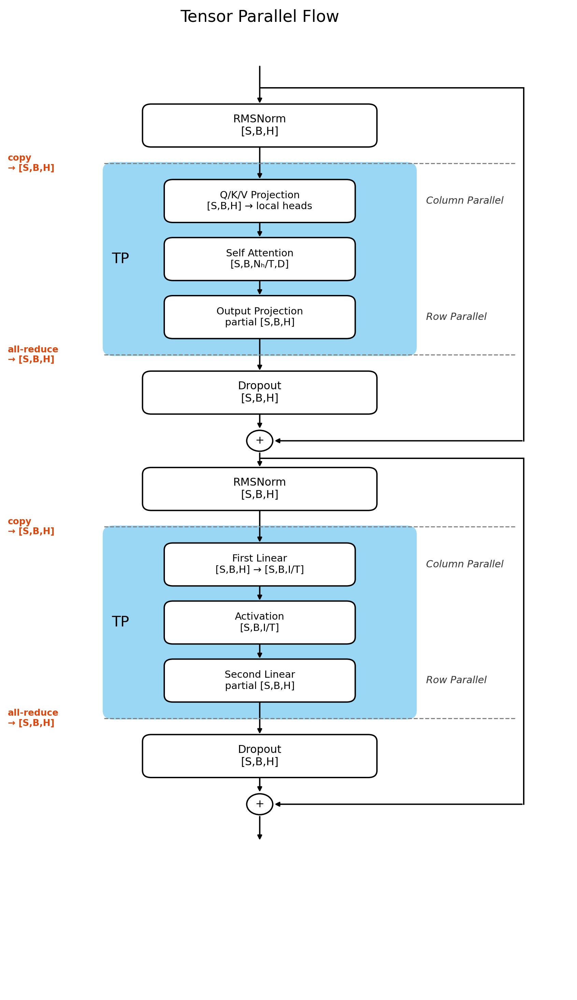
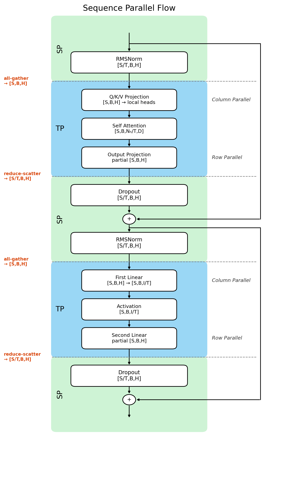

# Sequence Parallelism：布局与梯度

## 为什么需要 Sequence Parallelism

TP 已经切分了 Attention heads 和 MLP intermediate dimension，但这并不意味着整个 Transformer block 的显存占用可以变为 $1/T$。Sequence Parallelism （SP）就是为了进一步降低显存占用而提出的。

先分析一下 Transformer block 中 两个 TP 区域之间的计算：

```{mermaid}
flowchart LR
    classDef tp fill:#5f3dc4,stroke:#3b2585,color:#ffffff,stroke-width:2px;
    classDef data fill:#1971c2,stroke:#0b4a85,color:#ffffff,stroke-width:1px;
    classDef local fill:#2b8a3e,stroke:#176329,color:#ffffff,stroke-width:1px;

    TP1["TP 区域 A<br/>输出经过 all-reduce"]:::tp

    subgraph BETWEEN["两个 TP 区域之间"]
        direction TB

        subgraph R0["rank 0"]
            H0["H0<br/>[S,B,H]"]:::data
            L0["RMSNorm<br/>Dropout<br/>residual add"]:::local
            H0 --> L0
        end

        subgraph R1["rank 1"]
            H1["H1<br/>[S,B,H]"]:::data
            L1["RMSNorm<br/>Dropout<br/>residual add"]:::local
            H1 --> L1
        end
    end

    TP2["TP 区域 B<br/>读取相同输入"]:::tp

    TP1 --> H0
    TP1 --> H1
    L0 --> TP2
    L1 --> TP2
```

图中的 $H_0$ 和 $H_1$ 是数值相同的两份完整 tensor。它们来自 All-reduce 后的 Row Parallel Linear 的输出：每个 rank 先产生一份完整 shape 的部分结果，

$$
P_t: [S, B, H]
$$

接着在离开并行区域时执行 all-reduce：

$$
Y=\sum_{t=0}^{T-1}P_t,
$$

于是每个 rank 都得到完整的 $Y$。但紧接着的 RMSNorm、Dropout 和 residual add 都是逐 token 操作，让所有 rank 保存并处理全部 $S$ 个 token 没有必要。是否可以让每个 rank 只负责一段互不重复的 sequence？

先不考虑具体使用哪种 collective 可以做到我们想要的结果，把离开 TP 区域和重新进入 TP 区域时的两次布局转换分别记为 $f$ 和 $g$。我们希望得到下面的数据流：

```{mermaid}
flowchart LR
    classDef tp fill:#5f3dc4,stroke:#3b2585,color:#ffffff,stroke-width:2px;
    classDef transform fill:#e8590c,stroke:#8a2e00,color:#ffffff,stroke-width:2px;
    classDef data fill:#1971c2,stroke:#0b4a85,color:#ffffff,stroke-width:1px;
    classDef local fill:#2b8a3e,stroke:#176329,color:#ffffff,stroke-width:1px;

    TP1["TP 区域 A"]:::tp
    F["f<br/>完整 → sequence shards"]:::transform

    subgraph SP["两个 TP 区域之间"]
        direction TB

        subgraph R0["rank 0"]
            S0["sequence shard 0<br/>[S/2,B,H]"]:::data
            L0["本地逐 token 操作"]:::local
            S0 --> L0
        end

        subgraph R1["rank 1"]
            S1["sequence shard 1<br/>[S/2,B,H]"]:::data
            L1["本地逐 token 操作"]:::local
            S1 --> L1
        end
    end

    G["g<br/>sequence shards → 完整"]:::transform
    TP2["TP 区域 B"]:::tp

    TP1 --> F
    F --> S0
    F --> S1
    L0 --> G
    L1 --> G
    G --> TP2
```

此时两个 rank 不再保存相同的完整 hidden states，而是各自处理一段 sequence。接下来从普通 TP 的 all-reduce 出发，推导 $f$ 和 $g$ 应该由什么通信操作实现。

## SP 如何拆分完整的 hidden states

要让每个 rank 只保留一段 sequence，最直接的做法是在 all-reduce 之后，再各自沿 sequence 维切分完整的 $Y$。但每个 rank 明明只需要 $1/T$ 的结果，却仍要先通信得到完整 tensor，再把其余部分丢掉。

那么能不能跳过"先合并、再手动切开"这条弯路，直接一步到位地让每个 rank 拿到自己该有的那一段？

### All-Reduce 可以拆成两个阶段

答案是可以。all-reduce 本身可以拆成两个阶段：

```python
all-reduce = reduce-scatter + all-gather
```

如果对这两个 collective 还不熟悉，可以先回看开头的 [Reduce-Scatter](tensor_parallel.qmd#collective-reduce-scatter) 和 [All-Gather](tensor_parallel.qmd#collective-all-gather)。

这个等式成立的关键是：all-reduce 的求和是逐元素进行的，只要所有 rank 按相同方式切分 $P_t$，就可以先分别求出最终结果的各个 block，再把这些已经求和的 block 拼接起来。先以两个 rank 为例，沿 sequence 维把 $P_0$、$P_1$ 分成上下两块：

$$
P_0=
\begin{bmatrix}
P_0^{(0)}\cr
P_0^{(1)}
\end{bmatrix},
\qquad
P_1=
\begin{bmatrix}
P_1^{(0)}\cr
P_1^{(1)}
\end{bmatrix}.
$$

Reduce-scatter 先对相同位置的 block 求和，再把不同 block 留在不同 rank：

$$
\begin{aligned}
\text{rank 0}:&\quad Y^{(0)}=P_0^{(0)}+P_1^{(0)},\cr
\text{rank 1}:&\quad Y^{(1)}=P_0^{(1)}+P_1^{(1)}.
\end{aligned}
$$

随后执行 all-gather，两个 rank 都得到：

$$
Y=
\begin{bmatrix}
Y^{(0)}\cr
Y^{(1)}
\end{bmatrix}
=P_0+P_1,
$$

这与直接对 $P_0$、$P_1$ 执行 all-reduce 完全相同。推广到 $T$ 个 rank，把每个 $P_t$ 沿 sequence 维切成 $T$ 块：

$$
P_t=
\begin{bmatrix}
P_t^{(0)}\cr
P_t^{(1)}\cr
\vdots\cr
P_t^{(T-1)}
\end{bmatrix},
\qquad
Y^{(j)}=\sum_{t=0}^{T-1}P_t^{(j)}.
$$

Reduce-scatter 结束后，rank $j$ 持有 $Y^{(j)}$，shape 为 `[S/T,B,H]`：每个 rank 只拿到自己该负责的那一段 sequence，不再是一份完整拷贝。

### 完整数据流：本地计算插入两个阶段之间

既然 reduce-scatter 结束后每个 rank 已经拿到了自己的 sequence shard，两个 TP 区域之间的 RMSNorm、Dropout 和 residual add 就可以直接在这个 shard 上进行。下面把这些逐 token 的本地操作合记为 $f$：

```{mermaid}
flowchart LR
    classDef tp fill:#5f3dc4,stroke:#3b2585,color:#ffffff,stroke-width:2px;
    classDef comm fill:#e8590c,stroke:#8a2e00,color:#ffffff,stroke-width:2px;
    classDef data fill:#1971c2,stroke:#0b4a85,color:#ffffff,stroke-width:1px;
    classDef local fill:#2b8a3e,stroke:#176329,color:#ffffff,stroke-width:1px;

    subgraph TP1["TP 区域 A：Row Parallel"]
        direction TB

        subgraph A0["rank 0"]
            P0["P₀<br/>[P₀⁽⁰⁾ ; P₀⁽¹⁾]"]:::tp
        end

        subgraph A1["rank 1"]
            P1["P₁<br/>[P₁⁽⁰⁾ ; P₁⁽¹⁾]"]:::tp
        end
    end

    RS["reduce-scatter"]:::comm

    subgraph SP["SP 区域：沿 sequence 分工"]
        direction TB

        subgraph R0["rank 0"]
            S0["Y⁽⁰⁾ = P₀⁽⁰⁾ + P₁⁽⁰⁾<br/>[S/2,B,H]"]:::data
            L0["RMSNorm<br/>Dropout<br/>residual add"]:::local
            O0["local output<br/>f(Y⁽⁰⁾)"]:::data
            S0 --> L0 --> O0
        end

        subgraph R1["rank 1"]
            S1["Y⁽¹⁾ = P₀⁽¹⁾ + P₁⁽¹⁾<br/>[S/2,B,H]"]:::data
            L1["RMSNorm<br/>Dropout<br/>residual add"]:::local
            O1["local output<br/>f(Y⁽¹⁾)"]:::data
            S1 --> L1 --> O1
        end
    end

    AG["all-gather"]:::comm

    subgraph TP2["进入下一个 TP 区域"]
        direction TB

        subgraph T0["rank 0"]
            F0["full hidden states<br/>[f(Y⁽⁰⁾) ; f(Y⁽¹⁾)]"]:::data
            C0["Column Parallel<br/>weight shard 0"]:::tp
            F0 --> C0
        end

        subgraph T1["rank 1"]
            F1["full hidden states<br/>[f(Y⁽⁰⁾) ; f(Y⁽¹⁾)]"]:::data
            C1["Column Parallel<br/>weight shard 1"]:::tp
            F1 --> C1
        end
    end

    P0 --> RS
    P1 --> RS
    RS --> S0
    RS --> S1
    O0 --> AG
    O1 --> AG
    AG --> F0
    AG --> F1
```

通过 SP，两个 TP 区域之间的逐 token 计算被放到了不同 rank 上：reduce-scatter 交出分片、本地算完 $f$、all-gather 拼回完整序列，衔接下一个 TP 区域的 Column Parallel。

### 通信开销是否因此增加？

那么代价是什么呢？把一次 all-reduce 拆成两次 collective 会不会增加通信开销？
这里用 $T=4$ 个 rank 完整走一遍 ring all-reduce 的流程。

把每个 rank 手上的 $P_t$ 沿 sequence 维切成 4 块，用字母区分"最终归哪个 rank"、下标区分"最初来自哪个 rank"：

| Rank | 初始持有的 4 个 block |
|---|---|
| R0 | a0, b0, c0, d0 |
| R1 | a1, b1, c1, d1 |
| R2 | a2, b2, c2, d2 |
| R3 | a3, b3, c3, d3 |

4 个 rank 围成一个环：R0 → R1 → R2 → R3 → R0。目标是让 R0 拿到完整的 "a" 块（$a_0+a_1+a_2+a_3$），R1 拿到完整的 "b"，R2 拿到完整的 "c"，R3 拿到完整的 "d"。

规则很简单：**每一步，每个 rank 把自己当前"活跃"的那一格发给下一个 rank，对方收到后加到自己那一列上**。第一轮的"活跃格"就是各自的初始值。发出去的格子用"–"标记，之后不用再管：

| Rank | a | b | c | d |
|---|---|---|---|---|
| R0 | a0 | b0 | c0+c3 | – |
| R1 | – | b1 | c1 | d0+d1 |
| R2 | a1+a2 | – | c2 | d2 |
| R3 | a3 | b2+b3 | – | d3 |

同样的规则再走一轮：

| Rank | a | b | c | d |
|---|---|---|---|---|
| R0 | a0 | b0+b2+b3 | – | – |
| R1 | – | b1 | c0+c1+c3 | – |
| R2 | – | – | c2 | d0+d1+d2 |
| R3 | a1+a2+a3 | – | – | d3 |

再走一轮，每一列刚好凑齐 4 个 rank 的贡献：

| Rank | a | b | c | d |
|---|---|---|---|---|
| R0 | **a0+a1+a2+a3** | – | – | – |
| R1 | – | **b0+b1+b2+b3** | – | – |
| R2 | – | – | **c0+c1+c2+c3** | – |
| R3 | – | – | – | **d0+d1+d2+d3** |

3 步之后，4 个 rank 各自恰好持有一块完整求和的结果，这正是 reduce-scatter 的定义。
每一步 4 条链路都在同时传输，每条链路每步只搬运一个 $N/4$ 大小的 block（$N=SBH$），
因此每个 rank 总共发送 $3\times N/4=(T-1)N/T$（$T=4$）。

推广到任意 $T$：环上 $T$ 条链路、跑 $T-1$ 步，每步每条链路传一个 $N/T$ 的 block，总发送量是 $\dfrac{T-1}{T}N$。

All-Gather 沿用同一个环，只是这次传的是已经算完的结果，不需要再做加法：R0 把完整的 "a" 块转发给 R1、R1 转发给 R2，其余同理。同样走 3 步，通信量同样是 $\dfrac{T-1}{T}N$。

| 操作 | 每个 rank 发送量 |
|---|---:|
| reduce-scatter | $\dfrac{T-1}{T}N$ |
| all-gather | $\dfrac{T-1}{T}N$ |
| ring all-reduce（两阶段之和） | $2\dfrac{T-1}{T}N$ |

拆分前后总共都是 $2(T-1)$ 轮、$2(T-1)N/T$ 个元素，通信量是一样的。

所以"先环形传播求和，再环形传播广播"本来就是 ring all-reduce 内部真实的两个阶段。
SP把算法本来就存在的这个中间点暴露出来，插入可以本地计算的 $f$，去掉了 rank 间重复的计算：

**但有个前提**：这个推导假设走的是大 tensor 常见的 ring / bandwidth-optimal 实现。
真实开销还有一层没覆盖：拆成两次独立 collective，意味着多一次 kernel launch 和同步点，这部分延迟和 tensor 大小无关，是固定成本。

### 落到实现中的 Tensor Layout {#sec-sp-layout}

设 TP size 为 $T$。Reduce-scatter 沿 sequence 维分发结果后，rank $t$ 持有：

```python
[S/T, B, H]
```

SP 复用原来的 TP group。同一组 rank 在 Attention 和 MLP 内按 hidden dimension 协作，在两个 TP 区域之间则按 sequence dimension 分工。当前实现采用连续等分，因此要求：

```python
S % T == 0
```

`TPContext` 使用下面的字段控制是否在 TP 区域之间保留 sequence-sharded layout：

```python
sequence_parallel: bool = False
```

一个 Transformer block 中的 tensor layout 因此变为：

| 区域 | Tensor layout | 本地工作 |
|---|---|---|
| Norm / Dropout / Residual | `[S/T,B,H]` | 每个 rank 处理不同 token |
| Column Parallel Linear | 输入恢复为 `[S,B,H]` | 每个 rank 计算不同输出 shard |
| Row Parallel Linear 输出 | `[S/T,B,H]` | reduce-scatter 后回到 sequence shard |

## SP 如何在两种 Tensor Layout 之间切换

到这里，SP forward 需要的两种布局已经出现：

```python
TP 区域内:                     [S, B, H]
TP 区域之间（也就是 SP 区域）:   [S/T, B, H]
```

训练时还必须为每个布局变换定义对应的 backward，否则 forward 的 shape 即使正确，梯度也无法回到原来的数据分布。

这里有三类性质不同的切换，值得先分清楚：

```text
一次性入口：模型最开始的 Split
        只发生一次，把完整 sequence Embedding 第一次切成 shard，送进第一个 TP 区域

反复发生：All-Gather 与 Reduce-Scatter
        每个 TP 区域进出时都会用到的一对操作

一次性出口：模型最后进入 LM Head 前的 All-Gather
        只发生一次，把 SP shard 重新拼回完整 sequence，
        喂给在 rank 复制的 lm_head
```

和 TP 里那对 `CopyToModelParallelRegion` / `ReduceFromModelParallelRegion` 类似，这里的 all-gather 和 reduce-scatter 也是对偶的一对：一个的 forward 恰好是另一个的 backward。

| 发生场景 | Forward | Backward |
|---|---|---|
| 一次（模型入口） | split | all-gather |
| 每个 TP 区域入口（反复） | all-gather | reduce-scatter |
| 每个 TP 区域出口（反复） | reduce-scatter | all-gather |
| 一次（模型出口，进 LM Head） | all-gather | split |

同一个 All-Gather 在表里出现了两次、backward 却不一样，@sec-sp-enter-tp 和 @sec-sp-lm-head 会分别解释这两种 backward 各自成立的原因。

这些算子位于：

```python
model/tensor_parallel_mappings.py
```

### 一次性的入口：本地切分 {#sec-sp-entry}

Embedding 输出最初是完整的 `[S,B,H]`，而且每个 TP rank 都已经拥有相同的数据。为了让后续 block 从一开始就工作在 SP 布局上，每个 rank 只需根据自己的 `tp_rank`，在本地留下对应的 sequence shard：

```text
rank 0: [a,b,c,d] -> [a,b]
rank 1: [a,b,c,d] -> [c,d]
```

```python
forward:
  [S,B,H] -> split -> [S/T,B,H]

backward:
  [S/T,B,H] -> all-gather -> [S,B,H]
```

这里没有 rank 之间的数据传输。源码中的 autograd 类虽然名为 `ScatterToSequenceParallelRegion`，但它的 forward 只是索引和 `contiguous`；真正的跨 rank 通信发生在 backward 的 All-Gather。

求梯度时，embedding 权重的梯度需要看到完整 sequence 上的激活梯度，而每个 rank 的梯度只来自一个 sequence shard，
所以 backward 必须先把各 rank 手上的 sequence shard 梯度 `all-gather` 回完整形状，再往回传。


### 反复出现的循环（一）：All-Gather 进入 TP 区域 {#sec-sp-enter-tp}

进入 Column Parallel Linear 时，因为计算需要完整的输入，所以第一步必须把按 Sequence 切片的数据拼完整：

```python
[S/T, B, H] -> All-Gather -> [S, B, H]

```

#### 为什么 Backward 一定是 Reduce-Scatter？

我们用 TP size = 2 的例子直观地推一下（以 Rank 0 原来持有的 sequence shard $X^{(0)}$ 为例）：

1. **前向广播**：All-gather 拼出完整 $X$ 后，Rank 0 和 Rank 1 都拿到了包含 $X^{(0)}$ 的完整数据，各自过自己的 weight shard（$W_0$ 和 $W_1$）。
2. **两边都有梯度**：到了 Backward，因为 $X^{(0)}$ 既参与了 $W_0$ 的计算，也参与了 $W_1$ 的计算，所以两个 rank 都会算出一份针对 $X^{(0)}$ 的梯度（$dX_0^{(0)}$ 和 $dX_1^{(0)}$）。
3. **求和并归位**：根据链式法则，数据源头 $X^{(0)}$ 的最终梯度必须是两边叠加的结果：

$$dX^{(0)} = dX_0^{(0)} + dX_1^{(0)}$$


Reduce-Scatter 在求和的同时，只把 $X^{(0)}$ 对应的结果交还给 Rank 0；其他 sequence shard 的完整梯度则返回各自所属的 rank。

所以，这个 All-Gather 的 backward **必须且只能是 Reduce-Scatter**。

```{mermaid}
flowchart TB
    classDef rank0 fill:#1c7ed6,stroke:#1864ab,color:#ffffff,stroke-width:1px;
    classDef rank1 fill:#d9480f,stroke:#b5370f,color:#ffffff,stroke-width:1px;
    classDef comm fill:#f59f00,stroke:#d9480f,color:#ffffff,stroke-width:2px;

    %% 输入节点（左右对称）
    X0["Rank 0 输入<br/>Sequence Shard X⁽⁰⁾"]:::rank0
    X1["Rank 1 输入<br/>Sequence Shard X⁽¹⁾"]:::rank1

    %% 1. 中间 All-Gather 节点
    AG["All-Gather 通信<br/>拼接得到完整 X = [X⁽⁰⁾, X⁽¹⁾]"]:::comm

    %% 2. 前向计算节点
    W0["Rank 0 计算<br/>Column Parallel W₀"]:::rank0
    W1["Rank 1 计算<br/>Column Parallel W₁"]:::rank1

    %% 3. 反向梯度节点
    dX0["Rank 0 局部梯度<br/>dX₀ = [dX₀⁽⁰⁾, dX₀⁽¹⁾]"]:::rank0
    dX1["Rank 1 局部梯度<br/>dX₁ = [dX₁⁽⁰⁾, dX₁⁽¹⁾]"]:::rank1

    %% 4. 中间 Reduce-Scatter 节点
    RS["Reduce-Scatter 通信<br/>(梯度求和 + shard 归位)"]:::comm

    %% 5. 最终归位梯度
    Out0["Rank 0 领回完整梯度<br/>dX⁽⁰⁾ = dX₀⁽⁰⁾ + dX₁⁽⁰⁾"]:::rank0
    Out1["Rank 1 领回完整梯度<br/>dX⁽¹⁾ = dX₀⁽¹⁾ + dX₁⁽¹⁾"]:::rank1

    %% Forward 数据流
    X0 --> AG
    X1 --> AG
    AG --> W0
    AG --> W1

    %% Forward 到 Backward 的过渡
    W0 -.-|Backward| dX0
    W1 -.-|Backward| dX1

    %% Backward 数据流
    dX0 --> RS
    dX1 --> RS
    RS --> Out0
    RS --> Out1

```

**注意**：同一个 All-Gather 在模型最后进入 LM head 时还会再出现一次，但那次下游不是分片计算，backward 也就不能再用 Reduce-Scatter——具体原因见 @sec-sp-lm-head。
代码里是用这个显式的开关来区分语义的：
```python
tensor_parallel_output_grad: bool
```

### 反复出现的循环（二）：Reduce-Scatter 离开 TP 区域 {#sec-sp-leave-tp}

Row Parallel Linear 恰好是个镜像对称的过程：每个 rank 算出的都是完整 sequence 上的部分结果（partial result）：

```python
P_t: [S, B, H]

```

这里通过一次 Reduce-Scatter，刚好把**跨卡求和**和**按 sequence 切分**两件事一次性做完，完美退出 TP 区域：

```python
forward:
  partial [S,B,H] -> reduce-scatter -> [S/T,B,H]

backward:
  [S/T,B,H]       -> all-gather     -> [S,B,H]

```

#### 再看 TP size = 2 的反向逻辑

1. **前向求和切分**：前向传播做的是 $P = P_0 + P_1$，然后切分成 Sequence Shard 分发给各个 Rank。
2. **反向拼回完整 Sequence**：到了 Backward，下游传回来的梯度 $dY^{(0)}$ 和 $dY^{(1)}$ 都只有 `[S/T, B, H]`。要想算前向的梯度，必须先通过一次 **All-Gather** 把完整 sequence 上的梯度 $dP$（`[S, B, H]`）给拼出来。
3. **加法节点的反向**：因为前向是 $P = P_0 + P_1$（标准的加法节点），按照求导法则，加法节点的梯度是直接复制（Copy）给每一个输入项。所以拼出来的完整梯度 $dP$，Rank 0 和 Rank 1 **各自要原封不动地拿走一份**（$dP_0 = dP_1 = dP$），再去更新各自的 Row Parallel 权重。

```{mermaid}
flowchart TB
    classDef rank0 fill:#1c7ed6,stroke:#1864ab,color:#ffffff,stroke-width:1px;
    classDef rank1 fill:#d9480f,stroke:#b5370f,color:#ffffff,stroke-width:1px;
    classDef comm fill:#f59f00,stroke:#d9480f,color:#ffffff,stroke-width:2px;
    classDef logic fill:#2b8a3e,stroke:#176329,color:#ffffff,stroke-width:1px;

    %% 1. 前向计算 (Row Parallel Partial 结果)
    P0["Rank 0 局部结果 P₀<br/>[S, B, H]"]:::rank0
    P1["Rank 1 局部结果 P₁<br/>[S, B, H]"]:::rank1

    %% 2. 前向 Reduce-Scatter
    RS["Reduce-Scatter 通信<br/>(求和 P = P₀ + P₁ + 保留对应 shard)"]:::comm

    %% 3. 前向输出 (回到 Sequence Parallel)
    Y0["Rank 0 输出 Y⁽⁰⁾<br/>[S/T, B, H]"]:::rank0
    Y1["Rank 1 输出 Y⁽¹⁾<br/>[S/T, B, H]"]:::rank1

    %% 4. 反向输入 (下游梯度)
    dY0["Rank 0 传入梯度 dY⁽⁰⁾<br/>[S/T, B, H]"]:::rank0
    dY1["Rank 1 传入梯度 dY⁽¹⁾<br/>[S/T, B, H]"]:::rank1

    %% 5. 反向 All-Gather
    AG["All-Gather 通信<br/>(拼接还原完整梯度 dP)"]:::comm

    %% 6. 梯度的加法分配逻辑
    dP_COPY["因前向 P = P₀ + P₁<br/>加法节点反向：梯度原样复制<br/>dP₀ = dP, dP₁ = dP"]:::logic

    %% 7. 两个 Rank 各拿一份 dP
    dP0["Rank 0 拿到完整梯度 dP₀<br/>[S, B, H]"]:::rank0
    dP1["Rank 1 拿到完整梯度 dP₁<br/>[S, B, H]"]:::rank1

    %% Forward 数据流
    P0 --> RS
    P1 --> RS
    RS --> Y0
    RS --> Y1

    %% Forward 到 Backward 的过渡
    Y0 -. Backward .-> dY0
    Y1 -. Backward .-> dY1

    %% Backward 数据流
    dY0 --> AG
    dY1 --> AG
    AG --> dP_COPY
    dP_COPY --> dP0
    dP_COPY --> dP1

```

### 完整循环：All-Gather 与 Reduce-Scatter 如何配合

@sec-sp-enter-tp 和 @sec-sp-leave-tp 合在一起，就是每个 TP 区域进出时发生的数据 layout 变化的循环：

```{mermaid}
flowchart LR
    classDef comm fill:#e8590c,stroke:#8a2e00,color:#ffffff,stroke-width:2px;
    classDef data fill:#1971c2,stroke:#0b4a85,color:#ffffff,stroke-width:1px;

    SP0["rank 0<br/>SP shard [S/2,B,H]"]:::data
    SP1["rank 1<br/>SP shard [S/2,B,H]"]:::data
    AG["all-gather"]:::comm
    TP0["rank 0<br/>full sequence + weight shard 0"]:::data
    TP1["rank 1<br/>full sequence + weight shard 1"]:::data
    RS["reduce-scatter"]:::comm
    OUT0["rank 0<br/>output shard [S/2,B,H]"]:::data
    OUT1["rank 1<br/>output shard [S/2,B,H]"]:::data

    SP0 --> AG
    SP1 --> AG
    AG --> TP0
    AG --> TP1
    TP0 --> RS
    TP1 --> RS
    RS --> OUT0
    RS --> OUT1
```

Rank 顺序决定每个 rank 持有哪一段连续 sequence。所有 collective 必须使用相同 TP group，并提前满足相同的 shape、dtype 和 rank 顺序约定。

### 一次性的出口：All-Gather 进入 LM Head {#sec-sp-lm-head}

和 @sec-sp-entry 的入口本地切分相对，模型最后也有一次只发生一次的布局切换。

当最后一层 Transformer Block 算完，需要把 hidden 交给 lm head 去预测下一个词。
最后一个 Row Parallel 输出的 hidden states 先 all-gather 恢复成完整的 `[S,B,H]`，
紧接着喂给的是**没有切分、在所有 TP rank 间完全复制**的 lm_head 权重：

```python
forward:
  [S/T,B,H] -> all-gather -> [S,B,H]
```

这一步的 all-gather 和 @sec-sp-enter-tp 中的 all-gather 长得一模一样，但下游完全不同：@sec-sp-enter-tp 的下游是"每个 rank 只算一部分"的 TP 分片计算，这里的下游是"每个 rank 算一模一样的一整份"——lm_head 权重是复制的，输入（刚 all-gather 出来的完整 hidden states）、labels、loss scale 在所有 rank 上也都相同。于是每个 rank 独立算出来的完整 logits、loss，乃至这一步的梯度 `dX`，也必然完全相同：每个 rank 手里已经是完整的梯度。

```python
backward: split
```

既然 $T$ 个 rank 算出的 `dX` 其实是同一份完整梯度的 $T$ 份重复，就不需要"汇总"，只需要每个 rank 从这份大家都有的完整梯度里，切出（split）自己那一段 sequence shard 就行。
如果误用 reduce-scatter，会把这份本来就正确、完整的梯度先加 $T$ 次再切，等于错误地放大了 $T$ 倍。
这正是 @sec-sp-enter-tp 提到的 `tensor_parallel_output_grad` 开关要区分的另一半语义。

把 @sec-sp-entry 和 @sec-sp-lm-head 放在一起看，SP 只在模型内部生效：外部仍然是 `input_ids [B,S]` 输入、logits `[B,S,V]` 输出，调用方不需要感知内部 sequence sharding 的存在。

## 复制参数的梯度同步逻辑

在张量并行（TP）中，`ColumnParallelLinear` 和 `RowParallelLinear` 的权重被切分到各个 Rank 上。得益于 TP 内部配套的通信原语（All-Reduce / Reduce-Scatter），这些切分参数的梯度能够被正确聚合，无需我们额外操心。

但模型中还存在另一类参数：它们在每个 TP Rank 上都**完整复制**了一份，例如 LayerNorm 的权重、Embedding 矩阵、LM Head 等。一个很自然的直觉是：“既然是复制参数，那把各个 Rank 的梯度 All-Reduce 求和一下，总归没错吧？”

**然而，这个直觉并不总是对的。** 如果盲目对**所有**复制参数执行 All-Reduce，有时会导致梯度被放大数倍（并行度倍数），而有些复制参数如果漏掉了 All-Reduce，各 Rank 的参数在更新后会发生分叉，丧失并行训练的正确性。

那么，判断一个复制参数到底“该不该同步”的核心依据是什么？

### 判断的核心标准

判断是否需要执行 `All-Reduce Sum`，只看一点：

> **在反向传播计算该参数的梯度时，各个 Rank 拿到的激活梯度（Activation Gradient）是“全量的”，还是“被切分的/局部的”？**
>
> - **局部梯度**（每个 Rank 只贡献了部分 Token 或部分 Head） → **必须 All-Reduce Sum**。否则各 Rank 的权重在一次更新后就会分叉。
> - **全局相同梯度**（每个 Rank 都拿到了完整相同的激活梯度） → **绝对不能 All-Reduce**。否则梯度会被错误放大 $T$ 倍（$T$ 为并行度）。

---

### 需同步参数分类

依据上述标准，复制参数可划分为以下三类：

```{mermaid}
flowchart TD
    A[复制参数<br>Replicated Parameters] --> B{反向传播时<br>激活梯度是？}

    B -->|全局完整梯度| C[LM Head / Embedding]
    B -->|局部梯度（序列切分）| D[SP 影响参数<br>LayerNorm / RowParallel Bias / Final Norm]
    B -->|局部梯度（Head 切分）| E[TP 影响参数<br>Q-Norm / K-Norm]

    C --> F[不需要 All-Reduce<br>梯度天然全局一致]
    D --> G[需要 All-Reduce Sum<br>各 Rank 只算部分 Token 贡献]
    E --> H[需要 All-Reduce Sum<br>各 Rank 只算部分 Head 贡献]
```

#### 必须同步：受 SP 或 TP Head 切分影响的参数

这类参数在各 Rank 上虽然完整存在，但每个 Rank 在 Backward 时只计算了它的一部分贡献：

**SP 切分影响（Token 维度）**：

* **参数**：`input_layernorm.weight`、`post_attention_layernorm.weight`、`final_norm.weight`、`Row Parallel bias`
* **原因**：开启 SP 后，每个 Rank 在前向传播时只处理 `[S/T, B, H]` 的 Token 片段。反向传播时，每个 Rank 计算出的参数梯度**仅代表当前 Rank 负责的那部分 Token 的贡献**，因此必须通过 `All-Reduce Sum` 累加全局 Token 的梯度。


**TP 切分影响（Head 维度）**：

* **参数**：`q_norm.weight`、`k_norm.weight`
* **原因**：即便输入序列是完整的，TP 也会将 Attention Head 切分给不同 Rank（例如 Rank 0 算 Head 0~3，Rank 1 算 Head 4~7）。每个 Rank 算出的 Q/K Norm 梯度**仅包含了本地 Head 的贡献**，因此无论是否开启 SP，都必须在 TP Group 内做 `All-Reduce Sum`。

#### 无需同步：天然获得全局一致梯度的参数

这两类参数同样是完整复制在每个 Rank 上，但**绝对不能**执行 All-Reduce，否则会把梯度错误放大大模型并行度 $T$ 倍：

* **LM Head（显式拼接）**：
在进入 LM Head 前，前向传播已显式执行了 All-Gather，隐藏层状态被还原为完整的 `[S, B, H]`。所有 Rank 拿着**完全相同的输入**、**相同的参数**和**相同的 Labels** 进行独立计算，反向传播时天然得到**完全一模一样且完整**的 LM Head 梯度。
* **Embedding（隐式抵消）**：
前向传播时，每个 rank 都根据完整的 `input_ids` 计算出全量隐藏状态，随后在本地保留 `[S/T, B, H]` 的对应 shard，进入 TP 区域。
在反向传播时，**这个本地切分算子的 backward（即 All-Gather）会在梯度到达 Embedding 之前，将序列维度重新拼完整**。因此，Embedding 在反向传播时被动接收到了全量 Sequence 的激活梯度，算出的参数梯度天然就是全量且一致的。


当前实现通过在目标参数上注册 Hook 来完成梯度归约：

```python
parameter.register_hook(
    lambda grad: _reduce(grad, tp_group)
)
```

## 一个 SP Transformer Block 的 Tensor 生命周期 {#sec-sp-block-lifecycle}

@sec-sp-layout 已经概括了三类区域中的 tensor layout。现在把这些布局变化放回一个完整的 MiniMind Transformer block，观察 hidden states 如何依次经过 Attention、MLP 和两条 residual 路径。

仍以 $T=2$ 为例。TP 区域的输入和输出都保持：

```python
[S/2,B,H]
```

Attention 路径：

```python
sequence shard [S/2,B,H]
-> local input RMSNorm
-> all-gather full sequence
-> local Q/K/V heads
-> local Attention
-> Row Parallel o_proj partial output
-> reduce-scatter [S/2,B,H]
-> local residual add
```

MLP 路径：

```python
sequence shard [S/2,B,H]
-> local post-attention RMSNorm
-> all-gather full sequence
-> Column Parallel first Linear
-> local activation
-> Row Parallel second Linear partial output
-> reduce-scatter [S/2,B,H]
-> local residual add
```

::: {layout-ncol=2}





:::

上图对比了 TP 和 SP 在同一个 Transformer Block 中的 tensor 布局变化：

- **TP**：tensor 离开 TP 区域后，仍然是完整的 `[S, B, H]`，TP 区域之间计算完整序列。
- **TP + SP**：tensor 离开 TP 区域后，变成了 `[S/T, B, H]`，SP 区域之间计算不同的序列 shard，再次进入 TP 区域时通过 all-gather 拼回完整序列。

::: {.callout-note title="关于通信次数的说明"}
上图在 Attention 和 MLP 入口处各绘制了一次 [S/T, B, H] → [S, B, H] 的 All-Gather，这是为了展现 Hidden States 在逻辑上的布局切换。

在具体的代码实现中，All-Gather 并不是在进入子层前统一执行一次，而是在每一个 Column Parallel Linear 内部独立触发的。Attention 的 Q、K、V projection 各有一次，而普通的两层 MLP 只有第一层是 Column Parallel：

| 子层 | Forward all-gather | Forward reduce-scatter |
|---|---:|---:|
| Attention | 3 | 1 |
| 两层 MLP | 1 | 1 |
| 每个 block 合计 | 4 | 2 |

MiniMind 源码中的 SwigLU MLP 有两个 projection （gate_proj 和 up_proj），因此实际上会比这里的普通 MLP 再多一次 all-gather。
:::
