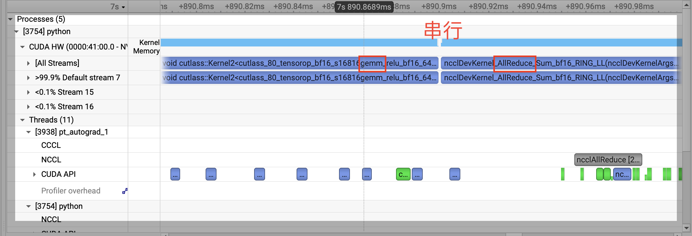
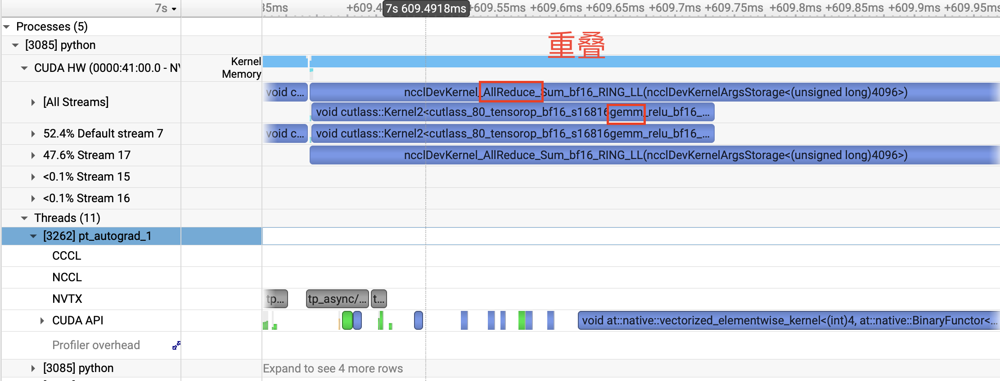

# Sequence Parallelism：显存边界、异步通信与重计算

## 基础 SP Benchmark {#sec-sp-benchmark}

SP 没有改变模型的数学语义，数值验证仍可沿用 @sec-tp-validation 的方法，只需增加 `--sequence_parallel`。这里直接回到 @sec-tp-benchmark 的相同配置，观察将 TP 区域之间的 hidden states 切成 sequence shards 后，显存和时间如何变化。

<details>
<summary>完整 benchmark 命令</summary>
```bash
python -m evaluation.parallel benchmark \
  --kind memory \
  --tp_size 2 \
  --pp_size 1 \
  -- \
  --modes ddp tp \
  --batch_policy fixed_per_rank \
  --num_hidden_layers 8 16 32 64 \
  --seq_len 2048 \
  --hidden_size 768 \
  --num_attention_heads 8 \
  --num_key_value_heads 4 \
  --vocab_size 6400 \
  --micro_batch_size 2 \
  --num_microbatches 1 \
  --dtype bfloat16 \
  --warmup_iters 2 \
  --benchmark_iters 5 \
  --sequence_parallel \
```
</details>

```{ojs}
//| echo: false
//| classes: no-code-copy

{
  const rows = [
    {layers: 8, tpMemory: 1509.53, spMemory: 1447.99, tpTime: 66.47, spTime: 74.53},
    {layers: 16, tpMemory: 2717.69, spMemory: 2608.19, tpTime: 129.90, spTime: 144.38},
    {layers: 32, tpMemory: 5129.40, spMemory: 4925.45, tpTime: 255.60, spTime: 284.55},
    {layers: 64, tpMemory: 9956.83, spMemory: 9560.83, tpTime: 502.83, spTime: 565.00}
  ].map(d => ({
    ...d,
    memorySaving: (1 - d.spMemory / d.tpMemory) * 100,
    timeIncrease: (d.spTime / d.tpTime - 1) * 100
  }))

  const chartWidth = Math.max(760, Math.min(width, 1100))
  const style = {background: "transparent", color: "currentColor", fontSize: "12px"}
  const layerDomain = ["8", "16", "32", "64"]
  const modeDomain = ["TP", "TP + SP"]

  const memoryData = rows.flatMap(d => [
    {layers: String(d.layers), mode: "TP", value: d.tpMemory, change: 0},
    {layers: String(d.layers), mode: "TP + SP", value: d.spMemory, change: d.memorySaving}
  ])

  const timeData = rows.flatMap(d => [
    {layers: String(d.layers), mode: "TP", value: d.tpTime, change: 0},
    {layers: String(d.layers), mode: "TP + SP", value: d.spTime, change: d.timeIncrease}
  ])

  const memoryChart = Plot.plot({
    width: chartWidth,
    height: 390,
    marginTop: 38,
    marginRight: 18,
    marginBottom: 46,
    marginLeft: 68,
    style,
    title: "Per-rank peak memory",
    x: {label: null, domain: modeDomain, axis: null},
    fx: {
      label: "Transformer layers",
      domain: layerDomain,
      axis: "bottom",
      tickPadding: 6,
      labelOffset: 27,
      padding: 0.12
    },
    y: {
      label: "Peak allocated memory (MiB)",
      domain: [0, 11000],
      grid: true,
      tickFormat: d => d.toLocaleString("en-US")
    },
    color: {
      domain: modeDomain,
      range: ["#495057", "#5f3dc4"],
      legend: true
    },
    marks: [
      Plot.barY(memoryData, {
        fx: "layers",
        x: "mode",
        y: "value",
        fill: "mode",
        insetLeft: 5,
        insetRight: 5
      }),
      Plot.text(memoryData.filter(d => d.mode === "TP"), {
        fx: "layers",
        x: "mode",
        y: "value",
        text: d => Math.round(d.value).toLocaleString("en-US"),
        dy: -9,
        fill: "#343a40"
      }),
      Plot.text(memoryData.filter(d => d.mode === "TP + SP"), {
        fx: "layers",
        x: "mode",
        y: "value",
        text: d => Math.round(d.value).toLocaleString("en-US"),
        dy: -24,
        fill: "#5f3dc4",
        fontWeight: 600
      }),
      Plot.text(memoryData.filter(d => d.mode === "TP + SP"), {
        fx: "layers",
        x: "mode",
        y: "value",
        text: d => `(-${d.change.toFixed(1)}%)`,
        dy: -9,
        fill: "#5f3dc4",
        fontWeight: 600
      }),
      Plot.ruleY([0])
    ]
  })
  memoryChart.style.margin = "0"

  const timeChart = Plot.plot({
    width: chartWidth,
    height: 390,
    marginTop: 38,
    marginRight: 18,
    marginBottom: 46,
    marginLeft: 62,
    style,
    title: "Step time",
    x: {label: null, domain: modeDomain, axis: null},
    fx: {
      label: "Transformer layers",
      domain: layerDomain,
      axis: "bottom",
      tickPadding: 6,
      labelOffset: 27,
      padding: 0.12
    },
    y: {label: "Step time (ms)", domain: [0, 620], grid: true},
    color: {
      domain: modeDomain,
      range: ["#495057", "#5f3dc4"],
      legend: true
    },
    marks: [
      Plot.barY(timeData, {
        fx: "layers",
        x: "mode",
        y: "value",
        fill: "mode",
        insetLeft: 5,
        insetRight: 5
      }),
      Plot.text(timeData.filter(d => d.mode === "TP"), {
        fx: "layers",
        x: "mode",
        y: "value",
        text: d => d.value.toFixed(1),
        dy: -9,
        fill: "#343a40"
      }),
      Plot.text(timeData.filter(d => d.mode === "TP + SP"), {
        fx: "layers",
        x: "mode",
        y: "value",
        text: d => d.value.toFixed(1),
        dy: -24,
        fill: "#5f3dc4",
        fontWeight: 600
      }),
      Plot.text(timeData.filter(d => d.mode === "TP + SP"), {
        fx: "layers",
        x: "mode",
        y: "value",
        text: d => `(+${d.change.toFixed(1)}%)`,
        dy: -9,
        fill: "#5f3dc4",
        fontWeight: 600
      }),
      Plot.ruleY([0])
    ]
  })
  timeChart.style.margin = "0"

  const grid = document.createElement("div")
  Object.assign(grid.style, {
    display: "grid",
    gridTemplateColumns: "minmax(760px, 1fr)",
    gap: "8px",
    minWidth: "760px",
    margin: "0"
  })
  grid.append(memoryChart, timeChart)

  const container = document.createElement("div")
  container.className = "benchmark-charts"
  container.style.overflowX = "auto"
  container.appendChild(grid)
  return container
}
```

基础 SP 的单卡峰值显存只比 TP only 低约 4%，远没有达到把所有 activation 都缩小到 $1/T$ 时可能产生的直觉收益；与此同时，额外的 all-gather 和 reduce-scatter 使 step time 增加了约 11%～12%。

这个结果说明，@sec-sp-block-lifecycle 中的 sequence-sharded layout 的确减少了 Norm、Dropout 和 residual 区域的重复 activation，但还有更大的 tensor 没有被这套布局覆盖。下一节将沿着 Column Parallel Linear 的 tensor 生命周期寻找它们。

## 为什么基础 SP 的显存收益有限 {#sec-sp-memory-limit}

基础 SP 已经具备正确的数值逻辑与语义，但它仅缩小了 **TP 区域边界处**（Norm、Dropout 和 Residual 路径）的 Activation。

在同步版本的 Column Parallel Linear 中，前向传播依然需要执行：

```python
full_x = gather_from_sequence_parallel_region(local_x, group)
output = F.linear(full_x, weight)
```

PyTorch Autograd 为了在反向传播（Backward）中计算权重的梯度：

$$dW = dY^T X$$

会保存 Gather 后的完整张量 `full_x: [S, B, H]`。因此，Sequence Shard 虽在 Norm、Dropout 和 Residual 区域生效，但一进入 Linear 计算，主要的 Activation 又恢复为完整 Sequence，并持续占用显存直至反向传播结束。

### Activation 理论减少量推导

根据 @sec-sp-layout 的分析，基础 SP 只缩小了 Norm、Dropout 和 Residual 区域的 Activation。我们可以手动估计一下基础 SP 带来的显存节省。

记一份 full-sequence BF16 tensor：`[S, B, H]` 的显存占用为：

$$F = 2 \text{ Bytes} \times S B H$$

#### 层内净显存变化

先看 RMSNorm。MiniMind 为了数值稳定性会先把输入转换为 FP32：

```python
return (weight * self.norm(x.float())).type_as(x)
```

因此 Autograd 会为 backward 保留两份主要的 FP32 `[S,B,H]` 中间量：`x.float()` 和 `self.norm(x.float())`。每份 FP32 tensor 占用 $2F$，因此每个 RMSNorm 主要保留 $4F$；每个 Block 有两个 RMSNorm，SP 将它们沿 sequence 切分后，理论节省：

$$
\Delta M_{\text{norm}}
=8F\left(1-\frac{1}{T}\right).
$$

但基础 SP 同时引入了新的开销。普通 TP 中，Q/K/V 的三个 Linear 共享一份完整 Attention 输入，gate/up 共享一份完整 MLP 输入，合计只有两份独立 storage：

$$M_{\text{TP,column input}}=2F.$$

基础 SP 将 all-gather 放在每个 Column Parallel Linear 内部，因此 Q/K/V 产生三份独立的 full input，gate/up 再产生两份，这些输入虽然内容一致，但是在各个 Linear 内部独立保存，共计 5 份：

$$M_{\text{SP,column input}}=5F.$$

这些 gather 输出需要保留到 backward 计算 $dW$，所以基础 SP 相对 TP 新增：

$$\Delta M_{\text{gather}}=5F-2F=3F.$$

两项合在一起，每个 Block 的净显存减少量约为：

$$
\Delta M_{\text{block}}
=8F\left(1-\frac{1}{T}\right)-3F.
$$

代入 @sec-sp-benchmark 的配置 $B=2,S=2048,H=768,T=2$，一份 full-sequence BF16 tensor 为 $F=6\text{ MiB}$，于是：

$$
\Delta M_{\text{block}}
=4F-3F
=F
=6\text{ MiB}.
$$

因此 $L$ 层共减少：

$$\Delta M_{\text{layer}}=6L\text{ MiB}.$$

#### 模型末端 RMSNorm 的显存节省

模型的末端还有一个 RMSNorm，这里在基础 SP 中也只接受 local sequence shard 的输入，因此节省的显存量为：

$$
\Delta M_{\text{final norm}}
=4F\left(1-\frac{1}{T}\right).
$$

带入 @sec-sp-benchmark 的配置，末端 RMSNorm 节省：

$$
\Delta M_{\text{final norm}} = 2F = 12\text{ MiB}.
$$

### 理论估算与实测对比

综合上述两部分，当前实现下基础 SP 节省的 Activation 总显存估算为：

$$\Delta M_{\text{estimated}} \approx 6L + 12\text{ MiB}$$

将该估算值与 @sec-sp-benchmark 中的实测显存差值进行对比：

| Layers ($L$) | 估算减少量 ($6L+12\text{ MiB}$) | 实测差值 ($\text{TP only} - \text{TP + SP}$) | 偏差 |
| --- | --- | --- | --- |
| **8** | 60 MiB | 61.54 MiB | +1.54 MiB |
| **16** | 108 MiB | 109.50 MiB | +1.50 MiB |
| **32** | 204 MiB | 203.95 MiB | -0.05 MiB |
| **64** | 396 MiB | 396.00 MiB | 0.00 MiB |

**结论**：理论估算与实测结果高度吻合。

这说明基础 SP 确实按 $1/T$ 缩小了 Norm 区域的 Activation，但 Column Parallel Linear 为 backward 保存的独立 full-sequence gather outputs 抵消了其中一部分收益。若要进一步降低显存占用，就需要引入重计算，改写 Linear 保存至 backward 的 Activation 结构。

## 如何避免保存 Full-Sequence Activation

@sec-sp-memory-limit 中的问题来自 autograd 跨越 forward/backward 保存了 `full_x`。
如果 forward 只保存 local shard，并在 backward 需要 $dW$ 时重新 all-gather，就能用额外通信换取 activation 显存；
同时，既然已经需要自己修改 Linear，我们还可以尝试把 dgrad 通信与 wgrad GEMM 重叠，减少通信带来的 overhead。

`LinearWithAsyncCommunication` 因此同时处理两个问题：

1. 普通 TP 中，让 dgrad all-reduce 尝试与 wgrad GEMM 重叠；
2. SP 中只保存 local sequence shard，在 backward 时重新构造完整 input。

对应的配置是：

```python
async_communication: bool = False
```

### 普通 TP：异步 dgrad all-reduce {#sec-tp-async}

Column Parallel Linear 的 backward 可以写成：

```python
1. 接收 dY_local（上层传来的局部梯度）
2. 计算本地 dgrad
3. 发起异步 All-Reduce，跨 TP Rank 累加 dgrad
4. 计算本地 wgrad：dW_local = X^T @ dY_local
5. 计算本地 bias 梯度
6. 等待 All-Reduce
7. 返回完整 dgrad 
```

### SP：只保存 local shard {#sec-sp-recompute}

SP forward：

```python
local_x [S/T,B,H]
-> all-gather full_x [S,B,H]
-> GEMM
-> autograd 只保存 local_x 和 weight
-> forward 结束后释放 full_x
```

SP backward：

```python
1. async all-gather local_x，重新构造 full_x
2. 计算 local dgrad
3. async reduce-scatter dgrad
4. wait all-gather
5. 使用 full_x 计算 wgrad
6. wait reduce-scatter
7. 返回 local sequence grad
```

```{mermaid}
flowchart LR
    classDef comm fill:#e8590c,stroke:#8a2e00,color:#ffffff,stroke-width:2px;
    classDef data fill:#1971c2,stroke:#0b4a85,color:#ffffff,stroke-width:1px;

    subgraph BASIC["基础 SP"]
        direction TB
        L1["local shard"]:::data --> G1["forward all-gather"]:::comm
        G1 --> F1["Linear"]:::data
        F1 --> S1["保存 full input 到 backward"]:::data
    end

    subgraph RECOMPUTE["SP Recompute"]
        direction TB
        L2["local shard"]:::data --> G2["forward all-gather"]:::comm
        G2 --> F2["Linear"]:::data
        F2 --> S2["只保存 local shard"]:::data
        S2 --> G3["backward all-gather"]:::comm
        G3 --> B2["计算 wgrad / dgrad"]:::data
    end

    BASIC ~~~ RECOMPUTE
```

这是一项明确的用时间换空间，使用额外的通信来减少需要储存的 tensor 尺寸。

```python
减少：跨 forward/backward 保存的 full input
增加：backward 中重建 full input 的 all-gather
```

按照两层 MLP 抽象，每个 block 的 SP backward 通信次数为：

| 路径 | Column Parallel backward | Row Parallel backward |
|---|---|---|
| 基础 SP | 4 次 reduce-scatter | 2 次 all-gather |
| SP Recompute | 4 次重建 input 的 all-gather + 4 次 dgrad reduce-scatter | 2 次 all-gather |

MiniMind 源码中的额外 MLP projection 会让上述 Column Parallel 通信次数从 4 变为 5。融合投影可以减少通信次数，但会改变参数布局和 checkpoint 转换逻辑，当前不考虑这种优化。

TP+SP 的数值验证仍沿用 @sec-tp-validation 的方法，比较 forward logits/loss、关键参数梯度和多步 AdamW；这里不再重复展开相同的验证步骤。

## Async 与 Recompute Benchmark {#sec-async-recompute-benchmark}

@sec-tp-async 和 @sec-sp-recompute 对 `LinearWithAsyncCommunication` 提出了两个目标：普通 TP 用通信—计算重叠缩短时间，SP 则通过 backward 重建 full-sequence input 进一步节省显存。这一节将对两者进行 benchmark，验证它们的实际收益。

### 普通 TP：Async 能隐藏多少通信

先运行同步 TP 基线：

<details>
<summary>TP 基线 benchmark 命令</summary>
```bash
CUDA_DEVICE_MAX_CONNECTIONS=1 python -m evaluation.parallel benchmark \
  --kind memory \
  --tp_size 2 \
  --pp_size 1 \
  -- \
  --modes ddp tp \
  --batch_policy fixed_per_rank \
  --num_hidden_layers 2 4 8 16 32 \
  --seq_len 2048 \
  --hidden_size 768 \
  --num_attention_heads 8 \
  --num_key_value_heads 4 \
  --vocab_size 6400 \
  --micro_batch_size 4 \
  --num_microbatches 1 \
  --dtype bfloat16 \
  --warmup_iters 10 \
  --benchmark_iters 5
```

异步版本保持其余参数不变，只增加：

```bash
--async_communication
```
</details>

| Layers | 同步 TP | Async TP | Step time 下降 |
|---:|---:|---:|---:|
| 2 | 35.82 ms | 35.27 ms | 1.5% |
| 4 | 66.55 ms | 65.39 ms | 1.7% |
| 8 | 127.84 ms | 125.64 ms | 1.7% |
| 16 | 249.51 ms | 245.38 ms | 1.7% |
| 32 | 493.13 ms | 484.62 ms | 1.7% |

Async 不改变保存的 tensor，因此两组实验的峰值显存完全相同。Step time 的下降也不大，在本次配置中约为 1.5%～1.7%。但端到端收益小，并不能直接说明 overlap 没有发生；还需要回到 @sec-tp-async 的目标，观察 dgrad all-reduce 与 wgrad GEMM 在 GPU 时间线上是否真正交叠。

同步实现中，all-reduce 与 GEMM 串行执行：

{fig-alt="同步 TP 的 GPU 时间线，NCCL all-reduce 与 GEMM 位于同一 stream，没有时间重叠"}

异步实现将 NCCL all-reduce 与 wgrad GEMM 重叠：

{fig-alt="异步 TP 的 GPU 时间线，NCCL all-reduce 与另一个 CUDA stream 上的 GEMM 在时间轴上重叠"}

因此，这里的实现机制是生效的，但它只隐藏 Columnn Parallel 的 all-reduce 与 wgrad GEMM 相交的部分，其他同步 collective的开销不会消失，最终只获得约 1.7% 的端到端改善。

### SP：Recompute 的时间—显存交换 {#sec-sp-recompute-result}

@sec-sp-recompute 中的 SP Recompute 不再让 Column Parallel Linear 跨越 forward/backward 保存 full-sequence input，而是在 backward 中重新 all-gather。下面比较基础 SP 与这一实现的峰值显存和 step time。

需要说明的是，本章所谓的“基础 SP”只是为了分步解释 tensor layout 而构造的中间版本，并不是 Megatron 中实际使用的一种独立 SP 配置。Megatron 所说的 Sequence Parallelism 已经包含只保存 local shard、在 backward 中重新 all-gather input 的过程；对应到 MiniMind，就是本节测试的 `sequence_parallel + async_communication`，也就是 `TP + SP + Async`。因此下面的基础 SP 数据只用于拆解这一步优化，最终应关注 Recompute 版本。

先运行基础 SP：

<details>
<summary>基础 SP benchmark 命令</summary>
```bash
CUDA_DEVICE_MAX_CONNECTIONS=1 python -m evaluation.parallel benchmark \
  --kind memory \
  --tp_size 2 \
  --pp_size 1 \
  -- \
  --modes ddp tp \
  --batch_policy fixed_per_rank \
  --num_hidden_layers 2 4 8 16 32 \
  --seq_len 2048 \
  --hidden_size 768 \
  --num_attention_heads 8 \
  --num_key_value_heads 4 \
  --vocab_size 6400 \
  --micro_batch_size 4 \
  --num_microbatches 1 \
  --dtype bfloat16 \
  --warmup_iters 10 \
  --benchmark_iters 5 \
  --sequence_parallel
```

Recompute 版本保持其余参数不变，只增加：

```bash
--async_communication
```
</details>

当前实现用同一个开关同时启用 SP Recompute 和 backward 异步通信，因此这组实验不能把两者的时间影响单独拆开。显存变化来自只保存 local shard；step time 则同时包含额外 backward all-gather，以及 dgrad collective 与 wgrad GEMM 重叠后的净结果。

```{ojs}
//| echo: false
//| classes: no-code-copy

{
  const rows = [
    {layers: 2, tpMemory: 1097.94, baseMemory: 1052.08, recomputeMemory: 956.73, tpTime: 35.82, baseTime: 40.46, recomputeTime: 48.70},
    {layers: 4, tpMemory: 1658.71, baseMemory: 1588.95, recomputeMemory: 1398.82, tpTime: 66.55, baseTime: 74.19, recomputeTime: 91.16},
    {layers: 8, tpMemory: 2781.92, baseMemory: 2665.97, recomputeMemory: 2282.97, tpTime: 127.84, baseTime: 141.76, recomputeTime: 175.38},
    {layers: 16, tpMemory: 5026.93, baseMemory: 4824.38, recomputeMemory: 4056.38, tpTime: 249.51, baseTime: 276.60, recomputeTime: 343.93},
    {layers: 32, tpMemory: 9521.13, baseMemory: 9136.96, recomputeMemory: 7600.27, tpTime: 493.13, baseTime: 546.35, recomputeTime: 680.42}
  ].map(d => ({
    ...d,
    baseMemorySaving: (1 - d.baseMemory / d.tpMemory) * 100,
    recomputeMemorySaving: (1 - d.recomputeMemory / d.baseMemory) * 100,
    baseTimeIncrease: (d.baseTime / d.tpTime - 1) * 100,
    recomputeTimeIncrease: (d.recomputeTime / d.baseTime - 1) * 100
  }))

  const chartWidth = Math.max(760, Math.min(width, 1100))
  const style = {background: "transparent", color: "currentColor", fontSize: "12px"}
  const layerDomain = ["2", "4", "8", "16", "32"]
  const modeDomain = ["TP", "基础 SP", "SP + Recompute"]

  const memoryData = rows.flatMap(d => [
    {layers: String(d.layers), mode: "TP", value: d.tpMemory, change: 0},
    {layers: String(d.layers), mode: "基础 SP", value: d.baseMemory, change: d.baseMemorySaving},
    {layers: String(d.layers), mode: "SP + Recompute", value: d.recomputeMemory, change: d.recomputeMemorySaving}
  ])

  const timeData = rows.flatMap(d => [
    {layers: String(d.layers), mode: "TP", value: d.tpTime, change: 0},
    {layers: String(d.layers), mode: "基础 SP", value: d.baseTime, change: d.baseTimeIncrease},
    {layers: String(d.layers), mode: "SP + Recompute", value: d.recomputeTime, change: d.recomputeTimeIncrease}
  ])

  const memoryChart = Plot.plot({
    width: chartWidth,
    height: 390,
    marginTop: 38,
    marginRight: 18,
    marginBottom: 46,
    marginLeft: 68,
    style,
    title: "Per-rank peak memory",
    x: {label: null, domain: modeDomain, axis: null},
    fx: {
      label: "Transformer layers",
      domain: layerDomain,
      axis: "bottom",
      tickPadding: 6,
      labelOffset: 27,
      padding: 0.12
    },
    y: {
      label: "Peak allocated memory (MiB)",
      domain: [0, 10000],
      grid: true,
      tickFormat: d => d.toLocaleString("en-US")
    },
    color: {
      domain: modeDomain,
      range: ["#495057", "#1971c2", "#5f3dc4"],
      legend: true
    },
    marks: [
      Plot.barY(memoryData, {
        fx: "layers",
        x: "mode",
        y: "value",
        fill: "mode",
        insetLeft: 5,
        insetRight: 5
      }),
      Plot.text(memoryData.filter(d => d.mode === "TP"), {
        fx: "layers",
        x: "mode",
        y: "value",
        text: d => Math.round(d.value).toLocaleString("en-US"),
        dy: -9,
        fill: "#343a40"
      }),
      Plot.text(memoryData.filter(d => d.mode === "基础 SP"), {
        fx: "layers",
        x: "mode",
        y: "value",
        text: d => Math.round(d.value).toLocaleString("en-US"),
        dy: -24,
        fill: "#1971c2",
        fontWeight: 600
      }),
      Plot.text(memoryData.filter(d => d.mode === "基础 SP"), {
        fx: "layers",
        x: "mode",
        y: "value",
        text: d => `(-${d.change.toFixed(1)}%)`,
        dy: -9,
        fill: "#1971c2",
        fontWeight: 600
      }),
      Plot.text(memoryData.filter(d => d.mode === "SP + Recompute"), {
        fx: "layers",
        x: "mode",
        y: "value",
        text: d => Math.round(d.value).toLocaleString("en-US"),
        dy: -24,
        fill: "#5f3dc4",
        fontWeight: 600
      }),
      Plot.text(memoryData.filter(d => d.mode === "SP + Recompute"), {
        fx: "layers",
        x: "mode",
        y: "value",
        text: d => `(-${d.change.toFixed(1)}%)`,
        dy: -9,
        fill: "#5f3dc4",
        fontWeight: 600
      }),
      Plot.ruleY([0])
    ]
  })
  memoryChart.style.margin = "0"

  const timeChart = Plot.plot({
    width: chartWidth,
    height: 390,
    marginTop: 38,
    marginRight: 18,
    marginBottom: 46,
    marginLeft: 62,
    style,
    title: "Step time",
    x: {label: null, domain: modeDomain, axis: null},
    fx: {
      label: "Transformer layers",
      domain: layerDomain,
      axis: "bottom",
      tickPadding: 6,
      labelOffset: 27,
      padding: 0.12
    },
    y: {label: "Step time (ms)", domain: [0, 750], grid: true},
    color: {
      domain: modeDomain,
      range: ["#495057", "#1971c2", "#5f3dc4"],
      legend: true
    },
    marks: [
      Plot.barY(timeData, {
        fx: "layers",
        x: "mode",
        y: "value",
        fill: "mode",
        insetLeft: 5,
        insetRight: 5
      }),
      Plot.text(timeData.filter(d => d.mode === "TP"), {
        fx: "layers",
        x: "mode",
        y: "value",
        text: d => d.value.toFixed(1),
        dy: -9,
        fill: "#343a40"
      }),
      Plot.text(timeData.filter(d => d.mode === "基础 SP"), {
        fx: "layers",
        x: "mode",
        y: "value",
        text: d => d.value.toFixed(1),
        dy: -24,
        fill: "#1971c2",
        fontWeight: 600
      }),
      Plot.text(timeData.filter(d => d.mode === "基础 SP"), {
        fx: "layers",
        x: "mode",
        y: "value",
        text: d => `(+${d.change.toFixed(1)}%)`,
        dy: -9,
        fill: "#1971c2",
        fontWeight: 600
      }),
      Plot.text(timeData.filter(d => d.mode === "SP + Recompute"), {
        fx: "layers",
        x: "mode",
        y: "value",
        text: d => d.value.toFixed(1),
        dy: -24,
        fill: "#5f3dc4",
        fontWeight: 600
      }),
      Plot.text(timeData.filter(d => d.mode === "SP + Recompute"), {
        fx: "layers",
        x: "mode",
        y: "value",
        text: d => `(+${d.change.toFixed(1)}%)`,
        dy: -9,
        fill: "#5f3dc4",
        fontWeight: 600
      }),
      Plot.ruleY([0])
    ]
  })
  timeChart.style.margin = "0"

  const grid = document.createElement("div")
  Object.assign(grid.style, {
    display: "grid",
    gridTemplateColumns: "minmax(760px, 1fr)",
    gap: "8px",
    minWidth: "760px",
    margin: "0"
  })
  grid.append(memoryChart, timeChart)

  const container = document.createElement("div")
  container.className = "benchmark-charts"
  container.style.overflowX = "auto"
  container.appendChild(grid)
  return container
}
```

图中基础 SP 的百分比相对 TP 计算，SP + Recompute 的百分比相对基础 SP 计算。

显存收益可以直接从 Column Parallel Linear 保存的输入估计。当前配置为：

$$
B=4,\qquad S=2048,\qquad H=768,\qquad T=2.
$$

一份 full-sequence BF16 input 占用：

$$
2\times B\times S\times H=12\text{ MiB},
$$

local sequence shard 则占 $6$ MiB。MiniMind 每个 block 有五个 Column Parallel Linear：

```text
Attention: q_proj, k_proj, v_proj
MLP:       gate_proj, up_proj
```

基础 SP 中，每次 Column Parallel forward 都会单独 all-gather。Q/K/V 因此保存三份独立的 full input，gate/up 再保存两份：

$$
M_{\text{basic, per block}}
=
(3+2)\times12
=60\text{ MiB}.
$$

这里计算的是基础 SP 到 Recompute 的变化。作为参照，普通 TP 的 Q/K/V 共享一份 full input storage，gate/up 共享另一份；基础 SP 多出的三份 full input 已经在 @sec-sp-memory-limit 中计入了 TP 与基础 SP 的比较。

Recompute 版本不保存这些 gather 输出。三个 Attention projections 只引用同一份 local input storage，两个 MLP projections 也只引用同一份 local input storage：

$$
M_{\text{recompute, per block}}
=
(1+1)\times6
=12\text{ MiB}.
$$

因此每个 block 的理论减少量为：

$$
60-12=48\text{ MiB}.
$$

| Layers | 理论减少量 $48L$ | 实测减少量 |
|---:|---:|---:|
| 2 | 96 MiB | 95.35 MiB |
| 4 | 192 MiB | 190.13 MiB |
| 8 | 384 MiB | 383.00 MiB |
| 16 | 768 MiB | 768.00 MiB |
| 32 | 1536 MiB | 1536.69 MiB |

理论值与实测结果基本一致，说明显存下降确实来自 @sec-sp-recompute 描述的 activation 生命周期变化。随着层数增加，固定的参数、optimizer states 和模型边界显存被逐渐摊薄，因此 Recompute 相对基础 SP 的显存收益从 9.1% 上升到 16.8%；但每层新增的 backward all-gather 需要额外付出约 24%～25%的时间代价。

这组结果展示的是一项明确的取舍：Recompute 用更长的 step time，换取更少的单卡峰值显存。
