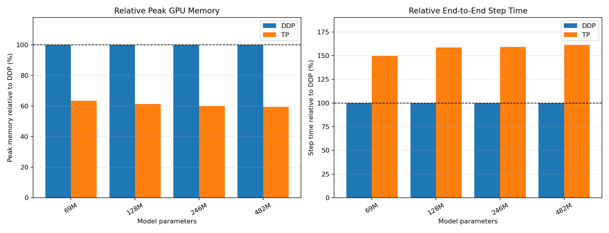

# 从 MiniMind 到 Tensor、Sequence 与 Vocab Parallelism

Dense Transformer 将每一层的完整参数、激活和优化器状态都放在同一张 GPU 上。随着 hidden size、intermediate size 和词表不断增大，单卡显存首先成为限制；即使增加 GPU，如果每张卡仍保存一份完整模型，也无法容纳更大的单层。

本教程从最基础的两层 MLP 出发，逐步推导出三种并行策略：**Tensor Parallelism**把权重切到多张 GPU 上；**Sequence Parallelism**在 TP 的基础上进一步切分激活值；**Vocab Parallelism**切分随词表增长的 embedding、LM head 和 logits。三者可以叠加，彼此正交。

## 全局路线图

```python
Part I   Tensor Parallelism 基础
         把同一层的权重切到多张 GPU，从两层 MLP 找到切分规律，
         再推广到 Attention。讲完就用 Dense 模型做数值验证，
         紧接着是 TP 的显存/吞吐 benchmark。

Part II  Sequence Parallelism
         TP 切开了权重，但 RMSNorm / Dropout / residual 这些逐 token
         操作，每张卡还在重复算同一份完整数据。SP 把这部分也切开。
         讲完同样先验证数值正确性，再看 SP 相比纯 TP 的额外收益。

Part III Vocab Parallelism
         embedding、LM head 和 logits 随词表大小增长，独立于 TP/SP
         已经切分的部分继续占用显存，VP 沿词表维度切分它们。
         讲完看 VP 的显存收益。

Part IV  统一 Benchmark、限制与源码索引
         在一致条件下比较 TP / SP / VP 的显存和训练时间，
         再列出当前实现的边界条件和源码索引。
```

TP 决定"权重怎么切"，SP 决定"激活值怎么切"，VP 决定"词表怎么切"。读完 Part I 之后，Part II 和 Part III 都是在问同一个问题："TP 还没切到的地方，显存占用能不能继续降下去"。

---

## 记号表

推导过程会反复使用下面这组符号。第一次看到某个符号时不必强记，可以随时回来查表。

| 符号 | 含义 | 典型 shape |
|---|---|---|
| $S$ | sequence length | 标量 |
| $B$ | batch size | 标量 |
| $H$ | hidden size | 标量 |
| $I$ | intermediate size（通常 $I>H$） | 标量 |
| $V$ | 词表大小 vocab size | 标量 |
| $T$ | TP world size（切成几份） | 标量 |
| $X$ | 层输入 | $[S,B,H]$ |
| $W_1,W_2$ | MLP 两层权重 | $[H,I]$，$[I,H]$ |
| $Z$ | 第一层线性输出（激活前） | $[S,B,I]$ |
| $A=\phi(Z)$ | 激活后的中间结果 | $[S,B,I]$ |
| $Y$ | 层输出 | $[S,B,H]$ |
| 下标 $t$ | 第 $t$ 个 TP rank 持有的分片 | 例：$W_{1,t}$、$X_t$ |
| $P_t$ | rank $t$ 计算出的部分和（还没求和之前） | 与最终输出同 shape |

两个容易混淆、但会贯穿全文的地方，先在这里说明一次：

> ⚠️ **数学切法 vs. 代码切法**
> 推导中说"矩阵 $W$ 左右切"或"上下切"，指的是数学公式
> $Y=XW$ 里 $W$ 的排列方式。但 PyTorch 的 `nn.Linear.weight`
> 存的是 $W^\mathsf{T}$，形状为 `[out_features, in_features]`。
> 所以本教程说"数学上左右切 $W$"，对应代码里是"按 `dim=0`
> 切 `weight`"；"数学上上下切 $W$"对应"按 `dim=1` 切
> `weight`"。后面每张图、每段代码都会同时标注这两种视角，直到
> 你习惯为止。

> ⚠️ **张量布局：sequence-first**
> 模型外部输入输出是 batch-first 的 `[B,S]` / `[B,S,V]`；但模型
> 内部统一使用 sequence-first 的 `[S,B,H]`，这样 Sequence
> Parallelism 的 all-gather / reduce-scatter 可以直接
> 作用于第 0 维，不需要反复 `movedim`。全文的 shape 标注默认是
> 内部布局，除非特别注明"外部"。

---

# 通信原语速查

在进入任何推导之前，先认识本教程反复使用的三种 collective。它们都不改变数据的"总量"，只改变数据在多张卡之间的分布方式。

下面用 4 个格子 `[a, b, c, d]` 在 2 张卡（rank 0 / rank 1）间分布举例，比抽象的 shape 更容易建立直觉。

```{mermaid}
flowchart TD
    classDef comm fill:#e8590c,stroke:#8a2e00,color:#ffffff,stroke-width:2px;
    classDef data fill:#1971c2,stroke:#0b4a85,color:#ffffff,stroke-width:1px;

    B["All-Gather<br/>每人一份，拼成人人都有完整数据"]:::comm
    C["All-Reduce<br/>每人一份部分和，求和后人人都有完整结果"]:::comm
    D["Reduce-Scatter<br/>每人一份部分和，求和 + 切分一步完成"]:::comm
```

> 全文的图统一约定：**橙色方框 = 通信操作（跨卡）**，**蓝色方框 = 本地计算（不跨卡）**。扫一眼颜色就能看出数据流里哪一步需要等待网络、哪一步只是本地 GEMM。

## All-Gather：每人一份，拼成完整 {#collective-all-gather}

```python
rank 0 持有：  [a, b]
rank 1 持有：  [c, d]

all-gather 之后，两个 rank 都拿到：  [a, b, c, d]
```

```{mermaid}
flowchart LR
    classDef comm fill:#e8590c,stroke:#8a2e00,color:#ffffff,stroke-width:2px;
    classDef data fill:#1971c2,stroke:#0b4a85,color:#ffffff,stroke-width:1px;

    R0["rank 0<br/>[a,b]"]:::data
    R1["rank 1<br/>[c,d]"]:::data
    AG["all-gather"]:::comm
    F0["rank 0<br/>[a,b,c,d]"]:::data
    F1["rank 1<br/>[a,b,c,d]"]:::data

    R0 --> AG
    R1 --> AG
    AG --> F0
    AG --> F1
```

All-Gather 会 rank 搬运数据：每个 rank 提供自己的 shard，最后每个 rank 都得到按顺序拼接后的完整 tensor。

## All-Reduce：每人一部分，操作后大家都一样

```python
rank 0 持有部分和：  P0 = [1, 2]
rank 1 持有部分和：  P1 = [3, 4]

all-reduce（sum）之后，两个 rank 都拿到：  P0+P1 = [4, 6]
```

```{mermaid}
flowchart LR
    classDef comm fill:#e8590c,stroke:#8a2e00,color:#ffffff,stroke-width:2px;
    classDef data fill:#1971c2,stroke:#0b4a85,color:#ffffff,stroke-width:1px;

    P0["rank 0<br/>P0"]:::data
    P1["rank 1<br/>P1"]:::data
    AR["all-reduce<br/>sum"]:::comm
    Y0["rank 0<br/>P0+P1"]:::data
    Y1["rank 1<br/>P0+P1"]:::data

    P0 --> AR
    P1 --> AR
    AR --> Y0
    AR --> Y1
```

每个 rank 手上的 $P_t$ 只是"最终结果"的一部分贡献，单独看是不完整、不正确的，
只有把所有 rank 的部分贡献组合起来，才是真正的答案，除了 SUM 也可以有其他操作如 MAX。

## Reduce-Scatter：求和 + 切分一步做完 {#collective-reduce-scatter}

```python
rank 0 持有部分和：  P0 = [1, 2, 3, 4]
rank 1 持有部分和：  P1 = [5, 6, 7, 8]

先求和：  P0+P1 = [6, 8, 10, 12]
再切分：
  rank 0 拿到前半：  [6, 8]
  rank 1 拿到后半：  [10, 12]
```

```{mermaid}
flowchart LR
    classDef comm fill:#e8590c,stroke:#8a2e00,color:#ffffff,stroke-width:2px;
    classDef data fill:#1971c2,stroke:#0b4a85,color:#ffffff,stroke-width:1px;

    P0["rank 0<br/>P0"]:::data
    P1["rank 1<br/>P1"]:::data
    RS["reduce-scatter"]:::comm
    O0["rank 0<br/>前半 (P0+P1)"]:::data
    O1["rank 1<br/>后半 (P0+P1)"]:::data

    P0 --> RS
    P1 --> RS
    RS --> O0
    RS --> O1
```

从数学结果看，它等价于先执行 All-Reduce，再由每个 rank 在本地保留规约结果中属于自己的 shard。Reduce-Scatter 把求和与结果分发合并成一次 collective，避免先让所有 rank 得到完整结果、再丢掉其中大部分。

## 三种原语一览

| 原语 | 输入布局 | 输出布局 | 数据变换 |
|---|---|---|---|
| All-Gather | 每个 rank 持有一个 shard | 每个 rank 都有完整 tensor | 收集并按 rank 顺序拼接所有 shard |
| All-Reduce | 每个 rank 持有一份部分贡献 | 每个 rank 都有规约后的完整结果 | 对各 rank 的 tensor 逐元素规约 |
| Reduce-Scatter | 每个 rank 持有一份部分贡献 | 每个 rank 保留规约结果的一个 shard | 逐元素规约后沿指定维度切分 |

后面每次在图里看到橙色方框，都可以回到这张表核对：输入是 shard 还是部分贡献，输出是完整 tensor 还是规约结果的 shard。

---

# Part I：Tensor Parallelism

Tensor Parallelism（TP）的出发点是把同一层的权重切到多张 GPU 上，让每个 rank 只完成一部分矩阵乘，再通过通信还原与 Dense 层相同的结果。这部分先从最简单的两层 MLP 找到 TP 的切分规律，再逐步推广到 Attention，最后落到 MiniMind 的实现、数值验证与 benchmark。

## 1. 从两层 MLP 开始

本章的原理推导统一采用数学记号：

$$
Y=XW.
$$

先考虑最简单的两层 MLP：

$$
Z=XW_1,\qquad A=\phi(Z),\qquad Y=AW_2,
$$

其中：

```python
X:  [S,B,H]
W1: [H,I]
Z:  [S,B,I]
W2: [I,H]
Y:  [S,B,H]
```

$H$ 是 hidden size，$I$ 是 intermediate size，通常 $I>H$。MLP 输出还要与 residual 相加，因此先固定它的外部契约：

```python
输入：每个 TP rank 都有完整 X [S,B,H]
输出：每个 TP rank 都得到完整 Y [S,B,H]
```

如果希望把 $W_1$ 和 $W_2$ 切到两个 rank 上，$W_1$ 可以上下切：

$$
W_1=
\begin{bmatrix}
W_{1,0}\cr
W_{1,1}
\end{bmatrix}.
$$

也可以左右切：

$$
W_1=
\begin{bmatrix}
W_{1,0} & W_{1,1}
\end{bmatrix}.
$$

## 2. 如何切W1
### 2.1 上下切 W1：非线性前需要同步

$W_1:[H,I]$ 上下切时，输入 $X$ 也左右切开：

$$
W_1=
\begin{bmatrix}
W_{1,0}\cr
W_{1,1}
\end{bmatrix},
\qquad
X=
\begin{bmatrix}
X_0 & X_1
\end{bmatrix}.
$$

每个 rank 得到一个完整形状的部分结果：

$$
Z=XW_1=X_0W_{1,0}+X_1W_{1,1}=P_0+P_1.
$$

由于 $\phi$ 是非线性函数：

$$
\phi(P_0+P_1)\neq\phi(P_0)+\phi(P_1).
$$

因此必须先对 `[S,B,I]` 的 $P_0,P_1$ 做 all-reduce，再执行 activation。同步之后，每个 rank 都保存完整 intermediate。

### 2.2 左右切 W1：activation 保持分片

$W_1$ 左右切时，每个 rank 使用完整 $X$ 计算一部分 intermediate：

$$
W_1=
\begin{bmatrix}
W_{1,0} & W_{1,1}
\end{bmatrix},
\qquad
Z=
\begin{bmatrix}
XW_{1,0} & XW_{1,1}
\end{bmatrix}
= \begin{bmatrix}
Z_0 & Z_1
\end{bmatrix}.
$$

activation 可以独立作用于两个 shard：

$$
A=
\begin{bmatrix}
\phi(Z_0) & \phi(Z_1)
\end{bmatrix}
= \begin{bmatrix}
A_0 & A_1
\end{bmatrix}.
$$

这条路径在 activation 前不需要通信，每个 rank 只保存 `[S,B,I/2]`。因此第一层选择左右切。

## 3. 分片的 activation 如何进入第二层

左右切 $W_1$ 后，两个 rank 分别持有 $A_0$、$A_1$。如果将 $W_2$ 上下切开，那么第二层可以直接消费这两个 shard：

$$
W_2=
\begin{bmatrix}
W_{2,0}\cr
W_{2,1}
\end{bmatrix},
\qquad
W_{2,0},W_{2,1}\in\mathbb{R}^{\frac{I}{2}\times H}.
$$

两个 rank 分别计算：

$$
\begin{aligned}
\text{rank 0:}\quad P_0 &= A_0W_{2,0},
&P_0&\in\mathbb{R}^{S\times B\times H},\cr
\text{rank 1:}\quad P_1 &= A_1W_{2,1},
&P_1&\in\mathbb{R}^{S\times B\times H}.
\end{aligned}
$$

展开 Dense 第二层：

$$
Y=AW_2
= \begin{bmatrix}
A_0 & A_1
\end{bmatrix}
\begin{bmatrix}
W_{2,0}\cr
W_{2,1}
\end{bmatrix}
=A_0W_{2,0}+A_1W_{2,1}
=P_0+P_1.
$$

$P_0$、$P_1$ 是完整输出的部分贡献，all-reduce 后得到每个 rank 都相同的 $Y$：

```{mermaid}
flowchart LR
    classDef comm fill:#e8590c,stroke:#8a2e00,color:#ffffff,stroke-width:2px;
    classDef data fill:#1971c2,stroke:#0b4a85,color:#ffffff,stroke-width:1px;

    X["每个 rank 上相同的 X"]:::data

    subgraph R0["rank 0"]
        W10["W1,0"]:::data --> Z0["Z0"]:::data --> A0["A0"]:::data --> W20["W2,0"]:::data --> P0["P0"]:::data
    end

    subgraph R1["rank 1"]
        W11["W1,1"]:::data --> Z1["Z1"]:::data --> A1["A1"]:::data --> W21["W2,1"]:::data --> P1["P1"]:::data
    end

    X --> W10
    X --> W11
    P0 --> AR["all-reduce sum"]:::comm
    P1 --> AR
    AR --> Y["每个 rank 上相同的 Y"]:::data
```

整个 forward 只在 MLP 末尾通信一次 `[S,B,H]`。

## 4. Column Parallel 与 Row Parallel {#sec-tp-linear}

在 $Y=XW$ 的约定下，$W$的形状是 `[in_features, out_features]`，因此：

```python
左右切权重：Column Parallel
上下切权重：Row Parallel
```

PyTorch 的 `Linear` 保存的 `weight` 的形状是 `[out_features, in_features]`，因此源码中的切分方向相反：

```python
数学 W 左右切（Column） -> PyTorch weight 上下切，dim=0
数学 W 上下切（Row）    -> PyTorch weight 左右切，dim=1
```

这就得到两层 MLP 的基本组合：Column Parallel 产生分片的 intermediate，非线性在本地完成，Row Parallel 再把各 rank 的贡献相加。

Bias 的位置同样由 tensor 的状态决定。

第一层的输出已经沿 intermediate dimension 分片，因此第一层 bias 也可以随之切分，并在本地加入：

$$
Z_t=XW_{1,t}+b_{1,t}.
$$

第二层本地计算得到的 $P_t$ 只是最终输出的部分贡献。完整结果应该是

$$
Y=P_0+P_1+b_2,
$$

因此第二层 bias 必须在 all-reduce 之后加入。若每个 rank 都在通信前加入同一个 $b_2$，则会得到

$$
(P_0+b_2)+(P_1+b_2)
=P_0+P_1+2b_2,
$$

bias 被重复计算。

至此，两层 MLP 的 forward 已经与 Dense 模型等价：输入和输出在各 rank 上保持完整，中间的参数与 activation 被切分，整个 forward 只需在 Row Parallel 输出处执行一次 all-reduce。

但训练不能只保证 forward 等价。接下来还需要检查，梯度能否沿着这条分片路径正确传回输入。

## 5. 分片之后，梯度如何正确传回输入

Forward 与 Dense MLP 等价，还不足以保证训练正确；backward 还必须让梯度沿分片路径正确传回，并恢复与 Dense 模型相同的输入梯度。先从每个 rank 都相同的 $\mathrm{d}Y$ 开始。由

$$
Y=A_0W_{2,0}+A_1W_{2,1}
$$

可得：

$$
\begin{aligned}
\mathrm{d}A_0 &= \mathrm{d}Y W_{2,0}^{\mathsf T},\cr
\mathrm{d}A_1 &= \mathrm{d}Y W_{2,1}^{\mathsf T}.
\end{aligned}
$$

Activation backward 仍然是本地逐元素操作。回到左右切分的 $W_1$ 后：

$$
\begin{aligned}
\mathrm{d}X_0 &= \mathrm{d}Z_0 W_{1,0}^{\mathsf T},\cr
\mathrm{d}X_1 &= \mathrm{d}Z_1 W_{1,1}^{\mathsf T}.
\end{aligned}
$$

展开 Dense input gradient：

$$
\begin{aligned}
\mathrm{d}X
&=\mathrm{d}Z W_1^{\mathsf T}\cr
&=
\begin{bmatrix}
\mathrm{d}Z_0 & \mathrm{d}Z_1
\end{bmatrix}
\begin{bmatrix}
W_{1,0}^{\mathsf T}\cr
W_{1,1}^{\mathsf T}
\end{bmatrix}\cr
&=\mathrm{d}Z_0W_{1,0}^{\mathsf T}
 +\mathrm{d}Z_1W_{1,1}^{\mathsf T}
=\mathrm{d}X_0+\mathrm{d}X_1.
\end{aligned}
$$

```{mermaid}
flowchart RL
    classDef comm fill:#e8590c,stroke:#8a2e00,color:#ffffff,stroke-width:2px;
    classDef data fill:#1971c2,stroke:#0b4a85,color:#ffffff,stroke-width:1px;

    dY["每个 rank 上相同的 dY"]:::data

    subgraph R0["rank 0"]
        dA0["dA0"]:::data --> dZ0["dZ0"]:::data --> W10T["W1,0ᵀ"]:::data --> dX0["dX0"]:::data
    end

    subgraph R1["rank 1"]
        dA1["dA1"]:::data --> dZ1["dZ1"]:::data --> W11T["W1,1ᵀ"]:::data --> dX1["dX1"]:::data
    end

    dY --> dA0
    dY --> dA1
    dX0 --> AR["all-reduce sum"]:::comm
    dX1 --> AR
    AR --> dX["每个 rank 上相同的 dX"]:::data
```

$\mathrm{d}X_0$、$\mathrm{d}X_1$ 是完整 input gradient 的部分贡献，all-reduce 后得到 $\mathrm{d}X$。因此 forward 和 backward 都只通信一次 `[S,B,H]`；$W_1$ 上下切则需要在 activation 前 all-reduce 更大的 `[S,B,I]`。

可以看到 Column 和 Row 需要的操作是对偶的：col前向 copy 反向 all-reduce，row 前向 all-reduce 反向 copy。

这样切分总体的通信只需要前向一次，反向一次。

## 6. Collective 如何接入 Autograd

前面的推导只需要两种跨 TP 区域的 autograd 算子：

| 算子 | 放置位置 | Forward | Backward |
|---|---|---|---|
| `CopyToModelParallelRegion` | Column Parallel 输入 | identity | all-reduce gradient |
| `ReduceFromModelParallelRegion` | Row Parallel 输出 | all-reduce partial output | identity |

前一个算子在 forward 中只是把每个 rank 已有的相同输入原样交给 Column Parallel；反向时，各权重 shard 产生的 $\mathrm{d}X_t$ 必须求和。后一个算子在 forward 中求和得到完整输出；反向时，每个 rank 直接使用相同的 $\mathrm{d}Y$ 计算自己的 activation-gradient shard。

### 6.1 自定义 torch.autograd.Function

自定义 `torch.autograd.Function` 的关键接口是：

```python
class CustomFunction(torch.autograd.Function):
    @staticmethod
    def forward(ctx, x1, x2, param):
        # 1. 用 save_for_backward 存 Tensor，非 Tensor 直接挂在 ctx 上
        ctx.save_for_backward(x1, x2)  # 这里其实都不用存，因为 backward 用不到
        ctx.param = param
        return x1 + x2  # 返回前向结果

    @staticmethod
    def backward(ctx, grad_output):
        x1, x2 = ctx.saved_tensors
        # 2. 返回的梯度必须与 forward 参数数量严格一致
        #    不需要梯度的参数返回 None
        return grad_output, grad_output, None
```

在这里，`CopyToModelParallelRegion` 只需要保存 TP process group。Forward 原样返回输入；Backward 将各 rank 产生的 input gradient 相加：

```python
class CopyToModelParallelRegion(torch.autograd.Function):
    @staticmethod
    def forward(ctx, x, group):
        ctx.group = group
        return x

    @staticmethod
    def backward(ctx, grad_output):
        grad_input = all_reduce(grad_output, group=ctx.group)
        return grad_input, None
```

这里不需要 `save_for_backward`，因为 backward 不依赖 forward 的 tensor 值；`ctx` 只需保存非 tensor 的 `group`。Backward 返回两个位置，是因为 forward 接收了 `x` 和 `group` 两个参数，而 process group 不需要梯度。

`ReduceFromModelParallelRegion` 与它对偶：forward 对 partial output 执行 all-reduce，backward 原样返回 `grad_output`。两者都必须使用所属的 TP group；误用其他的 group 会让无关 rank 参与求和。

当前实现位于 `model/tensor_parallel_mappings.py` 中的 `CopyToModelParallelRegion` 和 `ReduceFromModelParallelRegion`。

## 7. Attention：Transformer block 的另一核心组件

只切 MLP 还不能切分完整的 Transformer block。另一个主要参数和计算来源是 Attention，它的 Dense 数据流可以概括为：

```{mermaid}
flowchart LR
    classDef projection fill:#1971c2,stroke:#0b4a85,color:#ffffff,stroke-width:1px;
    classDef compute fill:#5f3dc4,stroke:#3b2585,color:#ffffff,stroke-width:1px;
    classDef data fill:#2b8a3e,stroke:#176329,color:#ffffff,stroke-width:1px;

    X["hidden states X"]:::data
    QP["Q projection"]:::projection
    KP["K projection"]:::projection
    VP["V projection"]:::projection
    Q["Q"]:::data
    K["K"]:::data
    V["V"]:::data
    MHA["Multi-Head Attention"]:::compute
    C["concat heads"]:::data
    OP["output projection"]:::projection
    Y["Attention output Y"]:::data

    X --> QP --> Q --> MHA
    X --> KP --> K --> MHA
    X --> VP --> V --> MHA
    MHA --> C --> OP --> Y
```

MLP 的切分之所以成立，是因为第一层产生的 intermediate shards 可以独立经过非线性，直到第二层再合并。要把同一思路用于 Attention，也需要在 Q/K/V projection 与 output projection 之间找到可以独立计算的单位。

Multi-Head Attention 已经把 hidden dimension 组织成多个 head。一个 head 内部的 Q、K、V 相互作用，但不同 head 在 output projection 之前彼此独立。因此可以先考虑下面这条候选路径：

```python
切分 Q/K/V projection 的输出
-> 每个 rank 计算一部分 heads
-> 保持 attention output 分片
-> 通过 output projection 合并
```

这条路径能否成立，取决于 Q/K/V projection 的 output shard 是否恰好对应若干完整的 head。下面先从 tensor shape 检查这一点。

### 7.1 Q/K/V 按 head 切分

设 Query head 数为 $N_q$，KV head 数为 $N_{kv}$，每个 head 的维度为 $D$，TP size 为 $T$。Dense Q/K/V projection 的输出形状分别是：

```python
Q: [S,B,N_q D]
K: [S,B,N_kv D]
V: [S,B,N_kv D]
```

Q/K/V projection 使用 Column Parallel Linear 后，每个 rank 只得到最后一维的一个 shard。以 Q 为例：

```python
Dense Q:     [S, B, N_q D]
rank t Q:    [S, B, N_q D / T]
reshape 后:  [S, B, N_q / T, D]
```

只要 $N_q$ 能被 $T$ 整除，这个 output shard 就可以直接 reshape 成 $N_q/T$ 个完整的 head，而不是每个 head 的一部分。K 和 V 的推导相同，只需将 $N_q$ 换成 $N_{kv}$。

```{mermaid}
flowchart LR
    classDef data fill:#1971c2,stroke:#0b4a85,color:#ffffff,stroke-width:1px;
    classDef op fill:#5f3dc4,stroke:#3b2585,color:#ffffff,stroke-width:1px;

    Q["Dense Q<br/>[head 0 | head 1 | head 2 | head 3]"]:::data
    Split["Column Parallel<br/>沿 projection 输出切分"]:::op
    Q0["rank 0<br/>[head 0 | head 1]"]:::data
    Q1["rank 1<br/>[head 2 | head 3]"]:::data

    Q --> Split
    Split --> Q0
    Split --> Q1
```

因此，Column Parallel 在这里不仅是切开一段连续的 feature，更重要的是让每个 rank 持有一组完整的 Q/K/V heads。每个 rank 随后可以独立完成：

- Q/K RMSNorm
- RoPE
- GQA 的 `repeat_kv`
- attention score
- softmax
- value aggregation

这些操作只在单个 head 内发生，不依赖其他 rank 上的 head，因此 Attention 计算本身不需要跨 rank 通信。

### 7.2 Output Projection 合并

先看单卡上的 Dense Attention。设第 $h$ 个 head 的输出为 $C_h$，形状为 `[S, B, D]`。所有 heads 沿最后一维拼接：

$$
C=
\begin{bmatrix}
C_0 & C_1 & \cdots & C_{N_q-1}
\end{bmatrix},
$$

因此：

```python
C:   [S, B, N_q D] = [S, B, H]
W_O: [H, H]
Y:   [S, B, H]
```

Dense output projection 为

$$
Y=CW_O.
$$

为了看清每个 head 对 $Y$ 的贡献，将 $W_O$ 按照 head 在 $C$ 中占据的范围上下分块：

$$
W_O=
\begin{bmatrix}
W_O^{(0)}\cr
W_O^{(1)}\cr
\vdots\cr
W_O^{(N_q-1)}
\end{bmatrix}.
$$

每个 $W_O^{(h)}$ 的形状都是 `[D, H]`。展开 Dense 矩阵乘：

$$
\begin{aligned}
Y
&=
\begin{bmatrix}
C_0 & C_1 & \cdots & C_{N_q-1}
\end{bmatrix}
\begin{bmatrix}
W_O^{(0)}\cr
W_O^{(1)}\cr
\vdots\cr
W_O^{(N_q-1)}
\end{bmatrix}\\
&=\sum_{h=0}^{N_q-1}C_hW_O^{(h)}.
\end{aligned}
$$

也就是说，output projection 可以等价地理解为：每个 head 先通过自己的 `[D, H]` 权重块投影到完整 hidden dimension，再将所有 head 的贡献相加。

TP 只是把这些 head 的贡献分给不同 rank 计算。假设一共有 4 个 Query heads，TP size = 2，并记 head dimension 为 $D$，那么 $H=4D$：

```python
rank 0:
  负责 head 0、head 1
  local heads:          [S, B, 2D]
  W_O 中对应的两块:      [2D, H]
  partial output P_0:   [S, B, H]

rank 1:
  负责 head 2、head 3
  local heads:          [S, B, 2D]
  W_O 中对应的两块:      [2D, H]
  partial output P_1:   [S, B, H]
```

两个 rank 的本地计算分别是：

$$
\begin{aligned}
P_0 &= C_0W_O^{(0)}+C_1W_O^{(1)},\cr
P_1 &= C_2W_O^{(2)}+C_3W_O^{(3)}.
\end{aligned}
$$

对 $P_0$、$P_1$ 执行 all-reduce：

$$
Y=P_0+P_1.
$$

因此不需要先 all-gather 所有 heads 来构造完整的 $C$。从 tensor layout 看，每个 rank 持有一部分 input features 和对应的 $W_O$ 行，计算完整输出的部分贡献，再通过 all-reduce 求和——这正是 Row Parallel Linear。

这样 Attention 输出重新变成完整 `[S,B,H]`，可以直接执行 residual add。

**图：TP Attention 数据流**

```{mermaid}
flowchart LR
    classDef comm fill:#e8590c,stroke:#8a2e00,color:#ffffff,stroke-width:2px;
    classDef data fill:#1971c2,stroke:#0b4a85,color:#ffffff,stroke-width:1px;

    X["Hidden states<br/>X [S,B,H]"]:::data

    subgraph G0["rank 0：本地 Q/K/V heads"]
        QKV0["Column Parallel<br/>q0, k0, v0"]:::data
        N0["Q/K RMSNorm<br/>RoPE<br/>repeat_kv"]:::data
        A0["Local Attention"]:::data
        O0["Row Parallel o_proj<br/>partial hidden P0"]:::data
        QKV0 --> N0 --> A0 --> O0
    end

    subgraph G1["rank 1：本地 Q/K/V heads"]
        QKV1["Column Parallel<br/>q1, k1, v1"]:::data
        N1["Q/K RMSNorm<br/>RoPE<br/>repeat_kv"]:::data
        A1["Local Attention"]:::data
        O1["Row Parallel o_proj<br/>partial hidden P1"]:::data
        QKV1 --> N1 --> A1 --> O1
    end

    X --> QKV0
    X --> QKV1
    O0 --> AR["all-reduce sum"]:::comm
    O1 --> AR
    AR --> Y["Attention output<br/>[S,B,H]"]:::data
```

## 8. GQA、RoPE 和 Norm

### 8.1 GQA 不改变 TP 主体设计

MiniMind 默认：

```python
num_attention_heads = 8
num_key_value_heads = 4
```

这是 Grouped Query Attention。

只要满足：

```python
num_attention_heads % tp_size == 0
num_key_value_heads % tp_size == 0
```

每个 rank 就能同时持有一部分 Q heads 和 KV heads，并在本地完成 `repeat_kv`。

### 8.2 RoPE 不需要跨 rank 通信

RoPE 是 per-head 操作。每个 rank 对自己的 local Q/K heads 使用相同位置编码即可。

### 8.3 Q/K Norm 为什么需要梯度同步 {#sec-qk-norm-grad}

Q/K Norm 权重只包含 `head_dim` 个参数，并在 TP ranks 间复制。

但每个 rank 处理不同 heads，因此各 rank 得到的参数梯度只是部分贡献。需要：

```python
q_norm.weight.grad: all-reduce sum
k_norm.weight.grad: all-reduce sum
```

当前实现通过参数 hook 完成：

```python
param.register_hook(lambda grad: _reduce(grad, group))
```

## 9. TPContext：把通信范围和分片编号传给每一层

前面的推导一直使用 rank 0 和 rank 1，默认它们共同组成一个 TP group。落到实现中，Column Parallel 和 Row Parallel 的每一层都需要知道两件事：

```python
这次 collective 应该和哪些 rank 通信？
当前进程持有第几个权重 shard？
```

这里的 rank 和 group 不一定是全局的。一次训练可以同时运行多个模型副本，每个副本内部又各自组成 TP group。如果直接使用 global rank 和 WORLD group，不同副本的 tensor 就可能被错误地放进同一次 collective。

`TPContext` 将这两个问题需要的信息一起传给并行层。它的基础字段是：


```python
@dataclass
class TPContext:
    group: dist.ProcessGroup
    world_size: int
    rank: int
```

其中，`group` 划定 collective 的通信边界，`world_size` 决定权重被切成多少份，`rank` 则决定当前进程持有其中哪一份。

在当前独立 demo 中：

```python
TP group = WORLD group
```

即使此时 TP group 恰好等于 WORLD group，并行层仍显式使用 `TPContext.group`。这样扩展到多个 TP group 时，层内通信不需要改变。

当前实现位于 `model/tensor_parallel_layers.py` 中的 `TPContext`。

## 10. Dense Checkpoint 如何变成 TP Shard {#sec-tp-checkpoint-shard}

并行模型知道怎样保存 shard，但已有 checkpoint 通常仍由 Dense 模型产生。要让加载后的第 $t$ 个 rank 恰好持有推导中的第 $t$ 个权重块，需要把数学上的左右/上下切分映射到 PyTorch 的参数布局。

加载时根据参数名称切片：

```python
q/k/v/gate/up weight: dim=0
o/down weight:        dim=1
其他参数:             完整复制
```

原因来自 PyTorch 的权重布局：

```python
Linear.weight = [out_features, in_features]
```

因此：

- Column Parallel 切 `dim=0`
- Row Parallel 切 `dim=1`

这个其实提过很多次了，具体来说，加载权重的实现类似如下：

```python
# 指定需要 Column / Row Parallel 的层
_COLUMN_PARALLEL_SUFFIXES = (
    "q_proj.weight",
    "k_proj.weight",
    "v_proj.weight",
    "gate_proj.weight",
    "up_proj.weight",
)

_ROW_PARALLEL_SUFFIXES = (
    "o_proj.weight",
    "down_proj.weight",
)


def shard_state_dict_for_tp(
    state_dict: Mapping[str, torch.Tensor],
    tp_context: TPContext,
) -> dict[str, torch.Tensor]:
    """Shard a full MiniMind state dict for the current TP rank."""
    tp_state_dict = {}

    for key, value in state_dict.items():
        if key.endswith(_COLUMN_PARALLEL_SUFFIXES):
            value = value.chunk(tp_context.world_size, dim=0)[tp_context.rank]
        elif key.endswith(_ROW_PARALLEL_SUFFIXES):
            value = value.chunk(tp_context.world_size, dim=1)[tp_context.rank]
        # for simplicity, other param are now replicated across all TP ranks
        tp_state_dict[key] = value.contiguous()

    return tp_state_dict

```

每个 shard 在加载前调用 `.contiguous()`，避免 chunk 得到的 view 不满足后续 kernel 或 collective 的连续内存要求。

## 11. 如何验证 TP 没有改变数值语义 {#sec-tp-validation}

分布式程序能够运行、tensor shape 正确，并不代表它与 Dense 模型等价。Shard 顺序、bias 位置或 backward 中漏掉一次求和，都可能让程序在不报错的情况下产生错误结果。因此，性能测试之前必须先把 TP 与 Dense 放在相同条件下逐层对齐。

验证分成三个层次：

```text
Forward：
  参数切分、head 切分和 forward collective 是否还原出相同输出

Backward：
  分片参数与复制参数是否得到正确梯度

多步 AdamW：
  微小浮点误差经过 optimizer state 累积后是否出现系统性发散
```

脚本同时构造 Dense MiniMind 和 TP MiniMind。Dense 模型的完整参数通过 [§10](#sec-tp-checkpoint-shard) 的规则切成各 rank 所需的 shard，并保证两者使用相同输入、labels 和初始权重。为了减少 fused kernel 的额外数值差异并排除 dropout 的随机性，验证固定使用：

```text
dropout = 0
flash_attn = False
dtype = float32
```

完整命令如下：

```bash
python -m evaluation.parallel validate \
  --tp_size 2 \
  --pp_size 1 \
  -- \
  --hidden_size 128 \
  --num_hidden_layers 6 \
  --num_attention_heads 8 \
  --num_key_value_heads 4 \
  --vocab_size 6400 \
  --seq_len 256 \
  --dtype float32 \
  --optimizer_steps 200 \
  --log_interval 20
```

### 11.1 Forward

Forward 首先比较最终 logits 和 loss：

```text
logits：
  检查每个 token、每个 vocab 位置的最大绝对误差

loss：
  检查完整输出经过 loss reduction 后是否仍然一致
```

```text
forward max logits diff: 6.556511e-07
forward loss diff:       0.000000e+00
```

logits 的最大误差约为 $6.6\times10^{-7}$，loss 差异在当前打印精度下为零。这里不要求 bitwise identical：TP 改变了部分矩阵乘和 collective 中的浮点运算顺序，最后几位出现差异是正常的。这个结果说明 [§4](#sec-tp-linear) 中的权重切分以及 Attention 中的 head 切分在 forward 结束时重新组成了与 Dense 一致的输出。

### 11.2 Backward

Forward 对齐还不够。Collective 的 backward 是否正确、Column 与 Row Parallel 的梯度该在哪一维比较，以及复制参数是否同步，需要能通过 backward 暴露出来。

不同参数使用不同的参考：

```text
Column Parallel 参数：
  与 Dense gradient 沿 dim=0 的对应 shard 比较

Row Parallel 参数：
  与 Dense gradient 沿 dim=1 的对应 shard 比较

复制参数：
  与完整 Dense gradient 比较
```

每个参数报告 mean absolute error、max absolute error 和 relative L2 error。脚本会打印所有层；下面只保留第一层和模型边界处的代表性参数：

| 参数 | 并行语义 | Mean error | Max error | Relative L2 |
|---|---|---:|---:|---:|
| `embed_tokens.weight` | 复制参数 | 9.256e-11 | 2.817e-08 | 9.903e-07 |
| `layers.0.self_attn.q_proj.weight` | Column shard | 5.444e-10 | 3.958e-09 | 1.030e-06 |
| `layers.0.self_attn.o_proj.weight` | Row shard | 1.406e-09 | 8.382e-09 | 7.703e-07 |
| `layers.0.self_attn.q_norm.weight` | 复制参数，聚合 local heads | 4.047e-10 | 7.567e-10 | 1.472e-06 |
| `layers.0.mlp.gate_proj.weight` | Column shard | 2.506e-10 | 1.979e-09 | 8.880e-07 |
| `layers.0.mlp.down_proj.weight` | Row shard | 2.482e-10 | 3.318e-09 | 8.810e-07 |
| `model.norm.weight` | 复制参数 | 2.233e-10 | 1.048e-09 | 4.608e-07 |
| `lm_head.weight` | 复制参数 | 7.906e-11 | 3.725e-09 | 6.530e-07 |

所有参数中的最大梯度绝对误差为：

```text
backward max grad diff: 2.817251e-08
```

Column shard、Row shard 和复制参数三类梯度都与对应的 Dense 参考对齐，relative L2 error 约为 $10^{-6}$。特别是 Q/K Norm：参数本身虽然复制在各 rank 上，但每个 rank 只处理 local heads；它的梯度能够对齐，说明 [§8.3](#sec-qk-norm-grad) 中额外的梯度求和没有遗漏。

### 11.3 多步 AdamW

单次 backward 正确后，最后再让 Dense 和 TP 使用相同的 AdamW 配置，在同一批输入上连续更新 200 步，让微小浮点差异反复进入 AdamW 的一阶、二阶状态，观察它们是否演化成结构性的偏差。

每隔 20 步比较更新后的 logits：

```text
mean absolute error
max absolute error
relative L2 error
```

| Step | Mean error | Max error | Relative L2 |
|---:|---:|---:|---:|
| 20 | 1.462e-06 | 2.348e-05 | 4.584e-06 |
| 40 | 7.233e-06 | 4.742e-05 | 1.236e-05 |
| 60 | 3.444e-05 | 2.702e-04 | 4.980e-05 |
| 80 | 4.606e-05 | 5.203e-04 | 5.585e-05 |
| 100 | 1.206e-04 | 1.339e-03 | 1.359e-04 |
| 120 | 6.207e-05 | 9.721e-04 | 6.750e-05 |
| 140 | 3.038e-05 | 4.915e-04 | 3.289e-05 |
| 160 | 1.284e-05 | 5.505e-04 | 1.451e-05 |
| 180 | 8.101e-06 | 5.265e-04 | 9.699e-06 |
| 200 | 6.269e-06 | 5.478e-04 | 8.394e-06 |

200 步后，所有参数的最大绝对差异为：

```text
AdamW final parameter max abs diff: 6.503519e-05
```

这里的误差没有持续放大，同时三类梯度已经逐项对齐，因此可以进入下一步 benchmark。若某次 collective 或复制参数同步缺失，应该会在首次 backward 的单步梯度中先出现远大于浮点舍入量级的系统性偏差。

## 12. TP Benchmark {#sec-tp-benchmark}

前面已经说明，TP 将 Attention 和 MLP 的大矩阵切到多个 rank 上。那么这些切分实际节省了多少单卡显存，又为此付出了多少通信时间？

```bash
python -m evaluation.parallel benchmark \
  --kind memory \
  --tp_size 2 \
  --pp_size 1 \
  -- \
  --modes ddp tp \
  --batch_policy fixed_per_rank \
  --num_hidden_layers 8 16 32 64 \
  --seq_len 2048 \
  --hidden_size 768 \
  --num_attention_heads 8 \
  --num_key_value_heads 4 \
  --vocab_size 6400 \
  --micro_batch_size 2 \
  --num_microbatches 1 \
  --dtype bfloat16 \
  --warmup_iters 2 \
  --benchmark_iters 5 \
  --output_csv results/tp/tp2_layers.csv \
  --output_plot results/tp/tp2_layers.png
```

这里使用 `batch_policy=fixed_per_rank`，即让 DDP 的每个 rank 的 `batchsize = 2`，而双卡 TP 的总 `batchsize = 2`。这样更适合观察参数、梯度和 optimizer states 被切分后的单卡显存变化；由于 DDP 的两个 rank 各自持有一个模型副本，而两个 TP rank 共同组成一个模型副本，两者的总 global batch 并不相同，因此下面的 step time 只用于展示同等单副本工作量下的通信代价，不是等效 global batch 下的吞吐比较。

{fig-alt="四种模型深度下，TP 相对 DDP 的峰值显存约为百分之六十，step time 约为百分之一百五十到一百六十"}

| Layers | DDP 显存 | TP 显存 | 单卡显存下降 | DDP step | TP step | 时间增加 |
|---:|---:|---:|---:|---:|---:|---:|
| 8 | 2377.65 MiB | 1509.53 MiB | 36.5% | 44.38 ms | 66.47 ms | 49.8% |
| 16 | 4433.28 MiB | 2717.69 MiB | 38.7% | 81.85 ms | 129.90 ms | 58.7% |
| 32 | 8549.79 MiB | 5129.40 MiB | 40.0% | 160.37 ms | 255.60 ms | 59.4% |
| 64 | 16766.42 MiB | 9956.83 MiB | 40.6% | 311.60 ms | 502.83 ms | 61.4% |

为什么层数增加后，TP 的显存比例还在下降？把每层新增的显存分成两部分：$a$ 表示会随 TP size 切分的参数、梯度、optimizer states 和 activation，$r$ 表示仍在每个 rank 上保留的部分；再用 $F_D$ 和 $F_T$ 表示不随层数增长的模型边界状态和其他固定开销。对于 TP size $T$，

$$
M_{\mathrm{DDP}}(L)=F_D+L(a+r),
\qquad
M_{\mathrm{TP}}(L)=F_T+L\left(\frac{a}{T}+r\right).
$$

如果没有固定项，而且每层的 $a:r$ 保持不变，那么 TP/DDP 显存比从第一层开始就是常数，不会随层数变化。这里从 63.5% 下降到 59.4%，本质上是 embedding、LM head、模型边界 activation 和其他不随层数增长的固定显存被更多 Transformer blocks 逐渐摊薄。层数足够大后，比例会逐渐接近

$$
\frac{a/T+r}{a+r}.
$$

其中 $r$ 包含未切分的 activation 和复制参数，因此即使固定项可以忽略，最终比例通常也不会达到理想的 $1/T$。换句话说，固定项解释了为什么较浅模型的 TP 收益更小，而每层仍然复制的部分决定了显存比例最终能下降到哪里。

需要这个比例与具体实验配置有关，$a$、$r$、$F_D$ 和 $F_T$ 都会随 batch size、sequence length、hidden size、vocab size、dtype、optimizer 和具体 kernel 实现变化。例如增大 batch size 或 sequence length 会提高 activation 的占比，而普通 TP 并不会切分所有 activation；增大 hidden size 时，大矩阵参数通常比 hidden states 增长得更快；增大 vocab size 又会放大 embedding、LM head 和 logits 等模型边界状态。配置变化后，TP 能切分与仍然复制的显存比例也会随之改变。

显存下降的代价是更长的 step time。本实验中 TP 比 DDP 慢约 50%～61%，这部分差距主要来自 Column Parallel 与 Row Parallel 在 forward/backward 中引入的 collective。后面的 [§20.1](#sec-tp-async) 会尝试隐藏其中一部分通信；在此之前，Part II 先处理另一个更直接的问题：TP 区域之间仍然重复保存的完整 hidden states。


# Part II：Sequence Parallelism

Part I 的 TP 切开了 Attention heads 和 MLP intermediate dimension 的权重，但两个并行区域之间仍保留完整的 hidden states。Sequence Parallelism（SP）在 TP 的基础上，把这部分逐 token 操作的激活值也切开。

## 13. 为什么需要 Sequence Parallelism

TP 已经切分了 Attention heads 和 MLP intermediate dimension，但这并不意味着整个 Transformer block 的激活都随 TP size 缩小。沿着一个 hidden states tensor 走出 TP 区域，可以看到它在进入下一个 TP 区域前又恢复成了完整的 `[S,B,H]`：

```python
每个 TP rank: [S, B, H]
```

```{mermaid}
flowchart LR
    classDef tp fill:#5f3dc4,stroke:#3b2585,color:#ffffff,stroke-width:2px;
    classDef data fill:#1971c2,stroke:#0b4a85,color:#ffffff,stroke-width:1px;
    classDef local fill:#2b8a3e,stroke:#176329,color:#ffffff,stroke-width:1px;

    TP1["TP 区域 A<br/>输出经过 all-reduce"]:::tp

    subgraph BETWEEN["两个 TP 区域之间"]
        direction TB

        subgraph R0["rank 0"]
            H0["H0<br/>[S,B,H]"]:::data
            L0["RMSNorm<br/>Dropout<br/>residual add"]:::local
            H0 --> L0
        end

        subgraph R1["rank 1"]
            H1["H1<br/>[S,B,H]"]:::data
            L1["RMSNorm<br/>Dropout<br/>residual add"]:::local
            H1 --> L1
        end
    end

    TP2["TP 区域 B<br/>读取相同输入"]:::tp

    TP1 --> H0
    TP1 --> H1
    L0 --> TP2
    L1 --> TP2
```

图中的 $H_0$ 和 $H_1$ 是数值相同的两份完整 tensor。它们来自 Row Parallel Linear 的输出：每个 rank 先产生一份完整 shape 的部分结果，

```python
P_t: [S, B, H]
```

普通 TP 在离开并行区域时执行 all-reduce：

$$
Y=\sum_{t=0}^{T-1}P_t,
$$

于是每个 rank 都得到完整的 $Y$。但紧接着的 RMSNorm、Dropout 和 residual add 都是逐 token 操作，让所有 rank 保存并处理全部 $S$ 个 token 没有必要。是否可以让每个 rank 只负责一段互不重复的 sequence？

先不考虑具体使用哪种 collective，把离开 TP 区域和重新进入 TP 区域时的两次布局转换分别记为 $f$ 和 $g$。我们希望得到下面的数据流：

```{mermaid}
flowchart LR
    classDef tp fill:#5f3dc4,stroke:#3b2585,color:#ffffff,stroke-width:2px;
    classDef transform fill:#e8590c,stroke:#8a2e00,color:#ffffff,stroke-width:2px;
    classDef data fill:#1971c2,stroke:#0b4a85,color:#ffffff,stroke-width:1px;
    classDef local fill:#2b8a3e,stroke:#176329,color:#ffffff,stroke-width:1px;

    TP1["TP 区域 A"]:::tp
    F["f<br/>完整 → sequence shards"]:::transform

    subgraph SP["两个 TP 区域之间"]
        direction TB

        subgraph R0["rank 0"]
            S0["sequence shard 0<br/>[S/2,B,H]"]:::data
            L0["本地逐 token 操作"]:::local
            S0 --> L0
        end

        subgraph R1["rank 1"]
            S1["sequence shard 1<br/>[S/2,B,H]"]:::data
            L1["本地逐 token 操作"]:::local
            S1 --> L1
        end
    end

    G["g<br/>sequence shards → 完整"]:::transform
    TP2["TP 区域 B"]:::tp

    TP1 --> F
    F --> S0
    F --> S1
    L0 --> G
    L1 --> G
    G --> TP2
```

此时两个 rank 不再保存相同的完整 hidden states，而是各自处理一段 sequence。接下来从普通 TP 的 all-reduce 出发，推导 $f$ 和 $g$ 应该由什么通信操作实现。

## 14. SP 如何拆分完整的 hidden states

要让每个 rank 只保留一段 sequence，最直接的做法是在 all-reduce 之后，再各自沿 sequence 维切分完整的 $Y$。但每个 rank 明明只需要 $1/T$ 的结果，却仍要先通信得到完整 tensor，再把其余部分丢掉。

于是要问：能不能跳过"先合并、再手动切开"这条弯路，直接一步到位地让每个 rank 拿到自己该有的那一段？

### 14.1 All-Reduce 可以拆成两个阶段

答案是可以。all-reduce 本身可以拆成两个阶段：

```python
all-reduce = reduce-scatter + all-gather
```

如果对这两个 collective 还不熟悉，可以先回看开头的 [Reduce-Scatter](#collective-reduce-scatter) 和 [All-Gather](#collective-all-gather)。

这个等式成立的关键是：all-reduce 的求和是逐元素进行的，只要所有 rank 按相同方式切分 $P_t$，就可以先分别求出最终结果的各个 block，再把这些已经求和的 block 拼接起来。先以两个 rank 为例，沿 sequence 维把 $P_0$、$P_1$ 分成上下两块：

$$
P_0=
\begin{bmatrix}
P_0^{(0)}\cr
P_0^{(1)}
\end{bmatrix},
\qquad
P_1=
\begin{bmatrix}
P_1^{(0)}\cr
P_1^{(1)}
\end{bmatrix}.
$$

Reduce-scatter 先对相同位置的 block 求和，再把不同 block 留在不同 rank：

$$
\begin{aligned}
\text{rank 0}:&\quad Y^{(0)}=P_0^{(0)}+P_1^{(0)},\cr
\text{rank 1}:&\quad Y^{(1)}=P_0^{(1)}+P_1^{(1)}.
\end{aligned}
$$

随后执行 all-gather，两个 rank 都得到：

$$
Y=
\begin{bmatrix}
Y^{(0)}\cr
Y^{(1)}
\end{bmatrix}
=P_0+P_1,
$$

这与直接对 $P_0$、$P_1$ 执行 all-reduce 完全相同。推广到 $T$ 个 rank，把每个 $P_t$ 沿 sequence 维切成 $T$ 块：

$$
P_t=
\begin{bmatrix}
P_t^{(0)}\cr
P_t^{(1)}\cr
\vdots\cr
P_t^{(T-1)}
\end{bmatrix},
\qquad
Y^{(j)}=\sum_{t=0}^{T-1}P_t^{(j)}.
$$

Reduce-scatter 结束后，rank $j$ 持有 $Y^{(j)}$，shape 为 `[S/T,B,H]`：每个 rank 只拿到自己该负责的那一段 sequence，不再是一份完整拷贝。

### 14.2 完整数据流：本地计算插入两个阶段之间

既然 reduce-scatter 结束后每个 rank 已经拿到了自己的 sequence shard，两个 TP 区域之间的 RMSNorm、Dropout 和 residual add 就可以直接在这个 shard 上进行。下面把这些逐 token 的本地操作合记为 $f$：

```{mermaid}
flowchart LR
    classDef tp fill:#5f3dc4,stroke:#3b2585,color:#ffffff,stroke-width:2px;
    classDef comm fill:#e8590c,stroke:#8a2e00,color:#ffffff,stroke-width:2px;
    classDef data fill:#1971c2,stroke:#0b4a85,color:#ffffff,stroke-width:1px;
    classDef local fill:#2b8a3e,stroke:#176329,color:#ffffff,stroke-width:1px;

    subgraph TP1["TP 区域 A：Row Parallel"]
        direction TB

        subgraph A0["rank 0"]
            P0["P₀<br/>[P₀⁽⁰⁾ ; P₀⁽¹⁾]"]:::tp
        end

        subgraph A1["rank 1"]
            P1["P₁<br/>[P₁⁽⁰⁾ ; P₁⁽¹⁾]"]:::tp
        end
    end

    RS["reduce-scatter"]:::comm

    subgraph SP["SP 区域：沿 sequence 分工"]
        direction TB

        subgraph R0["rank 0"]
            S0["Y⁽⁰⁾ = P₀⁽⁰⁾ + P₁⁽⁰⁾<br/>[S/2,B,H]"]:::data
            L0["RMSNorm<br/>Dropout<br/>residual add"]:::local
            O0["local output<br/>f(Y⁽⁰⁾)"]:::data
            S0 --> L0 --> O0
        end

        subgraph R1["rank 1"]
            S1["Y⁽¹⁾ = P₀⁽¹⁾ + P₁⁽¹⁾<br/>[S/2,B,H]"]:::data
            L1["RMSNorm<br/>Dropout<br/>residual add"]:::local
            O1["local output<br/>f(Y⁽¹⁾)"]:::data
            S1 --> L1 --> O1
        end
    end

    AG["all-gather"]:::comm

    subgraph TP2["进入下一个 TP 区域"]
        direction TB

        subgraph T0["rank 0"]
            F0["full hidden states<br/>[f(Y⁽⁰⁾) ; f(Y⁽¹⁾)]"]:::data
            C0["Column Parallel<br/>weight shard 0"]:::tp
            F0 --> C0
        end

        subgraph T1["rank 1"]
            F1["full hidden states<br/>[f(Y⁽⁰⁾) ; f(Y⁽¹⁾)]"]:::data
            C1["Column Parallel<br/>weight shard 1"]:::tp
            F1 --> C1
        end
    end

    P0 --> RS
    P1 --> RS
    RS --> S0
    RS --> S1
    O0 --> AG
    O1 --> AG
    AG --> F0
    AG --> F1
```

通过 SP，两个 TP 区域之间的逐 token 计算被放到了不同 rank 上：reduce-scatter 交出分片、本地算完 $f$、all-gather 拼回完整序列，衔接下一个 TP 区域的 Column Parallel。

### 14.3 通信开销是否因此增加？

那么代价是什么呢？把一次 all-reduce 拆成两次 collective 会不会增加通信开销？
这里用 $T=4$ 个 rank 完整走一遍 ring all-reduce 的流程。

把每个 rank 手上的 $P_t$ 沿 sequence 维切成 4 块，用字母区分"最终归哪个 rank"、下标区分"最初来自哪个 rank"：

| Rank | 初始持有的 4 个 block |
|---|---|
| R0 | a0, b0, c0, d0 |
| R1 | a1, b1, c1, d1 |
| R2 | a2, b2, c2, d2 |
| R3 | a3, b3, c3, d3 |

4 个 rank 围成一个环：R0 → R1 → R2 → R3 → R0。目标是让 R0 拿到完整的 "a" 块（$a_0+a_1+a_2+a_3$），R1 拿到完整的 "b"，R2 拿到完整的 "c"，R3 拿到完整的 "d"。

规则很简单：**每一步，每个 rank 把自己当前"活跃"的那一格发给下一个 rank，对方收到后加到自己那一列上**。第一轮的"活跃格"就是各自的初始值。发出去的格子用"–"标记，之后不用再管：

| Rank | a | b | c | d |
|---|---|---|---|---|
| R0 | a0 | b0 | c0+c3 | – |
| R1 | – | b1 | c1 | d0+d1 |
| R2 | a1+a2 | – | c2 | d2 |
| R3 | a3 | b2+b3 | – | d3 |

同样的规则再走一轮：

| Rank | a | b | c | d |
|---|---|---|---|---|
| R0 | a0 | b0+b2+b3 | – | – |
| R1 | – | b1 | c0+c1+c3 | – |
| R2 | – | – | c2 | d0+d1+d2 |
| R3 | a1+a2+a3 | – | – | d3 |

再走一轮，每一列刚好凑齐 4 个 rank 的贡献：

| Rank | a | b | c | d |
|---|---|---|---|---|
| R0 | **a0+a1+a2+a3** | – | – | – |
| R1 | – | **b0+b1+b2+b3** | – | – |
| R2 | – | – | **c0+c1+c2+c3** | – |
| R3 | – | – | – | **d0+d1+d2+d3** |

3 步之后，4 个 rank 各自恰好持有一块完整求和的结果，这正是 reduce-scatter 的定义。
每一步 4 条链路都在同时传输，每条链路每步只搬运一个 $N/4$ 大小的 block（$N=SBH$），
因此每个 rank 总共发送 $3\times N/4=(T-1)N/T$（$T=4$）。

推广到任意 $T$：环上 $T$ 条链路、跑 $T-1$ 步，每步每条链路传一个 $N/T$ 的 block，总发送量是 $\dfrac{T-1}{T}N$。

All-Gather 沿用同一个环，只是这次传的是已经算完的结果，不需要再做加法：R0 把完整的 "a" 块转发给 R1、R1 转发给 R2，其余同理。同样走 3 步，通信量同样是 $\dfrac{T-1}{T}N$。

| 操作 | 每个 rank 发送量 |
|---|---:|
| reduce-scatter | $\dfrac{T-1}{T}N$ |
| all-gather | $\dfrac{T-1}{T}N$ |
| ring all-reduce（两阶段之和） | $2\dfrac{T-1}{T}N$ |

拆分前后总共都是 $2(T-1)$ 轮、$2(T-1)N/T$ 个元素，通信量是一样的。

所以"先环形传播求和，再环形传播广播"本来就是 ring all-reduce 内部真实的两个阶段。
SP把算法本来就存在的这个中间点暴露出来，插入可以本地计算的 $f$，去掉了 rank 间重复的计算：

**但有个前提**：这个推导假设走的是大 tensor 常见的 ring / bandwidth-optimal 实现。
真实开销还有一层没覆盖：拆成两次独立 collective，意味着多一次 kernel launch 和同步点，这部分延迟和 tensor 大小无关，是固定成本。

### 14.4 落到实现中的 Tensor Layout {#sec-sp-layout}

设 TP size 为 $T$。Reduce-scatter 沿 sequence 维分发结果后，rank $t$ 持有：

```python
[S/T, B, H]
```

SP 复用原来的 TP group。同一组 rank 在 Attention 和 MLP 内按 hidden dimension 协作，在两个 TP 区域之间则按 sequence dimension 分工。当前实现采用连续等分，因此要求：

```python
S % T == 0
```

`TPContext` 使用下面的字段控制是否在 TP 区域之间保留 sequence-sharded layout：

```python
sequence_parallel: bool = False
```

一个 Transformer block 中的 tensor layout 因此变为：

| 区域 | Tensor layout | 本地工作 |
|---|---|---|
| Norm / Dropout / Residual | `[S/T,B,H]` | 每个 rank 处理不同 token |
| Column Parallel Linear | 输入恢复为 `[S,B,H]` | 每个 rank 计算不同输出 shard |
| Row Parallel Linear 输出 | `[S/T,B,H]` | reduce-scatter 后回到 sequence shard |

## 15. SP 如何在两种 Tensor Layout 之间切换

到这里，SP forward 需要的两种布局已经出现：

```python
TP 区域内:                     [S, B, H]
TP 区域之间（也就是 SP 区域）:   [S/T, B, H]
```

训练时还必须为每个布局变换定义对应的 backward，否则 forward 的 shape 即使正确，梯度也无法回到原来的数据分布。

这里有三类性质不同的切换，值得先分清楚：

```text
一次性入口：模型最开始的 Split
        只发生一次，把完整 sequence Embedding 第一次切成 shard，送进第一个 TP 区域

反复发生：All-Gather 与 Reduce-Scatter
        每个 TP 区域进出时都会用到的一对操作

一次性出口：模型最后进入 LM Head 前的 All-Gather
        只发生一次，把 SP shard 重新拼回完整 sequence，
        喂给在 rank 复制的 lm_head
```

和 TP 里那对 `CopyToModelParallelRegion` / `ReduceFromModelParallelRegion` 类似，这里的 all-gather 和 reduce-scatter 也是对偶的一对：一个的 forward 恰好是另一个的 backward。

| 发生场景 | Forward | Backward |
|---|---|---|
| 一次（模型入口） | split | all-gather |
| 每个 TP 区域入口（反复） | all-gather | reduce-scatter |
| 每个 TP 区域出口（反复） | reduce-scatter | all-gather |
| 一次（模型出口，进 LM Head） | all-gather | split |

同一个 All-Gather 在表里出现了两次、backward 却不一样，[§15.2](#sec-sp-enter-tp) 和 [§15.5](#sec-sp-lm-head) 会分别解释这两种 backward 各自成立的原因。

这些算子位于：

```python
model/tensor_parallel_mappings.py
```

### 15.1 一次性的入口：本地切分 {#sec-sp-entry}

Embedding 输出最初是完整的 `[S,B,H]`，而且每个 TP rank 都已经拥有相同的数据。为了让后续 block 从一开始就工作在 SP 布局上，每个 rank 只需根据自己的 `tp_rank`，在本地留下对应的 sequence shard：

```text
rank 0: [a,b,c,d] -> [a,b]
rank 1: [a,b,c,d] -> [c,d]
```

```python
forward:
  [S,B,H] -> split -> [S/T,B,H]

backward:
  [S/T,B,H] -> all-gather -> [S,B,H]
```

这里没有 rank 之间的数据传输。源码中的 autograd 类虽然名为 `ScatterToSequenceParallelRegion`，但它的 forward 只是索引和 `contiguous`；真正的跨 rank 通信发生在 backward 的 All-Gather。

求梯度时，embedding 权重的梯度需要看到完整 sequence 上的激活梯度，而每个 rank 的梯度只来自一个 sequence shard，
所以 backward 必须先把各 rank 手上的 sequence shard 梯度 `all-gather` 回完整形状，再往回传。


### 15.2 反复出现的循环（一）：All-Gather 进入 TP 区域 {#sec-sp-enter-tp}

进入 Column Parallel Linear 时，因为计算需要完整的输入，所以第一步必须把按 Sequence 切片的数据拼完整：

```python
[S/T, B, H] -> All-Gather -> [S, B, H]

```

#### 为什么 Backward 一定是 Reduce-Scatter？

我们用 TP size = 2 的例子直观地推一下（以 Rank 0 原来持有的 sequence shard $X^{(0)}$ 为例）：

1. **前向广播**：All-gather 拼出完整 $X$ 后，Rank 0 和 Rank 1 都拿到了包含 $X^{(0)}$ 的完整数据，各自过自己的 weight shard（$W_0$ 和 $W_1$）。
2. **两边都有梯度**：到了 Backward，因为 $X^{(0)}$ 既参与了 $W_0$ 的计算，也参与了 $W_1$ 的计算，所以两个 rank 都会算出一份针对 $X^{(0)}$ 的梯度（$dX_0^{(0)}$ 和 $dX_1^{(0)}$）。
3. **求和并归位**：根据链式法则，数据源头 $X^{(0)}$ 的最终梯度必须是两边叠加的结果：

$$dX^{(0)} = dX_0^{(0)} + dX_1^{(0)}$$


Reduce-Scatter 在求和的同时，只把 $X^{(0)}$ 对应的结果交还给 Rank 0；其他 sequence shard 的完整梯度则返回各自所属的 rank。

所以，这个 All-Gather 的 backward **必须且只能是 Reduce-Scatter**。

```{mermaid}
flowchart TB
    classDef rank0 fill:#1c7ed6,stroke:#1864ab,color:#ffffff,stroke-width:1px;
    classDef rank1 fill:#d9480f,stroke:#b5370f,color:#ffffff,stroke-width:1px;
    classDef comm fill:#f59f00,stroke:#d9480f,color:#ffffff,stroke-width:2px;

    %% 输入节点（左右对称）
    X0["Rank 0 输入<br/>Sequence Shard X⁽⁰⁾"]:::rank0
    X1["Rank 1 输入<br/>Sequence Shard X⁽¹⁾"]:::rank1

    %% 1. 中间 All-Gather 节点
    AG["All-Gather 通信<br/>拼接得到完整 X = [X⁽⁰⁾, X⁽¹⁾]"]:::comm

    %% 2. 前向计算节点
    W0["Rank 0 计算<br/>Column Parallel W₀"]:::rank0
    W1["Rank 1 计算<br/>Column Parallel W₁"]:::rank1

    %% 3. 反向梯度节点
    dX0["Rank 0 局部梯度<br/>dX₀ = [dX₀⁽⁰⁾, dX₀⁽¹⁾]"]:::rank0
    dX1["Rank 1 局部梯度<br/>dX₁ = [dX₁⁽⁰⁾, dX₁⁽¹⁾]"]:::rank1

    %% 4. 中间 Reduce-Scatter 节点
    RS["Reduce-Scatter 通信<br/>(梯度求和 + shard 归位)"]:::comm

    %% 5. 最终归位梯度
    Out0["Rank 0 领回完整梯度<br/>dX⁽⁰⁾ = dX₀⁽⁰⁾ + dX₁⁽⁰⁾"]:::rank0
    Out1["Rank 1 领回完整梯度<br/>dX⁽¹⁾ = dX₀⁽¹⁾ + dX₁⁽¹⁾"]:::rank1

    %% Forward 数据流
    X0 --> AG
    X1 --> AG
    AG --> W0
    AG --> W1

    %% Forward 到 Backward 的过渡
    W0 -.-|Backward| dX0
    W1 -.-|Backward| dX1

    %% Backward 数据流
    dX0 --> RS
    dX1 --> RS
    RS --> Out0
    RS --> Out1

```

**注意**：同一个 All-Gather 在模型最后进入 LM head 时还会再出现一次，但那次下游不是分片计算，backward 也就不能再用 Reduce-Scatter——具体原因见 [§15.5](#sec-sp-lm-head)。
代码里是用这个显式的开关来区分语义的：
```python
tensor_parallel_output_grad: bool
```

### 15.3 反复出现的循环（二）：Reduce-Scatter 离开 TP 区域 {#sec-sp-leave-tp}

Row Parallel Linear 恰好是个镜像对称的过程：每个 rank 算出的都是完整 sequence 上的部分结果（partial result）：

```python
P_t: [S, B, H]

```

这里通过一次 Reduce-Scatter，刚好把**跨卡求和**和**按 sequence 切分**两件事一次性做完，完美退出 TP 区域：

```python
forward:
  partial [S,B,H] -> reduce-scatter -> [S/T,B,H]

backward:
  [S/T,B,H]       -> all-gather     -> [S,B,H]

```

#### 再看 TP size = 2 的反向逻辑

1. **前向求和切分**：前向传播做的是 $P = P_0 + P_1$，然后切分成 Sequence Shard 分发给各个 Rank。
2. **反向拼回完整 Sequence**：到了 Backward，下游传回来的梯度 $dY^{(0)}$ 和 $dY^{(1)}$ 都只有 `[S/T, B, H]`。要想算前向的梯度，必须先通过一次 **All-Gather** 把完整 sequence 上的梯度 $dP$（`[S, B, H]`）给拼出来。
3. **加法节点的反向**：因为前向是 $P = P_0 + P_1$（标准的加法节点），按照求导法则，加法节点的梯度是直接复制（Copy）给每一个输入项。所以拼出来的完整梯度 $dP$，Rank 0 和 Rank 1 **各自要原封不动地拿走一份**（$dP_0 = dP_1 = dP$），再去更新各自的 Row Parallel 权重。

```{mermaid}
flowchart TB
    classDef rank0 fill:#1c7ed6,stroke:#1864ab,color:#ffffff,stroke-width:1px;
    classDef rank1 fill:#d9480f,stroke:#b5370f,color:#ffffff,stroke-width:1px;
    classDef comm fill:#f59f00,stroke:#d9480f,color:#ffffff,stroke-width:2px;
    classDef logic fill:#2b8a3e,stroke:#176329,color:#ffffff,stroke-width:1px;

    %% 1. 前向计算 (Row Parallel Partial 结果)
    P0["Rank 0 局部结果 P₀<br/>[S, B, H]"]:::rank0
    P1["Rank 1 局部结果 P₁<br/>[S, B, H]"]:::rank1

    %% 2. 前向 Reduce-Scatter
    RS["Reduce-Scatter 通信<br/>(求和 P = P₀ + P₁ + 保留对应 shard)"]:::comm

    %% 3. 前向输出 (回到 Sequence Parallel)
    Y0["Rank 0 输出 Y⁽⁰⁾<br/>[S/T, B, H]"]:::rank0
    Y1["Rank 1 输出 Y⁽¹⁾<br/>[S/T, B, H]"]:::rank1

    %% 4. 反向输入 (下游梯度)
    dY0["Rank 0 传入梯度 dY⁽⁰⁾<br/>[S/T, B, H]"]:::rank0
    dY1["Rank 1 传入梯度 dY⁽¹⁾<br/>[S/T, B, H]"]:::rank1

    %% 5. 反向 All-Gather
    AG["All-Gather 通信<br/>(拼接还原完整梯度 dP)"]:::comm

    %% 6. 梯度的加法分配逻辑
    dP_COPY["因前向 P = P₀ + P₁<br/>加法节点反向：梯度原样复制<br/>dP₀ = dP, dP₁ = dP"]:::logic

    %% 7. 两个 Rank 各拿一份 dP
    dP0["Rank 0 拿到完整梯度 dP₀<br/>[S, B, H]"]:::rank0
    dP1["Rank 1 拿到完整梯度 dP₁<br/>[S, B, H]"]:::rank1

    %% Forward 数据流
    P0 --> RS
    P1 --> RS
    RS --> Y0
    RS --> Y1

    %% Forward 到 Backward 的过渡
    Y0 -. Backward .-> dY0
    Y1 -. Backward .-> dY1

    %% Backward 数据流
    dY0 --> AG
    dY1 --> AG
    AG --> dP_COPY
    dP_COPY --> dP0
    dP_COPY --> dP1

```

### 15.4 完整循环：All-Gather 与 Reduce-Scatter 如何配合

[§15.2](#sec-sp-enter-tp) 和 [§15.3](#sec-sp-leave-tp) 合在一起，就是每个 TP 区域进出时发生的数据 layout 变化的循环：

```{mermaid}
flowchart LR
    classDef comm fill:#e8590c,stroke:#8a2e00,color:#ffffff,stroke-width:2px;
    classDef data fill:#1971c2,stroke:#0b4a85,color:#ffffff,stroke-width:1px;

    SP0["rank 0<br/>SP shard [S/2,B,H]"]:::data
    SP1["rank 1<br/>SP shard [S/2,B,H]"]:::data
    AG["all-gather"]:::comm
    TP0["rank 0<br/>full sequence + weight shard 0"]:::data
    TP1["rank 1<br/>full sequence + weight shard 1"]:::data
    RS["reduce-scatter"]:::comm
    OUT0["rank 0<br/>output shard [S/2,B,H]"]:::data
    OUT1["rank 1<br/>output shard [S/2,B,H]"]:::data

    SP0 --> AG
    SP1 --> AG
    AG --> TP0
    AG --> TP1
    TP0 --> RS
    TP1 --> RS
    RS --> OUT0
    RS --> OUT1
```

Rank 顺序决定每个 rank 持有哪一段连续 sequence。所有 collective 必须使用相同 TP group，并提前满足相同的 shape、dtype 和 rank 顺序约定。

### 15.5 一次性的出口：All-Gather 进入 LM Head {#sec-sp-lm-head}

和 [§15.1](#sec-sp-entry) 的入口本地切分相对，模型最后也有一次只发生一次的布局切换。

当最后一层 Transformer Block 算完，需要把 hidden 交给 lm head 去预测下一个词。
最后一个 Row Parallel 输出的 hidden states 先 all-gather 恢复成完整的 `[S,B,H]`，
紧接着喂给的是**没有切分、在所有 TP rank 间完全复制**的 lm_head 权重：

```python
forward:
  [S/T,B,H] -> all-gather -> [S,B,H]
```

这一步的 all-gather 和 [§15.2](#sec-sp-enter-tp) 中的 all-gather 长得一模一样，但下游完全不同：[§15.2](#sec-sp-enter-tp) 的下游是"每个 rank 只算一部分"的 TP 分片计算，这里的下游是"每个 rank 算一模一样的一整份"——lm_head 权重是复制的，输入（刚 all-gather 出来的完整 hidden states）、labels、loss scale 在所有 rank 上也都相同。于是每个 rank 独立算出来的完整 logits、loss，乃至这一步的梯度 `dX`，也必然完全相同：每个 rank 手里已经是完整的梯度。

```python
backward: split
```

既然 $T$ 个 rank 算出的 `dX` 其实是同一份完整梯度的 $T$ 份重复，就不需要"汇总"，只需要每个 rank 从这份大家都有的完整梯度里，切出（split）自己那一段 sequence shard 就行。
如果误用 reduce-scatter，会把这份本来就正确、完整的梯度先加 $T$ 次再切，等于错误地放大了 $T$ 倍。
这正是 [§15.2](#sec-sp-enter-tp) 提到的 `tensor_parallel_output_grad` 开关要区分的另一半语义。

把 [§15.1](#sec-sp-entry) 和 [§15.5](#sec-sp-lm-head) 放在一起看，SP 只在模型内部生效：外部仍然是 `input_ids [B,S]` 输入、logits `[B,S,V]` 输出，调用方不需要感知内部 sequence sharding 的存在。

## 16. 复制参数的梯度同步逻辑

在张量并行（TP）中，`ColumnParallelLinear` 和 `RowParallelLinear` 的权重被切分到各个 Rank 上。得益于 TP 内部配套的通信原语（All-Reduce / Reduce-Scatter），这些切分参数的梯度能够被正确聚合，无需我们额外操心。

但模型中还存在另一类参数：它们在每个 TP Rank 上都**完整复制**了一份，例如 LayerNorm 的权重、Embedding 矩阵、LM Head 等。一个很自然的直觉是：“既然是复制参数，那把各个 Rank 的梯度 All-Reduce 求和一下，总归没错吧？”

**然而，这个直觉并不总是对的。** 如果盲目对**所有**复制参数执行 All-Reduce，有时会导致梯度被放大数倍（并行度倍数），而有些复制参数如果漏掉了 All-Reduce，各 Rank 的参数在更新后会发生分叉，丧失并行训练的正确性。

那么，判断一个复制参数到底“该不该同步”的核心依据是什么？

### 16.1 判断的核心标准

判断是否需要执行 `All-Reduce Sum`，只看一点：

> **在反向传播计算该参数的梯度时，各个 Rank 拿到的激活梯度（Activation Gradient）是“全量的”，还是“被切分的/局部的”？**
>
> - **局部梯度**（每个 Rank 只贡献了部分 Token 或部分 Head） → **必须 All-Reduce Sum**。否则各 Rank 的权重在一次更新后就会分叉。
> - **全局相同梯度**（每个 Rank 都拿到了完整相同的激活梯度） → **绝对不能 All-Reduce**。否则梯度会被错误放大 $T$ 倍（$T$ 为并行度）。

---

### 16.2 需同步参数分类

依据上述标准，复制参数可划分为以下三类：

```{mermaid}
flowchart TD
    A[复制参数<br>Replicated Parameters] --> B{反向传播时<br>激活梯度是？}

    B -->|全局完整梯度| C[LM Head / Embedding]
    B -->|局部梯度（序列切分）| D[SP 影响参数<br>LayerNorm / RowParallel Bias / Final Norm]
    B -->|局部梯度（Head 切分）| E[TP 影响参数<br>Q-Norm / K-Norm]

    C --> F[不需要 All-Reduce<br>梯度天然全局一致]
    D --> G[需要 All-Reduce Sum<br>各 Rank 只算部分 Token 贡献]
    E --> H[需要 All-Reduce Sum<br>各 Rank 只算部分 Head 贡献]
```

#### 1. 必须同步：受 SP 或 TP Head 切分影响的参数

这类参数在各 Rank 上虽然完整存在，但每个 Rank 在 Backward 时只计算了它的一部分贡献：

**SP 切分影响（Token 维度）**：

* **参数**：`input_layernorm.weight`、`post_attention_layernorm.weight`、`final_norm.weight`、`Row Parallel bias`
* **原因**：开启 SP 后，每个 Rank 在前向传播时只处理 `[S/T, B, H]` 的 Token 片段。反向传播时，每个 Rank 计算出的参数梯度**仅代表当前 Rank 负责的那部分 Token 的贡献**，因此必须通过 `All-Reduce Sum` 累加全局 Token 的梯度。


**TP 切分影响（Head 维度）**：

* **参数**：`q_norm.weight`、`k_norm.weight`
* **原因**：即便输入序列是完整的，TP 也会将 Attention Head 切分给不同 Rank（例如 Rank 0 算 Head 0~3，Rank 1 算 Head 4~7）。每个 Rank 算出的 Q/K Norm 梯度**仅包含了本地 Head 的贡献**，因此无论是否开启 SP，都必须在 TP Group 内做 `All-Reduce Sum`。

#### 2. 无需同步：天然获得全局一致梯度的参数

这两类参数同样是完整复制在每个 Rank 上，但**绝对不能**执行 All-Reduce，否则会把梯度错误放大大模型并行度 $T$ 倍：

* **LM Head（显式拼接）**：
在进入 LM Head 前，前向传播已显式执行了 All-Gather，隐藏层状态被还原为完整的 `[S, B, H]`。所有 Rank 拿着**完全相同的输入**、**相同的参数**和**相同的 Labels** 进行独立计算，反向传播时天然得到**完全一模一样且完整**的 LM Head 梯度。
* **Embedding（隐式抵消）**：
前向传播时，每个 rank 都根据完整的 `input_ids` 计算出全量隐藏状态，随后在本地保留 `[S/T, B, H]` 的对应 shard，进入 TP 区域。
在反向传播时，**这个本地切分算子的 backward（即 All-Gather）会在梯度到达 Embedding 之前，将序列维度重新拼完整**。因此，Embedding 在反向传播时被动接收到了全量 Sequence 的激活梯度，算出的参数梯度天然就是全量且一致的。


当前实现通过在目标参数上注册 Hook 来完成梯度归约：

```python
parameter.register_hook(
    lambda grad: _reduce(grad, tp_group)
)
```

## 17. 一个 SP Transformer Block 的 Tensor 生命周期 {#sec-sp-block-lifecycle}

[§14.4](#sec-sp-layout) 已经概括了三类区域中的 tensor layout。现在把这些布局变化放回一个完整的 MiniMind Transformer block，观察 hidden states 如何依次经过 Attention、MLP 和两条 residual 路径。

仍以 $T=2$ 为例。Block 的输入和输出都保持：

```python
[S/2,B,H]
```

Attention 路径：

```python
sequence shard [S/2,B,H]
-> local input RMSNorm
-> all-gather full sequence
-> local Q/K/V heads
-> local Attention
-> Row Parallel o_proj partial output
-> reduce-scatter [S/2,B,H]
-> local residual add
```

MLP 路径：

```python
sequence shard [S/2,B,H]
-> local post-attention RMSNorm
-> all-gather full sequence
-> Column Parallel first Linear
-> local activation
-> Row Parallel second Linear partial output
-> reduce-scatter [S/2,B,H]
-> local residual add
```

```{mermaid}
flowchart LR
    classDef comm fill:#e8590c,stroke:#8a2e00,color:#ffffff,stroke-width:2px;
    classDef data fill:#1971c2,stroke:#0b4a85,color:#ffffff,stroke-width:1px;

    IN["Block input<br/>[S/2,B,H]"]:::data
    N1["Local input RMSNorm"]:::data
    G1["all-gather<br/>[S,B,H]"]:::comm
    ATT["TP Attention<br/>local heads"]:::data
    O["Row Parallel o_proj"]:::data
    RS1["reduce-scatter<br/>[S/2,B,H]"]:::comm
    ADD1["Local residual add"]:::data
    N2["Local post-attention RMSNorm"]:::data
    G2["all-gather<br/>[S,B,H]"]:::comm
    MLP["Column Linear + activation<br/>local intermediate shard"]:::data
    D["Row Parallel second Linear"]:::data
    RS2["reduce-scatter<br/>[S/2,B,H]"]:::comm
    ADD2["Local residual add"]:::data
    OUT["Block output<br/>[S/2,B,H]"]:::data

    IN --> N1 --> G1 --> ATT --> O --> RS1 --> ADD1
    IN -. residual .-> ADD1
    ADD1 --> N2 --> G2 --> MLP --> D --> RS2 --> ADD2
    ADD1 -. residual .-> ADD2
    ADD2 --> OUT
```

上图只追踪 hidden states 的布局变化，因此在 Attention 和 MLP 的入口各画了一次从 `[S/T,B,H]` 到 `[S,B,H]` 的 all-gather。实际实现中，每个 Column Parallel Linear 都会独立发起这次 all-gather：Attention 的 Q、K、V projection 各有一次，而本章抽象的两层 MLP 只有第一层是 Column Parallel：

| 子层 | Forward all-gather | Forward reduce-scatter |
|---|---:|---:|
| Attention | 3 | 1 |
| 两层 MLP | 1 | 1 |
| 每个 block 合计 | 4 | 2 |

MiniMind 源码中的 SwigLU MLP 有两个 projection （gate_proj 和 up_proj），因此实际上会比这里的普通 MLP 再多一次 all-gather。

## 18. 基础 SP Benchmark {#sec-sp-benchmark}

SP 没有改变模型的数学语义，数值验证仍可沿用 [§11](#sec-tp-validation) 的方法，只需增加 `--sequence_parallel`。这里直接回到 [§12](#sec-tp-benchmark) 的相同配置，观察将 TP 区域之间的 hidden states 切成 sequence shards 后，显存和时间如何变化。

```bash
python -m evaluation.parallel benchmark \
  --kind memory \
  --tp_size 2 \
  --pp_size 1 \
  -- \
  --modes ddp tp \
  --batch_policy fixed_per_rank \
  --num_hidden_layers 8 16 32 64 \
  --seq_len 2048 \
  --hidden_size 768 \
  --num_attention_heads 8 \
  --num_key_value_heads 4 \
  --vocab_size 6400 \
  --micro_batch_size 2 \
  --num_microbatches 1 \
  --dtype bfloat16 \
  --warmup_iters 2 \
  --benchmark_iters 5 \
  --sequence_parallel \
  --output_csv results/tp/tpsp2_layers.csv \
  --output_plot results/tp/tpsp2_layers.png
```

| Layers | TP only 显存 | TP + SP 显存 | 显存下降 | TP only step | TP + SP step | 时间增加 |
|---:|---:|---:|---:|---:|---:|---:|
| 8 | 1509.53 MiB | 1447.99 MiB | 4.1% | 66.47 ms | 74.53 ms | 12.1% |
| 16 | 2717.69 MiB | 2608.19 MiB | 4.0% | 129.90 ms | 144.38 ms | 11.1% |
| 32 | 5129.40 MiB | 4925.45 MiB | 4.0% | 255.60 ms | 284.55 ms | 11.3% |
| 64 | 9956.83 MiB | 9560.83 MiB | 4.0% | 502.83 ms | 565.00 ms | 12.4% |

基础 SP 的单卡峰值显存只比 TP only 低约 4%，远没有达到把所有 activation 都缩小到 $1/T$ 时可能产生的直觉收益；与此同时，额外的 all-gather 和 reduce-scatter 使 step time 增加了约 11%～12%。

这个结果说明，[§17](#sec-sp-block-lifecycle) 中的 sequence-sharded layout 的确减少了 Norm、Dropout 和 residual 区域的重复 activation，但还有更大的 tensor 没有被这套布局覆盖。下一节将沿着 Column Parallel Linear 的 tensor 生命周期寻找它们。

## 19. 为什么基础 SP 的显存收益有限 {#sec-sp-memory-limit}

基础 SP 已经具备正确的数值逻辑与语义，但它仅缩小了 **TP 区域边界处**（Norm、Dropout 和 Residual 路径）的 Activation。

在同步版本的 Column Parallel Linear 中，前向传播依然需要执行：

```python
full_x = gather_from_sequence_parallel_region(local_x, group)
output = F.linear(full_x, weight)

```

PyTorch Autograd 为了在反向传播（Backward）中计算权重的梯度：

$$dW = dY^T X$$

会保存 Gather 后的完整张量 `full_x: [S, B, H]`。因此，Sequence Shard 虽在 Norm、Dropout 和 Residual 区域生效，但一进入 Linear 计算，主要的 Activation 又恢复为完整 Sequence，并持续占用显存直至反向传播结束。

### 19.1 Activation 理论减少量推导

在基础 SP 下，真正得到省去的 Activation 仅包含每个 Transformer Block 中的两个 RMSNorm 输入，以及模型末端的最终 RMSNorm 输入。

#### 1. 层内 RMSNorm 的显存节省

每层两个 RMSNorm 输入 Activation 的理论减少量公式为（BF16精度）：

$$M_{\text{saved}} \approx 2\text{ bytes} \times B \times S\left(1-\frac{1}{T}\right) \times H \times 2 \times L$$

代入 [§18](#sec-sp-benchmark) 的具体配置（$B=2, S=2048, T=2, H=768$）， 对于 $L$ 层的模型，层内 RMSNorm 输入 Activation 的理论减少量为：

$$2\text{ bytes} \times 2 \times 2048 \times \frac{1}{2} \times 2 \times 768 \times L = 6L\text{ MiB}$$

$$\Delta M_{\text{layer}} = 6L\text{ MiB}$$

#### 2. 模型末端 RMSNorm 的显存节省

模型末端的最终 Norm 独立于 Transformer 层之外：

```python
hidden_states = self.norm(hidden_states)

```

Minimind 的 RMSNorm 实现中，为保证数值稳定性会显式产生 FP32 的中间张量：

```python
return (weight * self.norm(x.float())).type_as(x)

```

训练时，Autograd 需要为输入梯度计算和 Weight 梯度计算保留 `x.float()` 及其归一化结果。这两个张量均为 `[S, B, H]` 形状的 FP32 张量（单张量占用 $4\text{ bytes}$）。

在当前配置下，序列维度从 $S=2048$ 切分为 $S/T=1024$，省去的显存量为：

$$\begin{aligned} \Delta M_{\text{final\_norm}}  &= 2 \times \left[ 4\text{ bytes} \times B \times S\left(1 - \frac{1}{T}\right) \times H \right] \\ &= 2 \times \left[ 4\text{ bytes} \times 2 \times 1024 \times 768 \right] \\ &= 12,582,912\text{ Bytes} = 12\text{ MiB} \end{aligned}$$

### 19.2 理论估算与实测对比

综合上述两部分，当前实现下基础 SP 节省的 Activation 总显存估算为：

$$\Delta M_{\text{estimated}} \approx 6L + 12\text{ MiB}$$

将该估算值与 [§18](#sec-sp-benchmark) 中的实测显存差值进行对比：

| Layers ($L$) | 估算减少量 ($6L+12\text{ MiB}$) | 实测差值 ($\text{TP only} - \text{TP + SP}$) | 偏差 |
| --- | --- | --- | --- |
| **8** | 60 MiB | 61.54 MiB | +1.54 MiB |
| **16** | 108 MiB | 109.50 MiB | +1.50 MiB |
| **32** | 204 MiB | 203.95 MiB | -0.05 MiB |
| **64** | 396 MiB | 396.00 MiB | 0.00 MiB |

**结论**：理论估算与实测结果高度吻合。

这说明基础 SP 确实按 $1/T$ 缩小了 Norm 区域的输入 Activation，但这些 Activation 只是 model 中所有 Activation 的一部分，Column Parallel Linear 仍须为 Backward 保存全量 Sequence 的 Activation，若要进一步降低显存占用，就需要引入重计算，改写 Linear 保存至 Backward 的 Activation 结构。

## 20. 如何避免保存 Full-Sequence Activation

[§19](#sec-sp-memory-limit) 中的问题来自 autograd 跨越 forward/backward 保存了 `full_x`。
如果 forward 只保存 local shard，并在 backward 需要 $dW$ 时重新 all-gather，就能用额外通信换取 activation 显存；
同时，既然已经需要自己修改 Linear，我们还可以尝试把 dgrad 通信与 wgrad GEMM 重叠，减少通信带来的 overhead。

`LinearWithAsyncCommunication` 因此同时处理两个问题：

1. 普通 TP 中，让 dgrad all-reduce 尝试与 wgrad GEMM 重叠；
2. SP 中只保存 local sequence shard，在 backward 时重新构造完整 input。

对应的配置是：

```python
async_communication: bool = False
```

### 20.1 普通 TP：异步 dgrad all-reduce {#sec-tp-async}

Column Parallel Linear 的 backward 可以写成：

```python
1. 接收 dY_local（上层传来的局部梯度）
2. 计算本地 dgrad
3. 发起异步 All-Reduce，跨 TP Rank 累加 dgrad
4. 计算本地 wgrad：dW_local = X^T @ dY_local
5. 计算本地 bias 梯度
6. 等待 All-Reduce
7. 返回完整 dgrad 
```

### 20.2 SP：只保存 local shard {#sec-sp-recompute}

SP forward：

```python
local_x [S/T,B,H]
-> all-gather full_x [S,B,H]
-> GEMM
-> autograd 只保存 local_x 和 weight
-> forward 结束后释放 full_x
```

SP backward：

```python
1. async all-gather local_x，重新构造 full_x
2. 计算 local dgrad
3. async reduce-scatter dgrad
4. wait all-gather
5. 使用 full_x 计算 wgrad
6. wait reduce-scatter
7. 返回 local sequence grad
```

```{mermaid}
flowchart LR
    classDef comm fill:#e8590c,stroke:#8a2e00,color:#ffffff,stroke-width:2px;
    classDef data fill:#1971c2,stroke:#0b4a85,color:#ffffff,stroke-width:1px;

    subgraph BASIC["基础 SP"]
        direction TB
        L1["local shard"]:::data --> G1["forward all-gather"]:::comm
        G1 --> F1["Linear"]:::data
        F1 --> S1["保存 full input 到 backward"]:::data
    end

    subgraph RECOMPUTE["SP Recompute"]
        direction TB
        L2["local shard"]:::data --> G2["forward all-gather"]:::comm
        G2 --> F2["Linear"]:::data
        F2 --> S2["只保存 local shard"]:::data
        S2 --> G3["backward all-gather"]:::comm
        G3 --> B2["计算 wgrad / dgrad"]:::data
    end

    BASIC ~~~ RECOMPUTE
```

这是一项明确的用时间换空间，使用额外的通信来减少需要储存的 tensor 尺寸。

```python
减少：跨 forward/backward 保存的 full input
增加：backward 中重建 full input 的 all-gather
```

按照两层 MLP 抽象，每个 block 的 SP backward 通信次数为：

| 路径 | Column Parallel backward | Row Parallel backward |
|---|---|---|
| 基础 SP | 4 次 reduce-scatter | 2 次 all-gather |
| SP Recompute | 4 次重建 input 的 all-gather + 4 次 dgrad reduce-scatter | 2 次 all-gather |

MiniMind 源码中的额外 MLP projection 会让上述 Column Parallel 通信次数从 4 变为 5。融合投影可以减少通信次数，但会改变参数布局和 checkpoint 转换逻辑，不属于当前实现。

TP+SP 的数值验证仍沿用 [Part I §11](#sec-tp-validation) 的方法，比较 forward logits/loss、关键参数梯度和多步 AdamW；这里不再重复展开相同的验证步骤。

## 21. Async 与 Recompute Benchmark {#sec-async-recompute-benchmark}

[§20.1](#sec-tp-async) 和 [§20.2](#sec-sp-recompute) 对 `LinearWithAsyncCommunication` 提出了两个目标：普通 TP 用通信—计算重叠缩短时间，SP 则通过 backward 重建 full-sequence input 进一步节省显存。这一节将对两者进行 benchmark，验证它们的实际收益。

### 21.1 普通 TP：Async 能隐藏多少通信

先运行同步 TP 基线：

```bash
CUDA_DEVICE_MAX_CONNECTIONS=1 python -m evaluation.parallel benchmark \
  --kind memory \
  --tp_size 2 \
  --pp_size 1 \
  -- \
  --modes ddp tp \
  --batch_policy fixed_per_rank \
  --num_hidden_layers 2 4 8 16 32 \
  --seq_len 2048 \
  --hidden_size 768 \
  --num_attention_heads 8 \
  --num_key_value_heads 4 \
  --vocab_size 6400 \
  --micro_batch_size 4 \
  --num_microbatches 1 \
  --dtype bfloat16 \
  --warmup_iters 10 \
  --benchmark_iters 5
```

异步版本保持其余参数不变，只增加：

```bash
--async_communication
```

| Layers | 同步 TP | Async TP | Step time 下降 |
|---:|---:|---:|---:|
| 2 | 35.82 ms | 35.27 ms | 1.5% |
| 4 | 66.55 ms | 65.39 ms | 1.7% |
| 8 | 127.84 ms | 125.64 ms | 1.7% |
| 16 | 249.51 ms | 245.38 ms | 1.7% |
| 32 | 493.13 ms | 484.62 ms | 1.7% |

Async 不改变保存的 tensor，因此两组实验的峰值显存完全相同。Step time 的下降也不大，在本次配置中约为 1.5%～1.7%。但端到端收益小，并不能直接说明 overlap 没有发生；还需要回到 [§20.1](#sec-tp-async) 的目标，观察 dgrad all-reduce 与 wgrad GEMM 在 GPU 时间线上是否真正交叠。

同步实现中，all-reduce 与 GEMM 串行执行：

{fig-alt="同步 TP 的 GPU 时间线，NCCL all-reduce 与 GEMM 位于同一 stream，没有时间重叠"}

异步实现将 NCCL all-reduce 与 wgrad GEMM 重叠：

{fig-alt="异步 TP 的 GPU 时间线，NCCL all-reduce 与另一个 CUDA stream 上的 GEMM 在时间轴上重叠"}

因此，这里的实现机制是生效的，但它只隐藏 Columnn Parallel 的 all-reduce 与 wgrad GEMM 相交的部分，其他同步 collective的开销不会消失，最终只获得约 1.7% 的端到端改善。

### 21.2 SP：Recompute 的时间—显存交换 {#sec-sp-recompute-result}

[§20.2](#sec-sp-recompute) 中的 SP Recompute 不再让 Column Parallel Linear 跨越 forward/backward 保存 full-sequence input，而是在 backward 中重新 all-gather。下面比较基础 SP 与这一实现的峰值显存和 step time。

需要说明的是，本章所谓的“基础 SP”只是为了分步解释 tensor layout 而构造的中间版本，并不是 Megatron 中实际使用的一种独立 SP 配置。Megatron 所说的 Sequence Parallelism 已经包含只保存 local shard、在 backward 中重新 all-gather input 的过程；对应到 MiniMind，就是本节测试的 `sequence_parallel + async_communication`，也就是 `TP + SP + Async`。因此下面的基础 SP 数据只用于拆解这一步优化，最终应关注 Recompute 版本。

先运行基础 SP：

```bash
CUDA_DEVICE_MAX_CONNECTIONS=1 python -m evaluation.parallel benchmark \
  --kind memory \
  --tp_size 2 \
  --pp_size 1 \
  -- \
  --modes ddp tp \
  --batch_policy fixed_per_rank \
  --num_hidden_layers 2 4 8 16 32 \
  --seq_len 2048 \
  --hidden_size 768 \
  --num_attention_heads 8 \
  --num_key_value_heads 4 \
  --vocab_size 6400 \
  --micro_batch_size 4 \
  --num_microbatches 1 \
  --dtype bfloat16 \
  --warmup_iters 10 \
  --benchmark_iters 5 \
  --sequence_parallel
```

Recompute 版本保持其余参数不变，只增加：

```bash
--async_communication
```

当前实现用同一个开关同时启用 SP Recompute 和 backward 异步通信，因此这组实验不能把两者的时间影响单独拆开。显存变化来自只保存 local shard；step time 则同时包含额外 backward all-gather，以及 dgrad collective 与 wgrad GEMM 重叠后的净结果。

| Layers | 基础 SP 显存 | Recompute 显存 | 显存下降 | 基础 SP step | Recompute step | 时间增加 |
|---:|---:|---:|---:|---:|---:|---:|
| 2 | 1052.08 MiB | 956.73 MiB | 9.1% | 40.46 ms | 48.70 ms | 20.4% |
| 4 | 1588.95 MiB | 1398.82 MiB | 12.0% | 74.19 ms | 91.16 ms | 22.9% |
| 8 | 2665.97 MiB | 2282.97 MiB | 14.4% | 141.76 ms | 175.38 ms | 23.7% |
| 16 | 4824.38 MiB | 4056.38 MiB | 15.9% | 276.60 ms | 343.93 ms | 24.3% |
| 32 | 9136.96 MiB | 7600.27 MiB | 16.8% | 546.35 ms | 680.42 ms | 24.5% |

显存收益可以直接从 Column Parallel Linear 保存的输入验算。当前配置为：

$$
B=4,\qquad S=2048,\qquad H=768,\qquad T=2.
$$

一份 full-sequence BF16 input 占用：

$$
2\times B\times S\times H=12\text{ MiB},
$$

local sequence shard 则占 $6$ MiB。MiniMind 每个 block 有五个 Column Parallel Linear：

```text
Attention: q_proj, k_proj, v_proj
MLP:       gate_proj, up_proj
```

基础 SP 中，每次 Column Parallel forward 都会单独 all-gather。Q/K/V 因此保存三份独立的 full input，gate/up 再保存两份：

$$
M_{\text{basic, per block}}
=
(3+2)\times12
=60\text{ MiB}.
$$

Recompute 版本不保存这些 gather 输出。三个 Attention projections 只引用同一份 local input storage，两个 MLP projections 也只引用同一份 local input storage：

$$
M_{\text{recompute, per block}}
=
(1+1)\times6
=12\text{ MiB}.
$$

因此每个 block 的理论减少量为：

$$
60-12=48\text{ MiB}.
$$

| Layers | 理论减少量 $48L$ | 实测减少量 |
|---:|---:|---:|
| 2 | 96 MiB | 95.35 MiB |
| 4 | 192 MiB | 190.13 MiB |
| 8 | 384 MiB | 383.00 MiB |
| 16 | 768 MiB | 768.00 MiB |
| 32 | 1536 MiB | 1536.69 MiB |

理论值与实测结果基本一致，说明显存下降确实来自 [§20.2](#sec-sp-recompute) 描述的 activation 生命周期变化。随着层数增加，固定的参数、optimizer states 和模型边界显存被逐渐摊薄，因此 Recompute 的相对显存收益从 9.1% 上升到 16.8%；但每层新增的 backward all-gather 也使时间代价逐渐稳定在约 24%～25%。

这组结果展示的是一项明确的取舍：Recompute 用更长的 step time，换取更少的单卡峰值显存。

# Part III：Vocab Parallelism

## 22. 为什么还需要 Vocab Parallelism

TP 已经切分了 Attention 和 MLP 中的大矩阵，SP 又切分了两个 TP 区域之间的 activation。接下来检查模型边界处还没有被这两种策略覆盖的部分。

此时，仍未切分的主要大张量是 embedding 和 LM head：

```python
embedding weight: [V,H]
LM head weight:   [V,H]
```

它们在每个 rank 上都是完整副本，因为 TP 切的是 Transformer block 内的 hidden/intermediate dimension，SP 切的是 sequence dimension，两者都没有触及 vocab dimension。

MiniMind 将 embedding 与 LM head 绑定为同一个参数，因此不会实际保存两份 weight；但这份共享的 `[V,H]` 参数及其 gradient、optimizer states 仍在所有 rank 上完整复制。LM head 产生的 logits `[S,B,V]` 也不会随 TP size 缩小。词表 $V$ 越大，这部分显存就越难忽略。

既然这些 tensor 都沿 vocab dimension 增长，是否可以让不同 rank 各自负责一段词表？Vocab Parallelism（VP）正是沿这一维继续切分：

```python
embedding weight per rank: [V/T,H]
LM head weight per rank:   [V/T,H]
local logits:              [S,B,V/T]
```

它要求：

```python
V % T == 0
```

对应的配置是：

```python
vocab_parallel: bool = False
```

## 23. VP 的模型边界

Embedding 负责把 token id 映射到 hidden states，LM head 再把 hidden states 映射回 logits。绑定权重启用时，它们共享同一个 `[V,H]` 参数，因此较合理的设计是让 LM head 也沿相同的 vocab range 切分。

```{mermaid}
flowchart LR
    classDef input fill:#495057,stroke:#212529,color:#ffffff,stroke-width:1px;
    classDef rank0 fill:#1971c2,stroke:#0b4a85,color:#ffffff,stroke-width:1px;
    classDef rank1 fill:#0b7285,stroke:#064653,color:#ffffff,stroke-width:1px;
    classDef comm fill:#5f3dc4,stroke:#3b2585,color:#ffffff,stroke-width:2px;
    classDef model fill:#2b8a3e,stroke:#176329,color:#ffffff,stroke-width:1px;

    I["token ids"]:::input
    E0["Rank 0 Embedding<br/>使用 W0<br/>vocab [0,V/2)"]:::rank0
    E1["Rank 1 Embedding<br/>使用 W1<br/>vocab [V/2,V)"]:::rank1
    C["all-reduce<br/>或 reduce-scatter"]:::comm
    T["Transformer blocks"]:::model
    L0["Rank 0 LM Head<br/>复用 W0<br/>local logits [0,V/2)"]:::rank0
    L1["Rank 1 LM Head<br/>复用 W1<br/>local logits [V/2,V)"]:::rank1
    CE["Vocab Parallel<br/>Cross Entropy"]:::comm

    I --> E0
    I --> E1
    E0 --> C
    E1 --> C
    C --> T
    T --> L0
    T --> L1
    L0 --> CE
    L1 --> CE
    E0 -. "同一份 W0 shard" .-> L0
    E1 -. "同一份 W1 shard" .-> L1
```

Rank 0 在模型两端都使用 $W_0$，Rank 1 都使用 $W_1$，从单个 rank 的角度看，现在的行为与不切分 Embedding/LM head 完全一致，两个 layer 在底层共享同一份 Parameter。若不切分 LM head，则每次更新后需要在所有 rank 上同步 LM head 的完整参数，显然不如直接切分 LM head。

### 23.1 Vocab Parallel Embedding

Rank $t$ 只负责区间：

$$
\left[t\frac{V}{T},(t+1)\frac{V}{T}\right).
$$

先看一个具体例子。设 $V=8$、TP size $=2$，输入的两个 token id 是 `[1,6]`：

| | token 1 | token 6 |
|---|---|---|
| Rank 0，负责 `[0,4)` | $E_1$ | $0$ |
| Rank 1，负责 `[4,8)` | $0$ | $E_6$ |
| SUM | $E_1$ | $E_6$ |

Rank 0 只认识 token 1，Rank 1 只认识 token 6；不属于本地 vocab shard 的位置输出零。两个 local embedding 相加后，正好恢复 Dense Embedding 的结果：

$$
[E_1,0]+[0,E_6]=[E_1,E_6].
$$

本地 lookup 的关键逻辑是：

```python
mask = (token < self.vocab_start) | (token >= self.vocab_end)
local_token = token - vocab_start
local_token[mask] = 0
output = local_embedding(local_token)
output[mask] = 0
```

对于任意 token，只有一个 rank 产生非零 embedding。因此，根据 SP 是否开启，可以用不同的方法得到当前 rank 需要的 embedding：

```python
SP off: all-reduce local embeddings
SP on:  reduce-scatter local embeddings
```

### 23.2 Vocab Parallel LM Head

LM head 要在输出维度 V 上切成 V/T，本质上是 Column Parallel Linear：

```python
input:        [S,B,H]
LM head weight shape:  [V/T,H]
output:  [S,B,V/T]
```

MiniMind 绑定 embedding 和 LM head 权重。开启 VP 后，两者必须引用同一个 vocab shard，这个很简单，因为都在同一个 rank 上，设计时 `VocabParallelEmbedding` 和 `ColumnParallelLinear` 都是模仿普通的 `nn.Embedding` 和 `nn.Linear`，因此绑定权重和一般的模块完全一致：

```python
if self.config.tie_word_embeddings:
    self.model.embed_tokens.weight = self.lm_head.weight
```

## 24. Vocab Parallel Cross Entropy {#sec-vp-ce}

### 24.1 Forward：不恢复完整 Logits

当 LM head 被切分后，每个 rank 仅持有形状为 `[B, S, V/T]` 的 local logits。最直接的实现方式是通过全收集（all-gather）恢复完整张量：

```python
local logits [B, S, V/T]
-> all-gather
-> full logits [B, S, V]
-> standard cross entropy

```

但这种方式会在每个 rank 上重新构造 `[B, S, V]`，导致此前通过词表并行（VP）省下的完整 logits 显存重新被占用，且通信量也会随词表大小 $V$ 线性增长。因此我们需要思考：能否不恢复完整 logits，直接利用各 rank 的 vocab shards 算出与 Dense Cross Entropy 完全一致的结果？

设某一 token 位置上的完整 logits 为 $x$，目标类别为 $k$。Cross Entropy 可以展开为：

$$\operatorname{CE}(x,k) = -x_k + m + \log\sum_{i=1}^{V}e^{x_i-m}$$

其中 $m = \max_i x_i$ 用于保证数值稳定性。

虽然每个 rank 仅持有局部词表的 logits，但只需通过三次形状为 `[B, S]` 的通信，即可收集到所需的变量：

1. **目标类别的 target logit ($x_k$)**：正确词的 logit $x_k$ 只会出现在负责该词表 shard 的单个 rank 上。每个 rank 先检查每个 token 的目标类别是否落在自己的 vocab shard 内；若是，则将对应的 logit 写入本地 target logit 张量，否则填零。随后通过 `all-reduce`（SUM 算子）求和，所有 rank 便都能获得准确的 $x_k$。
2. **全局最大值 ($m$)**：每个 rank 先独立计算本地 logits 沿着 vocab 维度的最大值，再通过 `all-reduce`（MAX 算子）规约，得到全局最大值 $m$。
3. **全局 sum-exp 项**：每个 rank 利用全局最大值 $m$ 计算本地的 $\sum \exp(x_{\text{local}} - m)$，再通过 `all-reduce`（SUM 算子）求和，即可得到全局的归一化分母。

借助这三次仅传输 `[B, S]` 张量的通信，我们以极低的显存和通信开销精确计算出了 Cross Entropy，避免了传输 `[B, S, V]` 完整 logits 的高昂代价。

### 24.2 Backward：本地无分支更新

回顾 Cross Entropy 的定义：

$$\operatorname{CE}(x,k) = -x_k + \log\sum_{i=1}^{V}e^{x_i}$$

损失函数对第 $j$ 个 logit $x_j$ 的偏导数为：

$$\frac{\partial \operatorname{CE}}{\partial x_j} = \frac{e^{x_j}}{\sum_{i=1}^{V}e^{x_i}} - \mathbb{I}_{\{k=j\}} = p_j - y_j$$

即 Cross Entropy 对 logits 的梯度为：

$$\frac{\partial \operatorname{CE}}{\partial x_i} = p_i - y_i$$

在反向传播过程中：

* 概率 $p_i$ 可以通过本地 rank 的 logits 与 forward 阶段通信获取的全局 sum-exp 直接计算得出。
* one-hot $y_i$ 可以通过掩码逻辑判断 target 是否属于当前 rank：若在本地，则在 target 位置减 1；若不在，则减 0。

因此，backward 阶段的梯度计算完全不需要额外的跨卡通信，各 rank 均可在本地独立完成。

伪代码如下：

```python
# forward 阶段
target_mask = (target < vocab_start) | (target >= vocab_end)  # [B, S]，True 表示不在当前 rank
masked_target = target.clone() - vocab_start
masked_target[target_mask] = 0  # [B, S]，属于本地的映射为 local id，不属于的置 0 防越界

# forward 中其他计算 ...

prob = exp_logits / exp_logits_sum  # [B, S, v]
ctx.save_for_backward(prob, masked_target, target_mask)

# backward 阶段
prob, masked_target, target_mask = ctx.saved_tensors

prob_update = 1.0 - target_mask.float()  # 在当前 rank 为 1.0，不在为 0.0

grad_input = prob.view(-1, v)  # [B * S, v]
arange_1d = torch.arange(B * S, device=grad_input.device)

grad_input[arange_1d, masked_target.view(-1)] -= prob_update.view(-1)
# 逻辑说明：
# 1. 若 target 在本地：masked_target 为有效的 local id，prob_update 为 1.0，对应位置执行 p - 1.0。
# 2. 若 target 不在本地：masked_target 虽被置 0，但 prob_update 为 0.0，0 号位置执行 p - 0.0，保持不变。
```

### 24.3 ignore_index

对于设置了 `ignore_index` 的位置，其对应的 loss 和 logits gradient 均必须为零。最终 loss 的归一化计算公式为：

$$L = \frac{\sum_{n \in \text{valid}} \ell_n}{\max(1, N_{\text{valid}})}$$

由于 TP 各个 rank 处理的是完全同一批序列 token，各 rank 接收到的 `ignore_index` 掩码与有效 token 数量 $N_{\text{valid}}$ 完全一致，因此 loss 缩放与掩码操作均可在本地直接计算，无需额外的同步通信。

当前实现位置：

```python
VocabParallelEmbedding:
  model/tensor_parallel_layers.py

VocabParallelCrossEntropy:
  model/tensor_parallel_layers.py
```

## 25. 收益验证 {#sec-vp-benefit}

前面的推导说明，VP 直接作用于随词表大小 $V$ 增长的 embedding、LM head、logits 和交叉熵中间状态。为了观察这部分收益如何随 $V$ 变化，固定 8 层 Transformer 和 2048 sequence length，只扫描 vocab size：

```bash
for v in 6400 12800 25600 51200; do
  CUDA_DEVICE_MAX_CONNECTIONS=1 python -m evaluation.parallel benchmark \
    --kind memory \
    --tp_size 2 \
    --pp_size 1 \
    -- \
    --modes ddp tp tp_vp \
    --batch_policy fixed_per_rank \
    --num_hidden_layers 8 \
    --seq_len 2048 \
    --hidden_size 768 \
    --num_attention_heads 8 \
    --num_key_value_heads 4 \
    --vocab_size "$v" \
    --micro_batch_size 4 \
    --num_microbatches 1 \
    --dtype bfloat16 \
    --warmup_iters 10 \
    --benchmark_iters 5 \
    --output_csv "results/tp/vp_vocab_${v}.csv" \
    --output_plot "results/tp/vp_vocab_${v}.png"
done
```

峰值 allocated memory 如下：

| Vocab size | DDP | TP | TP + VP | VP 相对 TP 节省 |
|---:|---:|---:|---:|---:|
| 6,400 | 4148.79 MiB | 2781.92 MiB | 2554.47 MiB | 227.45 MiB（8.2%） |
| 12,800 | 4625.41 MiB | 3237.01 MiB | 2782.34 MiB | 454.67 MiB（14.0%） |
| 25,600 | 5577.66 MiB | 4147.36 MiB | 3237.44 MiB | 909.92 MiB（21.9%） |
| 51,200 | 7476.97 MiB | 5971.36 MiB | 4144.78 MiB | 1826.58 MiB（30.6%） |

可以看到 vocab size 每次翻倍时，VP 节省的绝对显存也几乎翻倍：约 227、455、910 和 1827 MiB。Transformer block 的其他显存保持不变时，VP 的相对收益也随 $V$ 增大，从 8.2% 上升到 30.6%。

对应的 end-to-end step time 为：

| Vocab size | TP | TP + VP | 时间变化 |
|---:|---:|---:|---:|
| 6,400 | 129.46 ms | 132.94 ms | +2.7% |
| 12,800 | 133.59 ms | 136.28 ms | +2.0% |
| 25,600 | 144.10 ms | 142.03 ms | -1.4% |
| 51,200 | 165.04 ms | 155.96 ms | -5.5% |

VP 确实引入了额外通信：Vocab Parallel Embedding 需要合并各 rank 的局部输出，Parallel Cross Entropy 也要同步 target logit、全局最大值和 sum-exp。但是这些 collective 传输的是 `[B,S,H]` 的 embedding 输出或 Cross Entropy 中 `[B,S]` 的统计量，通信 tensor 的 shape 并不随 vocab size 增长。

与此同时，每个 rank 的 LM head 输出宽度从 $V$ 降为 $V/T$，本地 logits 以及交叉熵中的指数、归约和梯度计算也只覆盖自己的 vocab shard，这部分计算和显存访问会随 $V$ 增长，因此切分后减少的计算也随 $V$ 增长。在较小词表上，新增通信带来约 2%～3% 的时间开销。词表增大后，本地计算减少带来的收益逐渐抵消通信，实测 step time 甚至略有下降。这里的几百分点仍可能受到 kernel 和短时 benchmark 波动影响，但整体趋势说明 VP 并不是单纯用通信换显存，它同时切小了词表维度上的计算。

# Part IV：统一 Benchmark、限制与源码索引

## 26. 统一 Benchmark {#sec-unified-benchmark}

前面的实验分别回答了 TP、SP、异步通信和 VP 各自解决什么问题。最后把它们放回同一组实验，观察这些优化叠加之后，显存收益来自哪里，又付出了多少时间代价。

### 26.1 显存降低 {#sec-tp-memory}

本节比较六种配置：

| Variant | 主要观察对象 |
|---|---|
| DDP | 未切分模型的单卡显存基线 |
| TP | 切分 Transformer block 中的参数、梯度和 optimizer states |
| TP + SP | 只在 TP 区域之间保留 sequence shard |
| TP + SP + Async | 带有 recompute 的完整 SP 实现 |
| TP + VP | 进一步切分 embedding、LM head 和 logits |
| TP + SP + Async + VP | 当前 TP 章节中的全部优化 |

所有实验使用两张 4090D 显卡、BF16、`hidden_size=768`、8 个 Q heads、4 个 KV heads、`vocab_size=6400`。`batch_policy=fixed_per_rank` 固定每个模型副本处理的 batch：每个 DDP rank 各自处理 batch 4，而两个 TP rank 共同处理 batch 4。这样可以观察同等单模型工作量下，切分参数和 activation 能为每个 rank 节省多少显存。

需要注意这里的 `TP + SP` 是 [§21.2](#sec-async-recompute-benchmark) 中为了拆解算法而保留的基础 SP。在实际 Nvidia 论文 [Reducing Activation Recomputation in Large Transformer Models](https://arxiv.org/abs/2205.05198) 中提出的序列并行对应这里的 `TP + SP + Async`：

#### 增加 Transformer 层数

先固定 `seq_len=2048`，将层数从 2 增加到 32：

```bash
CUDA_DEVICE_MAX_CONNECTIONS=1 python -m evaluation.parallel benchmark \
  --kind memory \
  --tp_size 2 \
  --pp_size 1 \
  -- \
  --modes ddp tp tp_sp tp_sp_async tp_vp tp_sp_async_vp \
  --batch_policy fixed_per_rank \
  --num_hidden_layers 2 4 8 16 32 \
  --seq_len 2048 \
  --hidden_size 768 \
  --num_attention_heads 8 \
  --num_key_value_heads 4 \
  --vocab_size 6400 \
  --micro_batch_size 4 \
  --num_microbatches 1 \
  --dtype bfloat16 \
  --warmup_iters 10 \
  --benchmark_iters 5
```

每个 rank 的峰值 allocated memory 如下，单位为 MiB。括号内以同一层数的 DDP 为 $100\%$，表示该配置的显存占比：

| Layers | DDP | TP | TP + SP | TP + SP + Async | TP + VP | 全部开启 |
|---:|---:|---:|---:|---:|---:|---:|
| 2 | 1452.19<br>（100%） | 1097.94<br>（75.6%） | 1052.08<br>（72.4%） | 956.73<br>（65.9%） | 867.23<br>（59.7%） | **719.59<br>（49.6%）** |
| 4 | 2350.91<br>（100%） | 1658.71<br>（70.6%） | 1588.95<br>（67.6%） | 1398.82<br>（59.5%） | 1427.88<br>（60.7%） | **1163.93<br>（49.5%）** |
| 8 | 4148.79<br>（100%） | 2781.92<br>（67.1%） | 2665.97<br>（64.3%） | 2282.97<br>（55.0%） | 2554.47<br>（61.6%） | **2048.08<br>（49.4%）** |
| 16 | 7745.10<br>（100%） | 5026.93<br>（64.9%） | 4824.38<br>（62.3%） | 4056.38<br>（52.4%） | 4796.54<br>（61.9%） | **3816.55<br>（49.3%）** |
| 32 | 14937.42<br>（100%） | 9521.13<br>（63.7%） | 9136.96<br>（61.2%） | 7600.27<br>（50.9%） | 9291.74<br>（62.2%） | **7364.60<br>（49.3%）** |

全部优化开启后，显存的比例大致为 DDP 的 49.3%~49.6%，略低于 2 卡情况下的理论下限，这可能是因为 DDP 中的 bucket 储存的额外的梯度导致测量出来的 DDP 峰值显存偏高。

#### 增加序列长度

接下来固定 8 层，将上面命令中的层数和序列长度替换为：

```bash
--num_hidden_layers 8 \
--seq_len 1024 2048 4096 8192
```

峰值 allocated memory 如下，单位为 MiB，括号内以同一 sequence length 的 DDP 为 $100\%$：

| Sequence | DDP | TP | TP + SP | TP + SP + Async | TP + VP | 全部开启 |
|---:|---:|---:|---:|---:|---:|---:|
| 1024 | 2378.46<br>（100%） | 1509.15<br>（63.5%） | 1447.62<br>（60.9%） | 1260.08<br>（53.0%） | 1385.84<br>（58.3%） | **1131.15<br>（47.6%）** |
| 2048 | 4148.79<br>（100%） | 2781.92<br>（67.1%） | 2665.97<br>（64.3%） | 2282.97<br>（55.0%） | 2554.47<br>（61.6%） | **2048.08<br>（49.4%）** |
| 4096 | 7751.45<br>（100%） | 5268.23<br>（68.0%） | 5027.70<br>（64.9%） | 4259.70<br>（55.0%） | 4839.45<br>（62.4%） | **3819.76<br>（49.3%）** |
| 8192 | 14954.20<br>（100%） | 10292.70<br>（68.8%） | 9811.70<br>（65.6%） | 8275.70<br>（55.3%） | 9464.89<br>（63.3%） | **7424.67<br>（49.6%）** |

随着 sequence 从 1024 增加到 8192，基础 SP 相对 TP 的显存收益仍保持在 4%～5%，完整 SP 的收益则从 16.5% 增加到 19.6%，可以用[§21.2](#sec-sp-recompute-result)中类似的方法去分析。

VP 在这组实验中相对 TP 始终节省约 8% 显存，绝对收益则从 123 MiB 增加到 828 MiB。与层数 scaling 不同，logits 和 parallel cross entropy 的中间状态会随 sequence length 线性增长，因此 VP 的绝对收益不再是一个固定常数。

### 26.2 吞吐 {#sec-tp-throughput}

[§25.1](#sec-tp-memory) 为了比较单卡容量，固定的是每个模型副本处理的 batch，因此 DDP 与 TP 的 global batch 不同。吞吐实验改用 `fixed_global`：两个 DDP rank 各自处理一半样本，而两个 TP rank 合作处理同一批完整样本。现在每种配置完成的总 token 数一致，可以直接比较 DDP 与各个模型并行方案。

#### 增加 Transformer 层数

```bash
CUDA_DEVICE_MAX_CONNECTIONS=1 python -m evaluation.parallel benchmark \
  --kind throughput \
  --tp_size 2 \
  --pp_size 1 \
  -- \
  --modes ddp tp tp_sp tp_sp_async tp_vp tp_sp_async_vp \
  --num_hidden_layers 2 4 8 16 32 \
  --seq_len 2048 \
  --hidden_size 768 \
  --num_attention_heads 8 \
  --num_key_value_heads 4 \
  --vocab_size 6400 \
  --micro_batch_size 4 \
  --num_microbatches 1 \
  --dtype bfloat16 \
  --warmup_iters 10 \
  --benchmark_iters 5 \
  --output_csv results/tp/tp_throughput.csv \
  --output_plot results/tp/tp_throughput.png
```

结果如下，吞吐单位为 K tokens/s，括号内以相同层数的 DDP 为 $100\%$：

| Layers | DDP | TP | TP + SP | TP + SP + Async | TP + VP | 全部开启 |
|---:|---:|---:|---:|---:|---:|---:|
| 2 | 533.0<br>（100%） | 226.6<br>（42.5%） | 192.0<br>（36.0%） | 167.2<br>（31.4%） | 205.4<br>（38.5%） | 159.7<br>（30.0%） |
| 4 | 311.4<br>（100%） | 121.1<br>（38.9%） | 110.1<br>（35.4%） | 89.9<br>（28.9%） | 115.7<br>（37.2%） | 87.8<br>（28.2%） |
| 8 | 179.1<br>（100%） | 63.4<br>（35.4%） | 57.7<br>（32.2%） | 46.8<br>（26.1%） | 61.8<br>（34.5%） | 46.1<br>（25.7%） |
| 16 | 92.9<br>（100%） | 32.5<br>（35.0%） | 29.5<br>（31.8%） | 23.8<br>（25.6%） | 32.1<br>（34.6%） | 23.7<br>（25.5%） |
| 32 | 49.6<br>（100%） | 16.5<br>（33.3%） | 15.0<br>（30.2%） | 12.0<br>（24.2%） | 16.3<br>（32.9%） | 12.0<br>（24.2%） |

可以看到，在单张 GPU 上能够完整放下模型的情况下，DDP 的吞吐更高，因为 DDP 的通信更少，只发生在反向传播完成后进行梯度同步，而且这个过程可以比较好的进行通信-计算重叠，而 TP 目的主要是是突破单卡容量限制，将权重拆开后每一层的前向和反向都引入了通信，所以能看到基本上随着层数的增加，TP 的吞吐与 DDP 相比越来越低。需要说明的是，本实验所用服务器 GPU 之间通过 PCIe 互联，带宽较低。在有 NVLink 环境下，TP 引入的通信开销会显著降低，吞吐表现可能会更好。因此实际的分布式训练中 TP 只建议在同一台物理机内部启用，即多张 GPU 通过 NVLink 或 NVSwitch 互联的场景。

在模型并行方案内部比较，基础 SP 的吞吐约为 TP 的 91% （除 layers=2 时为 85%）。这部分损失也许代表着 all-reduce 拆成 reduce-scatter 与 all-gather 并减少逐 token 操作的复制计算，总的带来造成的额外开销。`TP + SP + Async` 还会在 backward 中重新 all-gather Column Parallel Linear 的输入，用计算时的重建换取 [§25.1](#sec-tp-memory) 中更低的 activation 峰值，因此吞吐稳定在 TP 的约 73%～74%。

VP 的时间代价最小。随着层数增加，`TP + VP` 的吞吐从 TP 的 90.6% 上升到约 98.8%，因为 VP 新增的通信集中在模型边界，而 Transformer block 的计算随层数增长，这部分固定开销会被逐渐摊薄。全部优化开启后的吞吐约为 TP 的 70%～73%，与 `TP + SP + Async` 几乎相同，说明当前配置中的主要时间—显存交换来自 SP Recompute；VP 能继续降低 embedding、LM head 和 logits 显存，只增加很小的额外时间。

#### 增加序列长度

接下来固定 8 层，将 sequence length 从 1024 增加到 16000：

```bash
CUDA_DEVICE_MAX_CONNECTIONS=1 python -m evaluation.parallel benchmark \
  --kind throughput \
  --tp_size 2 \
  --pp_size 1 \
  -- \
  --modes ddp tp tp_sp tp_sp_async tp_vp tp_sp_async_vp \
  --num_hidden_layers 8 \
  --seq_len 1024 2048 4096 8192 16000 \
  --hidden_size 768 \
  --num_attention_heads 8 \
  --num_key_value_heads 4 \
  --vocab_size 6400 \
  --micro_batch_size 4 \
  --num_microbatches 1 \
  --dtype bfloat16 \
  --warmup_iters 10 \
  --benchmark_iters 5 \
  --output_csv results/tp/tp_throughput_sequence.csv \
  --output_plot results/tp/tp_throughput_sequence.png
```

结果如下：

| Sequence | DDP | TP | TP + SP | TP + SP + Async | TP + VP | 全部开启 |
|---:|---:|---:|---:|---:|---:|---:|
| 1024 | 112.3<br>（100%） | 61.8<br>（55.0%） | 55.9<br>（49.8%） | 45.5<br>（40.5%） | 60.7<br>（54.1%） | 45.1<br>（40.2%） |
| 2048 | 179.7<br>（100%） | 63.3<br>（35.2%） | 57.5<br>（32.0%） | 46.8<br>（26.0%） | 61.5<br>（34.2%） | 46.2<br>（25.7%） |
| 4096 | 209.7<br>（100%） | 61.5<br>（29.3%） | 56.7<br>（27.0%） | 46.3<br>（22.1%） | 59.8<br>（28.5%） | 45.7<br>（21.8%） |
| 8192 | 193.8<br>（100%） | 57.7<br>（29.8%） | 54.3<br>（28.0%） | 44.6<br>（23.0%） | 56.2<br>（29.0%） | 43.9<br>（22.7%） |
| 16000 | 152.9<br>（100%） | 53.8<br>（35.2%） | 50.1<br>（32.8%） | 42.0<br>（27.5%） | 52.3<br>（34.2%） | 41.2<br>（26.9%） |

以基础 TP 为基线，SP 的相对吞吐从 90.5% 提高到约 93%，`TP + SP + Async` 则从 73.6% 提高到 78.1%。SP collective 传输的 tensor 元素量大致随 $S$ 线性增长，而 Attention 的计算量随 $S$ 增长得更快；序列变长后，布局转换和 backward 重建在整个 step 中所占的比例因此有所下降。这个趋势与 [§25.1](#sec-tp-memory) 的显存结果互补：长序列让 SP Recompute 节省更多 activation，同时也更容易摊薄它的时间代价。


## 26. 当前限制与源码索引

当前实现的主要限制：

```python
hidden_size % TP == 0
intermediate_size % TP == 0
num_attention_heads % TP == 0
num_key_value_heads % TP == 0
SP 时 sequence_length % TP == 0
VP 时 vocab_size % TP == 0
```

此外：

- TP Attention 暂不支持 KV Cache。
- TP 模型暂不支持 MoE。
- 当前参数 gradient hook 是正确性实现，还没有用一个统一的函数进行管理。

关键实现索引：

| 组件 | 文件 / 类或函数 |
|---|---|
| TP/SP/VP 配置 | `model/tensor_parallel_layers.py::TPContext` |
| Column/Row Parallel Linear | `model/tensor_parallel_layers.py::ColumnParallelLinear` / `RowParallelLinear` |
| Async Linear | `model/tensor_parallel_layers.py::LinearWithAsyncCommunication` |
| SP autograd primitive | `model/tensor_parallel_mappings.py` |
| Vocab Parallel Embedding | `model/tensor_parallel_layers.py::VocabParallelEmbedding` |
| Parallel Cross Entropy | `model/tensor_parallel_layers.py::VocabParallelCrossEntropy` |
| Attention、MLP 与模型组装 | `model/model_tp.py` |
| Dense checkpoint 切分 | `model/model_tp.py::shard_state_dict_for_tp` |
| 数值验证 | `evaluation/validate.py` |
